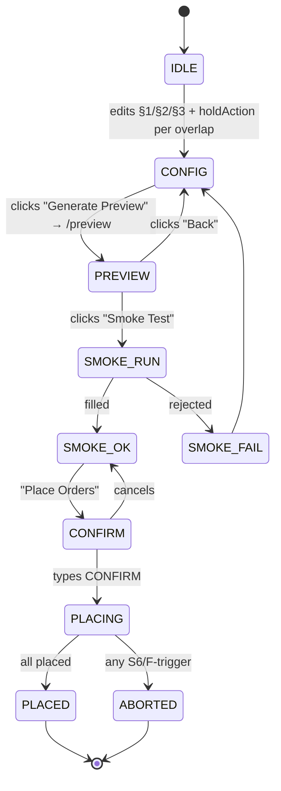

# Falcon Auto-Trade — Design

**Spec version:** 0.3 (DRAFT — broker-decided leverage + holdings overlap + positions tab)
**Author:** Claude (AI implementer)
**Last updated:** 2026-05-05

---

## 1. Architecture overview

```
┌──────────────────────────────────────────────────────────────────┐
│  Browser — Next.js                                               │
│  ┌─────────────────┐                  ┌──────────────────────┐   │
│  │ /falcon/trade   │                  │ /falcon/positions    │   │
│  │ (entry panel)   │                  │ (live holdings + SL) │   │
│  └────────┬────────┘                  └─────────┬────────────┘   │
└───────────┼─────────────────────────────────────┼─────────────────┘
            │  REST  /api/falcon/trade/*          │  /api/falcon/trade/positions
            ▼                                     ▼
┌──────────────────────────────────────────────────────────────────┐
│  FastAPI — backend/falcon/trade/routers/trade_router.py          │
│  /preview  /smoke-test  /place  /cancel-all  /status  /positions │
└────────┬─────────────────────────────────────────────────────────┘
         ▼
┌──────────────────────────────────────────────────────────────────┐
│  backend/falcon/trade/services/                                  │
│  ┌───────────────┐ ┌─────────────────┐ ┌─────────────────────┐   │
│  │ order_planner │ │ holdings_fetch  │ │ order_executor      │   │
│  │ (top_n + ovr) │ │ (kite.holdings) │ │ Kite + idempotency  │   │
│  └───────────────┘ └─────────────────┘ └─────────────────────┘   │
│  ┌───────────────┐ ┌─────────────────┐ ┌─────────────────────┐   │
│  │ mtf_eligible  │ │ volatility_gate │ │ trade_db (CRUD)     │   │
│  └───────────────┘ └─────────────────┘ └─────────────────────┘   │
└──────────────────────────────────────────────────────────────────┘
                                │
                                ▼
┌──────────────────────────────────────────────────────────────────┐
│  Storage:                                                        │
│  • kanida_universe.db   → falcon_trade_runs, falcon_trade_orders │
│  • falcon_signals_live  → READ ONLY                              │
│  • In-memory cache      → MTF eligibility (24h TTL)              │
│  • In-memory dict       → preview store (preview_id → plan, 30m) │
│  • In-memory cache      → holdings (5-min TTL during /preview)   │
│  • Kite live            → orders, holdings, positions            │
└──────────────────────────────────────────────────────────────────┘
```

---

## 2. State machine (frontend)



`/falcon/positions` is read-only; no state machine. Polls `/api/falcon/trade/positions` every 5s.

---

## 3. API contracts

### 3.1 `POST /api/falcon/trade/preview`

**Request:**
```json
{
  "signal_date":    "2026-05-05",
  "selected_symbols": ["HFCL", "CHENNPETRO", "CEMPRO", "GMDCLTD", "DEVYANI", "OLAELEC", "IRFC", "INOXWIND", "PTCIL", "OLECTRA", "IFCI", "MCX", "HINDZINC", "JIOFIN"],
  "total_capital":  5000000,
  "per_trade":      300000,
  "use_leverage":   true,
  "hold_days":      7,
  "sl_pct":         -7.0,
  "trail_trigger_pct": 10.0,
  "trail_lookback_days": 10,
  "hold_actions":   { "HFCL": "skip", "CEMPRO": "average" }
}
```

**Notes:**
- `leverage` field removed. **No internal leverage assumption either** — qty = `floor(PER_TRADE / close)`. Zerodha's per-stock margin is determined at order placement time; preview returns only certain numbers (notional).
- `top_n` and `custom_symbols` removed. UI sends an explicit `selected_symbols` list (driven by per-row checkboxes); the "Quick top-N preset" + Apply button is purely a UI helper that fills the checkbox set, not a separate API mode. Server validates that every symbol in `selected_symbols` exists in today's `falcon_signals_live` and is MTF-eligible.
- `hold_actions` only needs entries for symbols that are both selected AND held; missing entries default to `skip`.

**Response 200:**
```json
{
  "preview_id":      "prv_a3f9c2",
  "signal_date":     "2026-05-05",
  "entry_date":      "2026-05-06",
  "n_signals":       25,
  "n_selected":      14,
  "n_eligible":      12,
  "n_skipped_mtf":   2,
  "n_overlap":       5,
  "n_skip_action":   4,
  "n_average_action": 1,

  "skipped":         [{"symbol": "PAYTM", "reason": "MTF_INELIGIBLE"}],

  "existing_positions": [
    {
      "symbol":         "HFCL",
      "qty":            1798,
      "avg_entry":      85.10,
      "current_price":  87.45,
      "product":        "MTF",
      "entry_date":     "2026-05-04",
      "days_held":      1,
      "is_overlap":     true,
      "action":         "skip"
    }
  ],

  "per_trade":          300000,
  "total_deployed":     3600000,
  "headroom":           1400000,
  "utilization_pct":    72.0,

  "orders": [
    {
      "rank":           1,
      "symbol":         "GMDCLTD",
      "is_averaging":   false,
      "existing_qty":   0,
      "close":          412.55,
      "qty":            727,
      "notional":       299944.85,
      "sl_price":       383.67,
      "target_price":   453.81,
      "sl_order_type":  "SL-L",
      "vix_today":      14.2
    }
  ],
  "warnings": []
}
```

**Errors:**
- 400 `INVALID_INPUT`
- 400 `INSUFFICIENT_CAPITAL`
- 401 `KITE_TOKEN_INVALID`
- 404 `NO_SIGNALS_FOR_DATE`
- 409 `BATCH_IN_PROGRESS`
- 503 `HOLDINGS_FETCH_FAILED` — soft-fail; client may retry with `?ignore_holdings=true` to proceed without overlap check

### 3.2 `POST /api/falcon/trade/smoke-test`

Unchanged from v0.2.

### 3.3 `POST /api/falcon/trade/place`

Unchanged from v0.2 — just consumes the preview_id.

### 3.4 `POST /api/falcon/trade/cancel-all`

Unchanged from v0.2.

### 3.5 `GET /api/falcon/trade/status?batch_id=...`

Unchanged from v0.2.

### 3.6 `GET /api/falcon/trade/positions`  *(NEW)*

Returns current held positions with SL/target/trail metadata, joined from `falcon_trade_orders` and `kite.holdings()/positions()`.

**Response 200:**
```json
{
  "as_of":             "2026-05-05T18:42:11+05:30",
  "n_positions":       7,
  "total_notional":    3208432,
  "total_entry_value": 3203855,
  "unrealized_pnl":    4577,
  "pnl_pct":           0.14,

  "positions": [
    {
      "symbol":          "HFCL",
      "sector":          "Telecom",
      "qty":             1798,
      "avg_entry":       85.10,
      "current_price":   87.45,
      "product":         "MTF",
      "entry_date":      "2026-05-04",
      "days_held":       1,
      "hold_days_max":   7,
      "sl_price":        79.14,
      "sl_distance_pct": 9.51,
      "sl_kite_order_id":"240504000118473",
      "sl_type":         "SL-L",
      "target_price":    93.61,
      "target_distance_pct": 7.05,
      "trail_active":    false,
      "trail_low_10d":   null,
      "pnl_pct":         2.76
    }
  ],

  "trigger_watch": {
    "near_sl":        [{"symbol": "SAPPHIRE", "distance_pct": 2.65}, ...],
    "near_target":    [{"symbol": "GESHIP",   "distance_pct": 2.94}, ...],
    "near_time_stop": [{"symbol": "HFCL",     "days_held": 6}]
  }
}
```

### 3.7 `POST /api/falcon/trade/positions/exit`  *(NEW — manual exit)*

**Request:** `{"symbol": "HFCL", "confirm": true}`

**Response 200:**
```json
{
  "status":          "EXITED",
  "symbol":          "HFCL",
  "cancelled_sl":    "240504000118473",
  "exit_kite_order_id": "240505000200512",
  "exit_qty":        1798,
  "exit_price":      87.45,
  "realized_pnl":    4226.30
}
```

---

## 4. DB schema

Same as v0.2. The `falcon_trade_orders` table already captures everything needed for the positions view via JOIN with kite live data.

```sql
CREATE TABLE IF NOT EXISTS falcon_trade_runs (
    batch_id            TEXT PRIMARY KEY,
    started_at          TEXT NOT NULL,
    finished_at         TEXT,
    status              TEXT NOT NULL,
    signal_date         TEXT NOT NULL,
    entry_date          TEXT NOT NULL,
    top_n               INTEGER NOT NULL,
    total_capital       INTEGER NOT NULL,
    per_trade           INTEGER NOT NULL,
    use_leverage        INTEGER NOT NULL,    -- 0|1
    hold_days           INTEGER NOT NULL,
    sl_pct              REAL NOT NULL,
    trail_trigger_pct   REAL NOT NULL,
    trail_lookback_days INTEGER NOT NULL,
    n_attempted         INTEGER DEFAULT 0,
    n_filled            INTEGER DEFAULT 0,
    n_failed            INTEGER DEFAULT 0,
    n_overlap           INTEGER DEFAULT 0,
    n_average_action    INTEGER DEFAULT 0,
    n_skip_action       INTEGER DEFAULT 0,
    total_equity_used   INTEGER DEFAULT 0,
    total_notional      INTEGER DEFAULT 0,
    notes               TEXT
);

CREATE TABLE IF NOT EXISTS falcon_trade_orders (
    id                INTEGER PRIMARY KEY AUTOINCREMENT,
    batch_id          TEXT NOT NULL,
    symbol            TEXT NOT NULL,
    side              TEXT NOT NULL,
    role              TEXT NOT NULL,           -- ENTRY|STOP|SMOKE|EXIT
    is_averaging      INTEGER DEFAULT 0,       -- 0|1
    kite_order_id     TEXT,
    qty               INTEGER NOT NULL,
    price             REAL,
    trigger_price     REAL,
    product           TEXT NOT NULL,
    order_type        TEXT NOT NULL,
    status            TEXT NOT NULL,
    placed_at         TEXT,
    filled_at         TEXT,
    error             TEXT,
    idempotency_key   TEXT NOT NULL UNIQUE,
    FOREIGN KEY (batch_id) REFERENCES falcon_trade_runs(batch_id)
);

CREATE INDEX IF NOT EXISTS idx_trade_orders_batch  ON falcon_trade_orders(batch_id);
CREATE INDEX IF NOT EXISTS idx_trade_orders_symbol ON falcon_trade_orders(symbol);
CREATE INDEX IF NOT EXISTS idx_trade_orders_role   ON falcon_trade_orders(role);
```

Two new fields vs v0.2: `is_averaging` flag on orders, plus overlap counters in runs.

---

## 5. File layout

```
backend/falcon/trade/
├── SPEC/   {Requirements,Design,Tasks}.md
├── __init__.py
├── routers/trade_router.py
├── services/
│   ├── order_planner.py
│   ├── holdings_fetch.py        # NEW — kite.holdings() + positions() with cache
│   ├── mtf_eligibility.py
│   ├── order_executor.py
│   ├── volatility_gate.py
│   └── trade_db.py
└── tests/
    ├── test_order_planner.py
    ├── test_holdings_fetch.py    # NEW
    ├── test_mtf_eligibility.py
    ├── test_idempotency.py
    └── test_volatility_gate.py

backend/falcon/db_schema_extensions.sql  # APPEND new tables
backend/main.py                           # EDIT — register trade_router
frontend/app/falcon/trade/page.tsx        # NEW
frontend/app/falcon/positions/page.tsx    # NEW (positions tab)
frontend/app/falcon/layout.tsx            # EDIT — add Trade + Positions
frontend/lib/falcon-api.ts                # EDIT — extend FalconAPI
```

---

## 6. Key algorithms

### 6.1 Holdings fetch + overlap detection

```python
# services/holdings_fetch.py
from datetime import datetime, timedelta
from typing import Dict

_cache: dict = {"data": None, "fetched_at": None}
TTL = timedelta(minutes=5)

def get_held_positions(kite, force_refresh: bool = False) -> Dict[str, dict]:
    """Returns {symbol: {qty, avg_entry, current_price, product, entry_date, days_held}}.
    Combines kite.holdings() (long-term + MTF carry-overs) with kite.positions().net (intraday).
    """
    now = datetime.now()
    if not force_refresh and _cache["data"] and _cache["fetched_at"] and now - _cache["fetched_at"] < TTL:
        return _cache["data"]

    held: Dict[str, dict] = {}
    for h in kite.holdings():
        if h["quantity"] > 0:
            held[h["tradingsymbol"]] = {
                "qty":           h["quantity"],
                "avg_entry":     h["average_price"],
                "current_price": h["last_price"],
                "product":       h.get("product", "CNC"),
                "entry_date":    None,  # holdings doesn't report this; join from falcon_trade_orders
                "days_held":     None,
            }
    for p in kite.positions().get("net", []):
        if p["quantity"] > 0 and p["tradingsymbol"] not in held:
            held[p["tradingsymbol"]] = {
                "qty":           p["quantity"],
                "avg_entry":     p["average_price"],
                "current_price": p["last_price"],
                "product":       p.get("product", "MIS"),
                "entry_date":    None,
                "days_held":     None,
            }

    # Backfill entry_date from our own falcon_trade_orders audit
    enrich_with_entry_dates(held)

    _cache["data"] = held
    _cache["fetched_at"] = now
    return held
```

### 6.2 Order planner (overlap-aware, no leverage math)

```python
def plan_orders(
    signals, selected_symbols, per_trade,
    sl_pct, trail_trigger_pct,
    held_by_symbol, hold_actions,
    mtf_eligible_fn, sl_order_type_fn,
):
    # 1. Pick selection (explicit list from UI checkboxes)
    sigs = [s for s in signals if s.symbol in selected_symbols]

    # 2. MTF skip (server-side validation; UI also disables non-MTF checkboxes)
    eligible = [s for s in sigs if mtf_eligible_fn(s.symbol)]
    skipped  = [{"symbol": s.symbol, "reason": "MTF_INELIGIBLE"}
                for s in sigs if not mtf_eligible_fn(s.symbol)]

    # 3. Overlap action
    orders = []
    n_skip_action = 0
    n_average_action = 0
    for s in eligible:
        held = held_by_symbol.get(s.symbol)
        if held:
            action = hold_actions.get(s.symbol, "skip")
            if action == "skip":
                n_skip_action += 1
                continue
            n_average_action += 1

        # 4. Per-stock plan — qty derived directly from PER_TRADE (no leverage math)
        if s.close_at_signal is None or s.close_at_signal <= 0:
            skipped.append({"symbol": s.symbol, "reason": "NO_PRICE"}); continue
        qty = per_trade // int(s.close_at_signal)
        if qty == 0:
            skipped.append({"symbol": s.symbol, "reason": "POSITION_TOO_SMALL"}); continue
        notional     = qty * s.close_at_signal
        sl_price     = round(s.close_at_signal * (1 + sl_pct/100), 2)
        target_price = round(s.close_at_signal * (1 + trail_trigger_pct/100), 2)
        orders.append(OrderSpec(
            rank=len(orders)+1, symbol=s.symbol, sector=s.sector,
            close=s.close_at_signal, qty=qty,
            notional=notional,
            sl_price=sl_price, target_price=target_price,
            sl_order_type=sl_order_type_fn(s.symbol),
            is_averaging=bool(held),
            existing_qty=held["qty"] if held else 0,
        ))
    return orders, skipped, {"n_skip_action": n_skip_action, "n_average_action": n_average_action}
```

`OrderSpec` no longer carries `equity_used` or `borrowed` fields — those would require a leverage assumption. Broker decides at order time.

### 6.3 Positions view computation

```python
# routers/trade_router.py — /positions endpoint
def get_positions(kite):
    held = holdings_fetch.get_held_positions(kite)

    # Join with falcon_trade_orders to get SL prices, target levels, entry dates
    sl_orders = trade_db.get_open_sl_orders()        # {symbol: {sl_price, kite_order_id, sl_type}}
    entry_dates = trade_db.get_entry_dates()         # {symbol: entry_date}

    positions = []
    for symbol, h in held.items():
        sl = sl_orders.get(symbol)
        if not sl:
            continue   # held but no Falcon SL — not in our universe, skip
        entry_date = entry_dates.get(symbol)
        days_held = days_between(entry_date, today())

        target_price = round(h["avg_entry"] * (1 + 10/100), 2)   # initial target = +10% (TRAIL_TRIGGER)
        sl_distance_pct = ((h["current_price"] - sl["sl_price"]) / h["current_price"]) * 100
        target_distance_pct = ((target_price - h["current_price"]) / h["current_price"]) * 100

        positions.append({
            "symbol":          symbol,
            "qty":             h["qty"],
            "avg_entry":       h["avg_entry"],
            "current_price":   h["current_price"],
            "product":         h["product"],
            "entry_date":      entry_date,
            "days_held":       days_held,
            "hold_days_max":   7,    # from latest run config
            "sl_price":        sl["sl_price"],
            "sl_distance_pct": round(sl_distance_pct, 2),
            "sl_kite_order_id":sl["kite_order_id"],
            "sl_type":         sl["sl_type"],
            "target_price":    target_price,
            "target_distance_pct": round(target_distance_pct, 2),
            "trail_active":    False,         # Phase 2 will set this once HW reached
            "trail_low_10d":   None,
            "pnl_pct":         round(((h["current_price"] / h["avg_entry"]) - 1) * 100, 2),
        })

    # Trigger watch — top 3 closest in each category
    trigger_watch = {
        "near_sl":        sorted(positions, key=lambda p: p["sl_distance_pct"])[:3],
        "near_target":    sorted(positions, key=lambda p: p["target_distance_pct"])[:3],
        "near_time_stop": [p for p in positions if p["hold_days_max"] - p["days_held"] <= 2],
    }
    return {"positions": positions, "trigger_watch": trigger_watch, ...}
```

### 6.4 Manual exit

```python
def manual_exit(kite, symbol):
    sl = trade_db.get_open_sl_order(symbol)
    if not sl:
        raise NotFound(f"No live SL order for {symbol}")
    # 1. Cancel SL
    kite.cancel_order(variety="regular", order_id=sl.kite_order_id)
    trade_db.update_order_status(sl.id, "CANCELLED")
    # 2. Place market sell
    held_qty = holdings_fetch.get_held_positions(kite, force_refresh=True)[symbol]["qty"]
    exit_id = kite.place_order(
        variety="regular", exchange="NSE", tradingsymbol=symbol,
        transaction_type="SELL", quantity=held_qty,
        product=sl.product, order_type="MARKET",
        tag=idempotency_key(sl.batch_id, symbol, "EXIT"),
    )
    trade_db.insert_order(sl.batch_id, symbol, "SELL", "EXIT", exit_id, qty=held_qty, status="PLACED")
    return {"status": "EXITED", "exit_kite_order_id": exit_id, ...}
```

### 6.5 Idempotency, volatility gate, executor — same as v0.2

---

## 7. Reuse map

Same as v0.2.

---

## 8. Frontend state

```ts
// /falcon/trade
type AppState = ... // unchanged from v0.2

// /falcon/positions — read-only
type PositionsState = {
  positions: Position[]
  triggerWatch: {...}
  asOf: string
  loading: boolean
  error?: string
}
// Polls /api/falcon/trade/positions every 5s
```

---

## 9. Tests

| File | Coverage |
|---|---|
| `test_order_planner.py` | TOP_N, custom, MTF skip, overlap skip/average actions, qty floor, edge cases |
| `test_holdings_fetch.py` | Cache hit/miss, 5-min TTL, kite API failure soft-fail |
| `test_mtf_eligibility.py` | (unchanged) |
| `test_idempotency.py` | (unchanged) |
| `test_volatility_gate.py` | (unchanged) |
| Smoke-test UI button | Manual integration |
| End-to-end batch | Manual May 6 dry-run |
| Positions endpoint integration | Manual — verify SL distance, trigger watch sort order against real Kite holdings |

---

## 10. Operational notes

- `/positions` polls every 5s on UI; backend returns cached price (5-min TTL on holdings; current_price from Kite quote could be stale by up to 5 min). Phase 2 replaces with live Ticker.
- Manual exit during active batch: deferred to after batch completes (F14).
- Holdings fetch failure: soft-fail with banner; operator can proceed with `ignore_holdings=true` after acknowledging risk.

---

## 11. Decisions log

| Decision | Alternative | Why |
|---|---|---|
| **No LEVERAGE knob; no internal leverage constant either** | User-selectable 1X/2X/3X/4X, OR internal `ASSUMED_MTF_LEVERAGE=3` for preview-time estimate | Pudhuraja's stricter rule: "if it is leverage then it should come from zerodha so take it from zerodha if not leave it". Either get real numbers from Zerodha or omit the calculation. Don't fake position size with an assumption — preview shows only notional (`qty × close ≈ PER_TRADE`), broker decides actual margin at order placement |
| Default overlap action = SKIP | Default = AVERAGE | Skip is the safe default — never silently double up. Operator opts in to AVERAGE per pick |
| Holdings fetched at preview time only | Continuous polling | Preview is the decision point; cheaper |
| 5-min TTL on holdings cache | No cache | Reduces Kite API calls during repeated preview iterations |
| Soft-fail on holdings API error | Hard-fail | Operator can still proceed with manual due diligence (rare event) |
| Positions tab read-only | Editable | Phase 2 owns mutating actions (re-place SL daily, etc.) |
| Manual exit cancels SL → market sell | Manual exit only cancels SL | Operator's intent is to flatten the position immediately, not defer |
| Trigger Watch top-3 each | Show all sorted | Top-3 is enough cognitive load; full table is below |
| Daily SL re-place (Phase 2) | GTT | GTT can't do SL-L for equity |
| New `falcon_trade_*` tables | Reuse legacy `orders` | Legacy caps don't fit batch |
| `is_averaging` flag on orders | Separate `falcon_avg_orders` table | Simpler — same lifecycle, just a flag |
