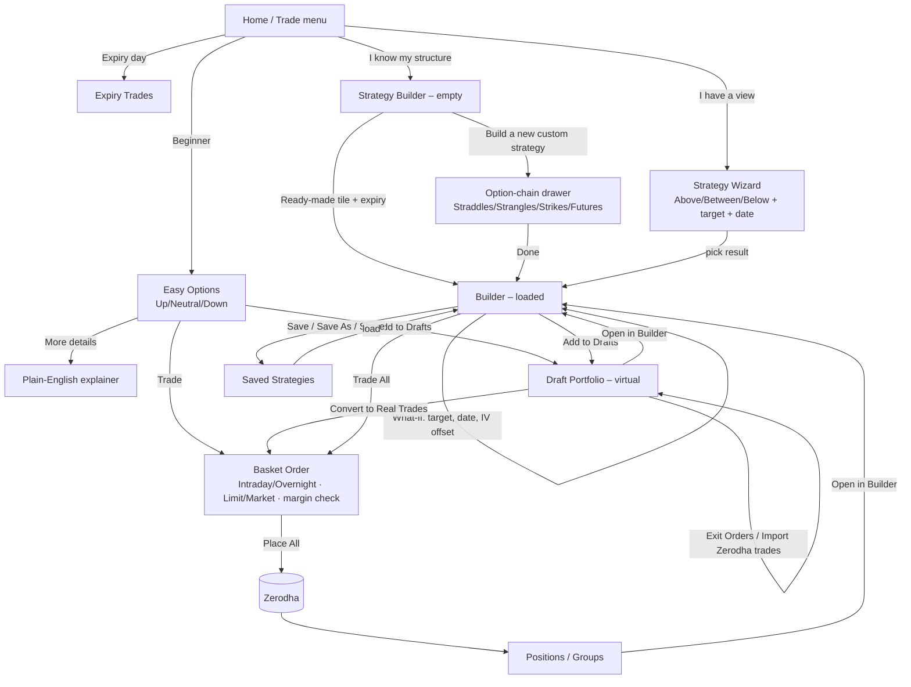
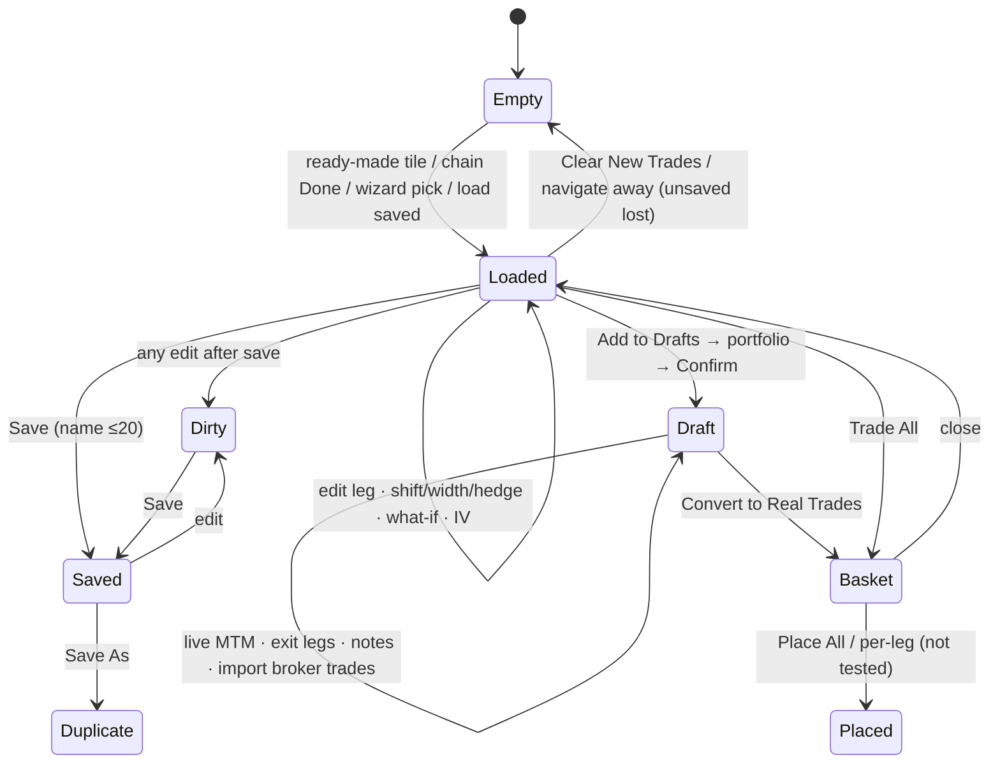

# 01 · Sensibull — F&O strategy study

**Source:** the live product at web.sensibull.com, logged in with a real account connected to Zerodha (client DC2940).
**When:** 25 Sep 2026, 08:15–09:30 IST. Screens are pre-market (last-close prices, Thu 24 Sep 15:40) unless marked *live*. The Strategy Wizard was re-checked after the 09:15 open.
**Method:** every control named here was clicked or opened.
- The test strategy "KANIDA TEST strgl" was saved and then deleted.
- One virtual trade was placed in a new draft portfolio "KANIDA TEST PF", which was then deleted.
- The broker basket was opened and inspected but **never submitted**.
- Raw notes: [raw/sensibull_notes.md](raw/sensibull_notes.md).

---

## 1. Screen inventory

| # | Screen | URL / entry | Purpose |
|---|---|---|---|
| S0 | Home | `/home` | Hub. Social proof, entry tiles into every strategy tool |
| S0a | Trade mega-menu | top nav **Trade ▾** | Menu of strategy tools: Builder, Wizard, Expiry Trades, Easy Options, Draft Portfolios, learning |
| S1 | Strategy Builder – empty | `/option-strategy-builder?instrument_symbol=NIFTY` | Start a strategy from a template or from scratch |
| S2 | Strategy Builder – loaded | same, plus `&builder_strategy_id=<uuid>` once saved | Build, edit and analyse a multi-leg strategy |
| S3 | Add/Edit option-chain drawer | **Add/Edit** / **Build a new custom strategy** | Pick legs from a chain (straddles, strangles, strikes, futures) |
| S4 | Insights ("Your warnings") drawer | **Insights** link | Risk warnings for the current strategy |
| S5 | Charges modal | **Charges** | Statutory and brokerage cost breakdown |
| S6 | Builder settings popover | **Settings** | Lots or Qty units; show Manual P&L |
| S6a | Funds & Margins settings | gear next to Funds & Margins | Include existing positions in funds/margin |
| S7 | Save / Save As / Share | **…** menu | Save strategy, duplicate, share link or socials |
| S7a | Saved Strategies tab | builder tab | List, search, load, rename, delete saved strategies |
| S8 | Basket Order (broker handoff) | **Trade All** | Review and place legs with the broker |
| S9 | Add to Drafts flow | **Add to Drafts** | Put the strategy into a virtual (paper) portfolio |
| S10 | Draft Portfolio detail | `/draft-portfolios/<uuid>` | Track virtual positions, P&L, Greeks, notes; exit or convert to real |
| S10a | Exit Draft Trade Orders modal | **Exit Orders ▸ Exit Orders Manually** | Close virtual legs at chosen price and time |
| S10b | Notes modal | **Notes** | Per-strategy journal |
| S11 | Draft Portfolios list | `/draft-portfolios` | All virtual portfolios, aggregate P&L, bulk delete |
| S12 | Strategy Wizard | `/trade-options-strategies` | View-based discovery: "NIFTY above 23300 by 28 Sep" → ranked strategies |
| S12a | Wizard Filters | **Filters** | Constrain generated strategies |
| S13 | Easy Options | `/trade-options` | Beginner discovery: Up / Neutral / Down → Defensive / Balanced / Aggressive |
| S13a | Easy Options "More Details" | card link | Plain-English explanation of the trade |
| S14 | Expiry Trades | `/expiry-trades` | Expiry-day strategy ideas per index |
| S15 | Positions | `/positions` | Live broker positions and groups (empty for this account) |
| S16 | Options Screener | `/options-screener` | Stock-level F&O discovery (IV, IVP, OI action, PCR…) |

---

## 2. Screen-by-screen detail

### S0 · Home
- **Purpose:** get the user into a strategy tool fast, and build trust through social proof.
- **What the user sees:**
  - "Welcome <name>".
  - A banner: "6020 people are sharing their live positions right now. Check out Showcase". Below it, a carousel of verified live-P&L cards (avatar, name, handle, capital, return %, **Live** tag).
  - Six entry tiles, each with a one-line pitch: Easy options, Strategy wizard, Strategy builder, Draft Portfolios, NIFTY Heatmap, Share Verified P&L.
  - A promo card, "Introducing Mindful Trading".
  - An Advanced tools grid: option chain, OI, multi-strike OI, FII/DII, straddle charts, live option charts, stock data, screener, technical signals, IV chart, events calendar.
- **Inputs:** none.
- **Controls:** tile buttons; carousel dots; Showcase link; Mindful Trading **Try now** / **Dismiss**. The popup reappears inside the builder until dismissed.
- **Interactions:** each tile deep-links to its tool. Carousel cards open a trader's verified live positions.
- **Navigation:** top nav Home · Trade ▾ · Analyse ▾ · Watchlist (New) · Positions · Orders · avatar menu (Settings, Verified by Sensibull, FAQ, Help, About, What's New, Logout).
- **States:** logged in. The promo popup is a transient overlay.

### S0a · Trade mega-menu
Three columns, each item with a one-line description:
1. Strategy Builder (*Popular* badge), Strategy Wizard, Expiry Trades, Easy Options.
2. Draft Portfolios, Mindful Trading (*New*).
3. Learn Options Strategies (*New*), Learn Options Trading (videos), Verified by Sensibull.

The menu is organised by user intent (build / discover / practise / learn), not by feature type.

### S1 · Strategy Builder – empty
- **Purpose:** choose how to start.
- **What the user sees:**
  - **Left column:**
    - Instrument search ("NIFTY 23063.10 -1.64%") with chart and Info buttons, plus **Settings**.
    - An empty trades card: illustration "No Trades Added", primary CTA **Build a new custom strategy**, and a disabled **Manual P/L** row.
    - Tabs **Ready-made | Positions | Saved Strategies | Draft Portfolios**.
  - **Right column:** three collapsed accordions (Summary, Charts and Graphs, Greeks and IVs).
- **Ready-made tab:**
  - Prompt "Please click on a ready-made strategy to load it" and a **Learn Options Strategies** link.
  - Chips **Bullish / Bearish / Neutral / Others** and an **Expiry** dropdown with days-to-expiry: 29 Sep (4 Days), 06 Oct (11), 13 Oct, 19 Oct, 27 Oct, 03 Nov, 23 Nov, 29 Dec (95).
  - 38 tiles, each a mini payoff sketch (red loss / green profit) plus a name:
    - **Bullish (11):** Buy Call, Sell Put, Bull Call Spread, Bull Put Spread, Call Ratio Back Spread, Long Calendar with Calls, Bull Condor, Bull Butterfly, Range Forward, Buy Future, Long Synthetic Future.
    - **Bearish (11):** Buy Put, Sell Call, Bear Call Spread, Bear Put Spread, Put Ratio Back Spread, Long Calendar with Puts, Bear Condor, Bear Butterfly, Risk Reversal, Sell Future, Short Synthetic Future.
    - **Neutral (8):** Short Straddle, Iron Butterfly, Short Strangle, Short Iron Condor, Batman, Double Plateau, Jade Lizard, Reverse Jade Lizard.
    - **Others (8):** Call Ratio Spread, Put Ratio Spread, Long Straddle, Long Iron Butterfly, Long Strangle, Long Iron Condor, Strip, Strap.
- **Other tabs:**
  - **Positions:** "No positions found" (empty broker book).
  - **Saved Strategies:** search box plus list.
  - **Draft Portfolios:** list of portfolios with strategy count and P&L, plus **Create New Portfolio**.
- **Footer:** "Prices last updated at --. (Prices are auto-refreshed every 30 seconds)" and an **Important info** accordion.
- **Interaction:** one click on a tile fills the legs for the chosen expiry at ATM-relative strikes and expands the analysis panel (→ S2).
- **Empty states:** "No Trades Added"; "No positions found"; "Prices last updated at --" before the first tick.

### S2 · Strategy Builder – loaded (the core screen)
- **Purpose:** edit legs and understand the risk and reward before trading.
- **Leg editor card (left):**
  - **Header:**
    - Strategy name: "New Strategy" until saved, then the saved name with a ✏ rename icon.
    - **Insights** link and **Clear New Trades**.
    - Master checkbox with an auto-detected name, e.g. "2 selected – Bull Call Spread". The name updates live: a straddle became "Short Strangle" after a Width change.
    - **Reset Prices** re-pulls LTP into entry prices.
  - **Leg row:**
    - `[✓ include]` toggles the leg in or out of analysis without deleting it.
    - `[B|S pill]` toggles direction.
    - `[Expiry ▾]`.
    - `[– Strike +]` steps one strike interval.
    - `[Type CE/PE/FUT]`.
    - `[Lots ▾]`.
    - `[Price]` is editable; a corner mark appears once overridden.
    - `[≡]` opens a market-depth popover: Open/High/Low/Close plus 5-level bids and offers with quantity.
    - `[🗑]` deletes the leg.
  - **Bulk adjusters:**
    - **Shift** – N +: moves every strike together. Tested +50: 23100/23100 → 23150/23150.
    - **Width** – N +: distance between the legs. A straddle at +100 became CE 23200 / PE 23100.
    - **Hedge** – 200 +: wing distance for spreads; disabled for straddles.
  - **Multiplier ▾**, plus "Price Pay 90.75" (net per unit) and "Premium Pay 5,899" (net rupees).
  - **Charges** opens S5.
  - **Action row:** **Add/Edit** (S3) · **Add to Drafts** (S9) · **Trade All** (S8, primary blue) · **…** (S7).
  - **Manual P/L** checkbox plus **Add Manual P/L** (inject realised P&L).
- **Summary strip (right top):**
  - Max Profit +7,101 (+20%) · Max Loss −5,899 (−17%); shows "Unlimited" in red for naked shorts.
  - **Breakeven** with a Target | Expiry toggle: one value for spreads, two for strangles.
  - **Reward/Risk** 1.2 with a **1/x** inverter · **POP** 44% · Time Value 2,974 · Intrinsic Value 2,925.
  - **Funds & Margins** (live from broker): Funds Needed 39,898 · Margin Needed 35,582 · Margin Available 1,89,594.
- **Analysis tabs:** **Payoff Graph | P&L Table | Greeks | Strategy Chart**, plus the **Add Booked P&L** toggle.
  - **Payoff Graph:**
    - Two curves: *On Expiry* (red/green piecewise) and *On Target Date* (blue, smooth).
    - Shaded ±1SD/±2SD bands, a "Current price" flag, and a badge at the target, e.g. "Projected loss: −68 (−0.19%)" or "Projected profit: 5,155 (+14%)".
    - OI bars overlay. The **OI Change ▾** menu has: Show OI toggle; Open Interest vs Change in OI; multi-select "Expiry Used". Notes: "Intraday OI change is not available from 8:00am to 9:18am and on holidays"; "OI overlay not available for MCX, USDINR and far expiries".
    - **SD Fixed ▾** sets SD Mode: *Fixed SD* (N days, default 7) or *Dynamic SD* (from the target date/time).
    - **Zoom In**.
  - **Payoff Table:** **Target Interval ▾** (10/25/50/100/200; default 50) and a **Show %** toggle. Rows are spot levels with % from spot; columns are *On Target Date* and *On Expiry*. The current-spot row is highlighted and editable.
  - **P&L Table:** Multiply by Lot Size / by No. of Lots toggles. Columns: Instrument, Target P&L, Target Price, Entry Price, LTP. The Total row is tagged **Projected**.
  - **Greeks tab:** per-leg Delta, Theta, Decay, Gamma, Vega, plus Total.
  - **Strategy Chart:** the combined strategy price vs NIFTY FUT over about 7 sessions (dual axis), with an **Invert Price** toggle.
- **What-if controls** (shared by all tabs):
  - **NIFTY Target:** % label, stepper input, slider, Reset.
  - **Date:** "5D to expiry" slider from today to expiry, ‹ › day steppers, a timestamp ("Thu, 24 Sep 3:40 PM"), Reset.
  - Tested target 23300 (+1.0%) at Mon 28 Sep (1D): the badge flipped to profit 5,155 (+14%) and the Target breakeven moved to 23123.
- **Below the chart:**
  - **Strikewise IVs:** a global Offset stepper, per-leg IV steppers, a "Chg" column vs live, and Reset IVs. This is the IV what-if.
  - **Greeks** panel: portfolio totals with multiply toggles.
  - **Target Day Futures Prices.**
  - **Standard Deviation** table (1SD 374.9 pts = 1.6% → 22688/23438; 2SD 749.8).
- **Floating** refresh button.
- **States:** "Unlimited" loss styling; projected profit (green) vs loss (red) badge; dirty vs saved (Save disabled until changed).

### S3 · Add/Edit option-chain drawer
- **Purpose:** pick legs visually from the chain.
- **Header:** underlying search, close ✕, and a vertical **Show Editor »** tab to peek at the legs behind the drawer.
- **Mode tabs:** **Straddles | Strangles | Strikes | Futures**, plus **Settings** (Lots | Qty).
- **Expiry ▾**, with the view toggle **LTP | OI | Greeks**:
  - **LTP:** Delta · Call LTP · Call OI bar · Strike · IV · Put OI bar · Put LTP · Delta. ITM cells are shaded; the ATM strike is highlighted.
  - **OI:** Call OI (Chg%) bars | Strike | Put OI (Chg%).
  - **Greeks:** Call Delta · Strike · IV · Put Delta · Theta · Vega · Gamma.
- **Straddles:** one radio per strike. Picking adds **S** CE + **S** PE (the default is *short*), and the payoff redraws live behind the drawer.
- **Strikes:** hovering a row reveals **B / S** on each side. After picking, a Qty dropdown (65) appears under it.
- **Futures:** real expiries (29 Sep, 27 Oct, 23 Nov) with B/S, plus a **Synthetic Futures** section for weekly expiries (06 Oct 23111.43 …).
- **Guard:** switching mode with legs present shows the modal "You are changing strategy type from Futures to Straddles." with Cancel / Proceed. Proceeding clears the selection.
- **Footer:** "N legs selected" / "1 straddle selected" · **Clear All** · **Done** (disabled at 0).

### S4 · Insights drawer
A right drawer titled "Your warnings". It holds one chip per detected risk (e.g. **Decay** for a short straddle) and a **Hide** button. It is thin: no explanation text is visible without expanding.

### S5 · Charges modal
Total ₹72.94, broken into: Brokerage 40.00 · STT 20.10 · Exchange txn 4.76 · GST 8.06 · Stamp 0.00 · SEBI 0.01. There is a Disclaimer accordion and a Close button.

### S6 / S6a · Settings
- **Builder Settings:** Lots | Qty radio; **Show Manual P&L** toggle.
- **Funds & Margins gear:** "Include existing positions for funds calculation" and "… for margin calculation" (both on). This gives a portfolio-aware margin.

### S7 / S7a · Save, duplicate, share, manage
- **… menu:** **Save** · **Save As** (greyed until first save; this is the duplicate) · **Share ▸** Facebook, Twitter, WhatsApp, Telegram, **Copy Link**.
- **Save:** modal "Save New Strategy". Strategy Name has a **20-char limit** with a counter; buttons Cancel / **Save Changes**.
- **After save:**
  - Toast "Strategy saved successfully".
  - The URL gains `builder_strategy_id=<uuid>`.
  - The title shows the name with ✏.
  - The **Saved Strategies** tab opens automatically.
- **Saved Strategies list:**
  - Search "name underlying etc.".
  - Rows show the name and a symbol preview ("NIFTY26SEP23200CE and 1 more"); ✓ marks the loaded one.
  - Hover shows ✏ rename and 🗑 delete. Delete asks for confirmation: "Are you sure you want to delete KANIDA TEST strgl strategy? This action cannot be reversed." (Cancel / Yes, Delete).
- **Load:** clicking a row restores the legs *with their saved entry prices*. Max P/L is recomputed against current prices.
- The builder does **not** keep unsaved work across navigation (the page reloaded empty).

### S8 · Basket Order (broker handoff)
- **Form:** a floating window with minimise, pop-out and close.
- **Header:**
  - Broker account: name, **Client ID DC2940**, Settings.
  - Product **Intraday | Overnight**.
  - **Prices** (refresh) and **Charges & Margin**.
- **One card per leg:**
  - "SELL NIFTY 28th Sep 23200 CE", a 5-level depth ladder, and OHLC/LTP/Avg.
  - **Market | Limit**, Price with a refresh-to-LTP button, Lots, and a **per-leg Sell/Buy** button (places only that leg).
- **Footer:**
  - "Always open Basket in new tab" checkbox.
  - **Margin Needed 1,97,221 vs Available 1,89,594**, shown in red when short. Note: "Changing price or quantity will automatically update the margin".
  - **Re-arrange** (leg order, e.g. buys first for margin benefit).
  - **Place All at Market ▾** (split button).
- **Not clicked:** any place/submit control.
- **Observed defect:** the builder showed expiry "29 Sep", but the basket printed "28th Sep". This is a timezone-rendering bug; the browser runs in US Pacific time.

### S9 · Add to Drafts (virtual trade)
1. Modal "Add to draft portfolio": radio list of existing portfolios plus **Create new**.
2. Create new: Portfolio Name (40) and Strategy Name (40), then **Create**.
3. Review: "The following trades will be added" (leg, price, qty), with the footer "This is not a real trade. This is a draft portfolio without real money." Then **Confirm**.
4. Success: "Trades added to draft portfolio", with **Load in Builder** | **Open Full Draft Portfolio**.

### S10 · Draft Portfolio detail (virtual tracking)
- **Frame:** a dashed **Drafts Mode** banner marks the paper context.
- **Left rail:**
  - "1 of 1 Strategy"; Total / Unbooked / Booked P&L (−224 / −224 / 0); **Total Decay +1,165**.
  - **Show closed positions** toggle and a gear.
  - A strategy checklist; ticked strategies aggregate into the totals.
  - "Like this feature? Give us feedback".
- **Header:**
  - Breadcrumb **Portfolios › [portfolio ▾]**. The dropdown switches portfolio and also holds **Rename** / **Delete** for the current one.
  - **+ Create New Strategy**.
- **Strategy card:** name ✏ 🗑, "2 of 2 Positions", Total / Unbooked / Booked P&L, **Notes**, collapse.
- **Tabs:**
  - **Net Positions:**
    - Underlying + chart + Info.
    - A one-line summary: "Breakeven 22894 (−0.7%), 23406 (+1.5%) · Max Profit +13,403 · Max Loss Unlimited".
    - **Show All** and an expiry chip.
    - Table: ✓, Instrument, Qty, Avg, LTP, Total P&L, Unbooked, Booked.
  - **Orderbook:** "Showing 2/2 orders based on your selection", **See Selection ▾**, Tip ("How does this work?"). Columns: Instrument, Qty, Price, Exit Price, LTP, P&L.
- **Action rail:**
  - **Open in Builder ↗**.
  - **Add Orders ▾** (Add Orders Manually / **Import Zerodha Trades**).
  - **Exit Orders (n) ▾** (Exit Orders Manually / Exit using Zerodha Trades).
  - **Edit (n)** · **Delete (n)**.
  - **Convert To Real Trades**.
  - **Greeks ▾** (Delta 8.57, Gamma −0.16, Vega −1365, Decay 1165).
- **S10a Exit modal:** rows with Type (Buy), Instrument, Contract, Expiry, Strike, Qty, **Exit Price** (editable, with refresh-to-LTP) and **Time**. Buttons Cancel / **Exit All (2)**.
- **S10b Notes:** "Add Note" text area and **Add New Note**, with the history on the right. Empty state: "you haven't added any notes yet".

### S11 · Draft Portfolios list
- **Left rail:** "5 of 64 Portfolios" with aggregate P&L (−4.35L); "Total no. of Portfolios: 64".
- **Controls:** list/grid toggle · **Delete portfolios (5)** · **+ Create New** · Sort by: Recently Updated ▾.
- **Table:** checkbox, name, Total / Unbooked / Booked P&L, "N Strategies ›". Row hover shows ⋯.
- **UX hazard:** the 5 most-recent portfolios arrive **pre-ticked**. The aggregation selection is the same as the bulk-delete selection, so one click would delete 5 real user portfolios. I did not use it.

### S12 · Strategy Wizard (view-based discovery)
- **Inputs:**
  - Stock Name (search).
  - **Prediction** Above / Between / Below.
  - **NIFTY Target** (one or two inputs).
  - **Target Date**: 29 Sep Expiry (4 Days) / 27 Oct Expiry (32 Days) / *Specific date*.
  - **Filters**.
  - **Go**, disabled until a prediction is chosen.
- **Empty state:** illustration plus "Tell us where a stock is going and we will give you smart option strategies to trade."
- **Offline state (pre-market):** "Strategy wizard is offline till next market open (9:15 AM). Please come back and check again for strategies after that time."
- **Filters panel (S12a):**
  - Premium: Get / Pay.
  - Expiry checklist, with a "⚠ Expiry Missing?" helper.
  - **Hedged** strategies with counts: Buy Call, Buy Put, Call Spread, Put Spread, Iron Condor, Iron Butterfly.
  - **Unhedged:** Sell Call, Sell Put, Straddle, Strangle.
  - **ATM IV on target** per expiry (stepper). The IV assumption is fed into the ranking.
  - Spread gap.
  - **Max loss limit** slider (1,000,000).
  - **Min profit** slider.
  - **Delta range** 0–1 dual slider.
- **Results (after 09:15, live):** see §2a below.

### S13 · Easy Options (beginner discovery)
- **Header:** "Simple, low-risk, and fun option trading".
- **One card per index** (NIFTY, BANKNIFTY, FINNIFTY):
  - "Where do you think NIFTY will go in 4 days?" with the chip "Expiring coming Tuesday at 3:40 PM".
  - A plain-language description of the index and a 1-month price chart.
  - **UP / NEUTRAL / DOWN** buttons.
- **After a pick, three cards appear:** **Defensive** (green bar) / **Balanced** (yellow) / **Aggressive** (red). Each card has:
  - A thesis, e.g. "Choose this if you think NIFTY will not go down, and stay above 22972 (−0.4%)". Neutral cards use ranges: "stay between 22836 (−1%) and 23364 (1.3%)".
  - Max profit and Max loss.
  - Quantity (1 Lot) stepper and "Standalone funds".
  - **Add to Drafts** / **Trade**.
- **More Details (S13a):**
  - Risk bar and thesis.
  - "How does this trade work?" bullets, e.g. "You buy 23100 Call because you think NIFTY will go up / You sell 23200 Call to reduce your costs and losses / It is easier to break even…".
  - A mini "Profit & Loss on Expiry" chart with hover.
  - Max Profit "When NIFTY is above 23200" · Max Loss "When NIFTY is below 23100".
  - Expiry · Breakeven 23147 "move by +0.4%" · Quantity · **Standalone Margin 33,014** with a *Refundable* tag.
  - **Add to Drafts** / **Trade**.
- **Transient state:** "BANKNIFTY chart not found" (loaded on the second render).

### S14 · Expiry Trades
- "Where will FINNIFTY close on Expiry?" with a Bullish / Bearish / Neutral toggle.
- A left list of indices with expiry weekday and availability ("available in 0 hours", "available from 26 Oct 8:45PM").
- **Empty state:** "No strategies available to trade currently. Please check back by 24 Sep 2026, 8:45 pm". **Defect:** the check-back time was already in the past.

### S15 · Positions
- Positions | Groups tabs.
- Total / Booked / Unbooked P&L and Total Decay.
- Charges, Share Verified P&L, gear, Closed positions toggle, View Funds.
- **Empty states:** "You do not have any open F&O positions." and "No groups yet — keep a track on your strategies by grouping different positions together". The Groups illustration shows a row menu: Open in Builder, Exit Positions, Add to Group, Add to Drafts, Shadow.

### S16 · Options Screener
- **Filters:** Stock, Sector, Expiry, Liquid only, Volume spike, Upcoming events, OI action (Long buildup / Short cover / Long unwind / Short buildup), and ranges for IV, IVP, PCR, Fut %, OI %.
- **Views:** Table | Heat Map.
- **Columns:** Stock, Fut Price, ATM IV, IV Chg, IVP, Result date, Volume, OI % Chg, PCR, Max Pain.
- **Row hover quick actions:** chart, chain, OI, watchlist, straddle chart.
- Pagination; **Download as Excel**; "Caution: Do not trade without reading this completely".

### 2a · Strategy Wizard results (live, after 09:15)
See the addendum at the end of this file.

---

## 3. End-to-end user flow

**Happy path (tested):**
1. Home → Trade ▾ → Strategy Builder.
2. Ready-made › Bullish › 29 Sep › **Bull Call Spread** (legs auto-filled 23050/23250).
3. Check Max P/L, POP and margin.
4. Drag the target to 23300 and the date to 1 DTE to see the projected profit.
5. **Add/Edit** → Straddles → 23100 (becomes a short straddle) → **Width +100** (renamed Short Strangle).
6. **… › Save** "KANIDA TEST strgl".
7. **Add to Drafts** → new portfolio → Confirm → Draft Portfolio page (live P&L −224, Greeks, Exit modal).
8. **Trade All** → basket (margin shortfall flagged) → close without placing.

---

## 4. Feature and functionality map

| Area | Capability | Present | Notes |
|---|---|---|---|
| Discovery | Ready-made library | ✅ 38 templates, 4 intents, expiry-aware | Best-in-class breadth |
| | View-based wizard | ✅ Above/Between/Below + target + date + filters | Offline pre-market |
| | Beginner risk-tiered ideas | ✅ Easy Options: Defensive/Balanced/Aggressive | Plain-English explainer |
| | Expiry-day ideas | ✅ Expiry Trades | Often empty |
| | Screener → strategy | ◐ Stock screener with quick actions | No "build strategy from this row" seen |
| | Social proof / copy | ✅ Verified P&L showcase | Not strategy-specific |
| Build | Option-chain leg picker | ✅ 4 modes, LTP/OI/Greeks views | Straddle default = short |
| | Leg edit (strike±, B/S, expiry, lots, price) | ✅ | Inline steppers |
| | Include/exclude leg | ✅ checkbox | Good for what-if |
| | Bulk Shift / Width / Hedge | ✅ | Unique; a fast way to adjust or roll strikes |
| | Auto strategy recognition | ✅ live renaming | |
| | Futures + synthetic futures | ✅ | |
| | Multi-expiry (calendars) | ✅ per-leg expiry | |
| Analyse | Payoff expiry + target-date curves | ✅ | SD bands, OI overlay |
| | Payoff table | ✅ interval 10–200, % toggle | |
| | P&L table per leg | ✅ | |
| | Greeks per leg + total | ✅ | Multiply toggles |
| | POP, R/R, time/intrinsic value | ✅ | |
| | Breakeven target vs expiry | ✅ | |
| | IV what-if (offset + per-strike) | ✅ | |
| | SD fixed/dynamic | ✅ | |
| | Historical strategy price chart | ✅ ~7 sessions | Not a backtest |
| | Insights / warnings | ◐ chip only | Thin |
| Risk & cost | Live margin from broker | ✅ with existing-position toggle | |
| | Charges breakdown | ✅ | |
| Manage | Save / Save As / rename / delete / search | ✅ | 20-char name limit |
| | Share (social / link) | ✅ | |
| | Persist unsaved work | ❌ | Lost on navigation |
| Simulate | Virtual (draft) portfolios | ✅ full lifecycle, notes, import broker trades, convert to real | Strong |
| | Backtest | ❌ | No historical strategy backtest |
| Execute | Broker basket | ✅ depth, limit/market, re-arrange, margin check, per-leg | Zerodha-linked |
| Monitor | Positions grouped by strategy | ✅ Groups | |
| | Strategy alerts (P&L/Greeks/spot) | ❌ | None found |
| | Adjustment suggestions | ❌ | Only manual Shift/Width |

---

## 5. PRD (reverse-engineered)

**Product:** Sensibull Options Strategy platform (web).
**Primary users:**
1. Retail options traders who know structures (Builder).
2. Directional traders with a view but no structure knowledge (Wizard).
3. Beginners (Easy Options).
4. Learners and practisers (Draft Portfolios).

**Problem:** Indian retail traders need to turn a market view into a correctly hedged multi-leg order, understand max loss, margin and probability, and send it to their broker in one go.

**Goals:**
1. Reduce the time from view to order.
2. Make risk visible before the trade: max loss, breakeven, POP, margin.
3. Offer safe practice through virtual portfolios.
4. Retain users with saved strategies, drafts and social proof.

**Functional requirements (as built):**
1. **Instrument & expiry context.** Search any F&O underlying. Expiry lists show days to expiry. The weekly/monthly tag is shown on synthetic futures.
2. **Template library.** At least 38 templates across Bullish / Bearish / Neutral / Others. One click instantiates at ATM-relative strikes for the chosen expiry.
3. **Chain picker.**
   - Modes Straddles / Strangles / Strikes / Futures (+ synthetic).
   - Views LTP / OI / Greeks.
   - Confirm before switching mode when legs exist.
4. **Leg editor.**
   - Per-leg include, B/S, expiry, strike stepper, type, lots, editable price, depth popover and delete.
   - Bulk Shift / Width / Hedge.
   - Multiplier.
   - Auto-name the recognised strategy.
5. **Analytics.**
   - Payoff at expiry and at target date.
   - SD bands (fixed or dynamic).
   - OI overlay.
   - Payoff table (configurable interval).
   - P&L table.
   - Per-leg and total Greeks.
   - POP, R/R (with inverse), time/intrinsic value.
   - Breakevens (target / expiry).
   - Strategy price history.
6. **What-if.** Target spot (input and slider), target date (slider and day steppers), IV offset and per-strike IV. Every metric recomputes live.
7. **Costs & margin.** Broker-sourced funds needed, margin needed and margin available, with a toggle to net existing positions. Itemised charges.
8. **Persistence.** Save (name ≤ 20 chars), Save As, rename, delete with confirmation, search. A deep link via `builder_strategy_id`. Share to socials or a copy link.
9. **Virtual trading.**
   - Draft portfolios → strategies → orders.
   - Live MTM, booked/unbooked P&L, decay, Greeks.
   - Manual exit at a chosen price and time.
   - Import or exit using broker trades.
   - Notes.
   - Convert to real.
   - Portfolio rename/delete.
10. **Execution.**
    - Basket per strategy: product type, market/limit, price refresh, lots, per-leg or all-legs placement, re-arrange leg order.
    - Live margin needed vs available.
    - Option to always open in a new tab.
11. **Discovery.**
    - Wizard: prediction, target, date, filters (hedged/unhedged, IV, max loss, min profit, delta, spread gap).
    - Easy Options: 3 risk tiers with a plain-English explainer.
    - Expiry Trades.

**Non-functional (observed):**
- Prices auto-refresh every 30 s (a floating manual refresh is also present).
- Wizard and Expiry Trades are tied to market hours.
- OI overlay is unavailable from 08:00 to 09:18 and on holidays.

**Out of scope (as observed):** backtesting; strategy-level alerts; algorithmic adjustments; persisting unsaved builder state; multi-broker execution (only the linked broker is shown).

**Success metrics (inferred):** strategies built per DAU; the Save → Draft → Trade conversion rate; basket placement rate; draft-to-real conversion.

---

## 6. Flowchart — builder state machine

---

## 7. Strengths
1. **Breadth and depth in one screen.** Template → chain → leg edit → payoff, tables, Greeks, IV and margin, all on one page with live recompute.
2. **Bulk Shift / Width / Hedge.** The fastest way seen to move or re-shape a whole structure (a manual roll or adjust). Nobody else has it.
3. **Two-curve payoff with SD bands and an OI overlay.** Probability context, not just a P&L line.
4. **True what-if on three axes.** Spot, date and IV (per-strike or offset), with Target-vs-Expiry breakevens.
5. **Portfolio-aware margin** straight from the broker, plus an itemised charges modal.
6. **Draft Portfolios are a complete paper-trading loop.** Enter, track, exit at a chosen price and time, keep notes, import real trades, convert to real.
7. **Three discovery tiers** (Wizard, Easy Options, Expiry Trades) for three levels of expertise. Easy Options' plain-English "How does this trade work?" is excellent.
8. **Safety touches.** Confirmation before a mode switch or a strategy delete; "not a real trade" copy on drafts; margin shortfall in red in the basket.
9. **Auto strategy recognition** that renames as you edit.

## 8. Weaknesses
1. **No backtest.** "Strategy Chart" is only about 7 sessions of price, so there is no evidence the structure has worked before. The Wizard ranks by model assumptions, not by history.
2. **No strategy-level monitoring or alerts.** No P&L, breakeven-breach, delta or IV alerts; no adjustment suggestions.
3. **Unsaved work is lost** on navigation. There is no autosave or draft.
4. **Dangerous bulk-delete default.** Draft Portfolios pre-selects 5 portfolios, and that selection doubles as the bulk-delete selection.
5. **Timezone bug.** Expiry rendered as "28th Sep" in the basket vs "29 Sep" in the builder for a non-IST browser.
6. **Market-hours gating.** The Wizard is offline before 09:15. Expiry Trades showed a past "check back by" time.
7. **Density.** More than 40 controls on one screen. Beginners are pushed to a different product (Easy Options) instead of progressive disclosure.
8. **Thin Insights.** The warnings chip ("Decay") has no explanation or suggested fix.
9. **Straddle picker defaults to SHORT.** It is silently the higher-risk direction.
10. **20-character strategy name limit;** the save dialog cannot hold notes or tags.
11. **Single-broker execution context.** The basket is tied to the linked broker.

---

## Addendum · Strategy Wizard results (live, 09:17 IST, NIFTY 23,091)
**Query:** NIFTY · Above · 23300 · target date "28 Sep". The label is TZ-shifted: the results header says "on 29 Sep".

- **Events banner (collapsible):** "2 events that can affect your trade".
  - Table columns: Date, Country, Event, Impact, Expected, Actual, Previous, View Details.
  - Rows: *07 Oct, Wed 10:00 AM · India · RBI Interest Rate Decision · High · prev 5.25%* and *07 Oct, Wed 11:30 PM · USA · FOMC Minutes · High*.
  - These events fall after the 29 Sep expiry, so they matter only for the Oct rows.
- **Result header:** "We found **362 trades** for your prediction of NIFTY above 23300 on 29 Sep". Paginated 5 rows × 73 pages.
- **Columns:** Trade (side + legs + strike tag) · **Profit** ↑ (at target) · Breakeven ↑ · Approx. capital ↑ · **4 days return %** ↑ · More (Trade ▾).
- **Default sort = absolute profit at target.** The top 5 are all **naked SELL PE**: Sep 29 23150 PE (profit 7,417, BE 23036, capital 1.74L, +4.3%), then four Oct 27 short puts.
  - Unlimited-risk trades lead the list by default.
- **Row expand ("Trade ▾"):**
  - Leg name.
  - "**How does this trade work?** You will make money in this trade if NIFTY goes up, or stays neutral."
  - Liquidity **Warning**: "Odd multiples of 50 – 23150 etc might not be liquid, and prices can be wrong. Please check prices before trading".
  - Max profit 7,417 · **Max loss Unlimited** · **Probability of profit 64%**; View Greeks ▾.
  - LTP 114.10 · Target price 0.00 · Quantity (1 Lot) stepper.
  - **Sell** (direct order button) · **Analyse** (→ Builder) · **Add to Drafts**.
- **Filters with live counts:** Buy Call (24), Call Spread (147), Put Spread (159), Sell Put (32); Iron Condor/Butterfly, Sell Call, Straddle and Strangle (0).
  - Spread gap chips 50/100/150/200/250/300/350/400/450/500.
  - ATM IV on target per expiry (29 Sep 10.6, 27 Oct 11).
- **Unticking Sell Put** leaves "330 trades", led by:
  - BULL Call Spread Sep 29 23150–23300 (profit 5,866, BE 23210, capital 38,000, +15%);
  - BULL Put Spread 23150–22850 (5,525, BE 23065, 52,000, +11%);
  - BUY Oct 27 23150 CE (5,251, BE **23510**, 23,384, +22%).
  - Note that the last row shows a *profit at the 23300 target* while its breakeven column shows the *expiry* breakeven of 23510. The two metrics use different horizons in the same row, which confuses readers.
- I restored the Sell Put filter afterwards.

**Wizard-specific strengths:**
- It translates a view into hundreds of concrete candidates within seconds.
- It flags events, carries per-row plain-English and liquidity warnings, and puts POP in the row detail.
- Filters show live counts per family.

**Wizard-specific weaknesses:**
- Ranking is by raw profit at target. Unlimited-risk naked shorts come first by default.
- There is no return-on-risk or evidence ranking.
- The results are an overwhelming 362 rows.
- Mixed horizons sit in one row (target-date profit vs expiry breakeven).
- The date selector is TZ-shifted.
- A direct **Sell** button sits inside discovery.
