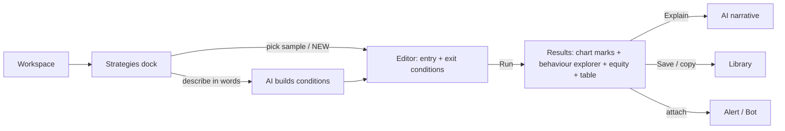

# 02 · TrendSpider — F&O strategy study

**Source:** the live product at charts.trendspider.com, logged in, 25 Sep 2026, around 08:40 IST (US market closed).
**Scope verdict:** TrendSpider **has no options strategy builder**.
- There is no multi-leg construction, strategy payoff, strategy Greeks, margin or broker basket.
- Its options features are **data widgets only**: an Options Chain grid, an Options Map heatmap and an Unusual Options (flow) widget.
- On this account all option data is locked behind an exchange agreement: "An exchange agreement is required in order to access this data. Click here to review and accept."
- I did **not** accept the agreement. Accepting terms needs the owner's explicit OK.
- It covers US equities only, with no NSE/BSE F&O.

You said to move on if TrendSpider wasn't usable, so I studied only the parts that feed the KANIDA blueprint:
- the **Strategy Tester** (the best backtest UX of the four apps);
- **alerts and bots**;
- the **widget and workspace** model.

A broader earlier study already exists at `kanida-app/docs/TRENDSPIDER_STUDY.md`. Raw notes: [raw/trendspider_notes.md](raw/trendspider_notes.md).

---

## 1. Screen inventory (relevant parts)

| # | Screen | Purpose |
|---|---|---|
| T0 | Workspace picker | Open a saved workspace or create one from a template gallery |
| T1 | Main chart workspace | Chart, drawing tools, docked widgets, watchlist/scanner column, right icon rail |
| T2 | Options dock → Options Grid | Expiry chips with DTE; calls/puts chain (locked: "no data") |
| T2a | "Add an options data widget" | Two templates: Options Chain, Options Map |
| T2b | Unusual Options widget | Options-flow widget, added from the right rail |
| T3 | Strategy Tester (library, editor, results) | Rule-based backtest of an entry/exit strategy on a symbol or a list |
| T4 | Alerts / Bots widgets | Dockable alert and bot managers; top-bar Alerts&Bots overlay toggle |

## 2. Screen detail

### T0 · Workspace picker
- **Left:** "Open a workspace of yours". Default, Day/Swing/Official/Dan's copies, Multi Symbol View, Dashboard, ML Quant Lab.
- **Right:** "Or create a new workspace" gallery with thumbnails.
- **Footer:** the plan limit (10 workspaces), with a "Chat with us" upsell.
- **Interaction:** click to open the workspace in the same tab.

### T1 · Main workspace
- **Top bar:** symbol · MTFA · Fibs · Trends · Indicators · Candle Patterns · Chart Patterns · Heatmap · Other · **Alerts&Bots** (overlay toggle) · Visual Scripts · **Sidekick** (AI) · apps grid · help · notifications.
- **Right icon rail:** watch · alerts · news · analysts · season · notes · insiders · reports · checklist · options · bots · learn · trading. Each icon opens a menu: "Add <X> widget" / "Put into a new column".
- **Bottom dock tabs:** Strategies · Scanner · Events · Stock Maps · Options · Fundamentals · Custom Indicators · ML Lab, plus **Add a widget…**.
- **Idea for KANIDA:** every tool is a dockable widget. The user composes a workspace; nothing is a dead-end page.

### T2 · Options Grid (locked)
- **Expiry chips:** Oct'26 16 M · 22 dte, Nov'26 20 M · 57 dte, Dec'26 18 M · 85 dte, … Dec'27 17 M · 449 dte. M means monthly.
- **Header:** "WST contracts expiring at 16 Oct'26, 22 days to expiration".
- **Table:** CALLS (OI, Last, Bid, Ask) | STRIKE | PUTS (Ask, Bid, Last, OI). Every cell shows "no data" behind the agreement banner.
- **Empty/error state:** the yellow banner "An exchange agreement is required…" with "Click here".

### T2a · Add an options data widget
Two templates:
- **Options Chain:** "a full detailed view for a given expiration; displays multiple metrics at a time".
- **Options Map:** "a heatmap visualizing one metric across all the strikes at all the expirations".

### T3 · Strategy Tester
- **Library panel:**
  - Search; filter chips all / yours / built-in / subscr / store.
  - Items tagged #sample or #subscription, e.g. "AAPL 8/21 EMA Cross Strategy".
  - **NEW STRATEGY**.
- **Mode selector:** Test a strategy on a single symbol | across a list of symbols | multiple strategies on a single symbol.
- **AI entry:** "Describe your strategy and AI will create and configure it" (text and mic), plus "skip to point&click editor" and "examples".
- **Editor:**
  - Name, timeframe (Daily), history depth (7000 candles), gear.
  - **Entry Conditions** and **Exit Conditions** blocks: "All of the following ▾ happened ▾".
  - Condition chips, e.g. `EMA(8,0,close)(last) Crossed Up EMA(21,0,close)`, with **add a condition**.
  - Named signals ("Delta" / "Oscar").
  - Banner on a pre-made strategy: "create your own copy to be able to save your changes".
  - Buttons **Explain** (AI) · **More…** · **Run** · **Save**.
- **Results (after Run):**
  - Entries and exits drawn on the chart: "Entry, long 355.73", "Exit +36.29% (Oscar)".
  - **Price behavior explorer:** a fan of post-entry price paths.
    - Mean and median change %.
    - A **random control** (a baseline of random entries).
    - Winners and losers counts, min/max bands, 96% bands (including pre-entry), raw data.
    - Caption "153 positions analyzed across 27.3 years of WST data (6865 candles). Mean trade return: 2.21%".
  - **Performance chart:** strategy equity vs buy-and-hold (1129% vs 3980%). Toggles for Drawdown, Sharpe, Sortino, RVOL and Correlation (each also for the asset), plus a range brush.
  - **Tabular data:** Market, **Trade cost (0% by default)**, Net Perf, Asset Perf, Beta, Positions 153, Wins 36%, Losses 64%, Max DD −53.7%, Avg Win 12.59%, Avg Loss −3.61%, Avg Return 2.21%, Rew/Risk 3.49, **Expectancy 0.6**, and a win/loss histogram.

### T4 · Alerts & Bots
- **Right rail:** alerts and bots are dockable widgets ("Add Alerts widget" / "Put into a new column").
- **Top bar:** Alerts&Bots toggles alert and bot overlays on the chart.
- **Bots** (from the prior study): alert → action automation (webhook or broker).

---

## 3. End-to-end flow (strategy test)

## 4. Feature map (vs F&O checklist)

| Checklist item | TrendSpider |
|---|---|
| Strategy builder / store / defaults / saved | ❌ for options. ✅ for indicator strategies (library + samples) |
| Strike / expiry selection, call/put legs, multi-leg | ❌ |
| Payoff, P&L table, Greeks, margin, breakeven, what-if | ❌ |
| Edit / adjust / roll | ❌ |
| Save / duplicate / delete | ✅ (strategies; copy-to-save) |
| **Backtest / simulate** | ✅ **best in class** (behaviour explorer, random control, equity vs asset, expectancy) |
| Virtual trade | ❌ observed |
| Broker handoff | ◐ via bots (not options) |
| Alerts / monitoring | ✅ alerts + bots as widgets |
| Discovery | ◐ scanner, chart-pattern scans, AI Sidekick; no options-strategy discovery |

## 5. PRD summary (the relevant slice)
- **Strategy Tester:**
  - Rule-based entry/exit on any timeframe and history depth, run on one symbol, a list, or many strategies.
  - The output must separate *edge* from *luck*: a random-entry control, win/loss distributions, pre-entry vs post-entry paths.
  - It must benchmark against buy-and-hold.
  - An AI layer turns natural language into rules and explains the results.
- **Workspace:** every capability is a dockable widget; layouts are saved per user.
- **Alerts/Bots:** conditions on chart objects or indicators trigger notifications or actions.

## 6. Strengths
1. **Backtest honesty features.** The random control, the behaviour fan and "N positions across 27.3 years" make the sample size and baseline explicit. This matches KANIDA's quant rules.
2. **AI-assisted strategy authoring and Explain.**
3. **Composable widget workspace;** alerts and bots are first-class.
4. **Clear expiry chips with DTE** in the options grid.

## 7. Weaknesses
1. **No options strategy tooling at all.** It is irrelevant for NSE F&O construction.
2. **Options data is paywalled or agreement-gated,** and the widgets are empty until the terms are accepted.
3. **Trade cost defaults to 0%** in backtests, which inflates results. This breaks KANIDA's "costs + slippage on every trade" rule.
4. **Very dense UI** with more than 20 top-level tools and a steep learning curve.
5. **US-only data.**
