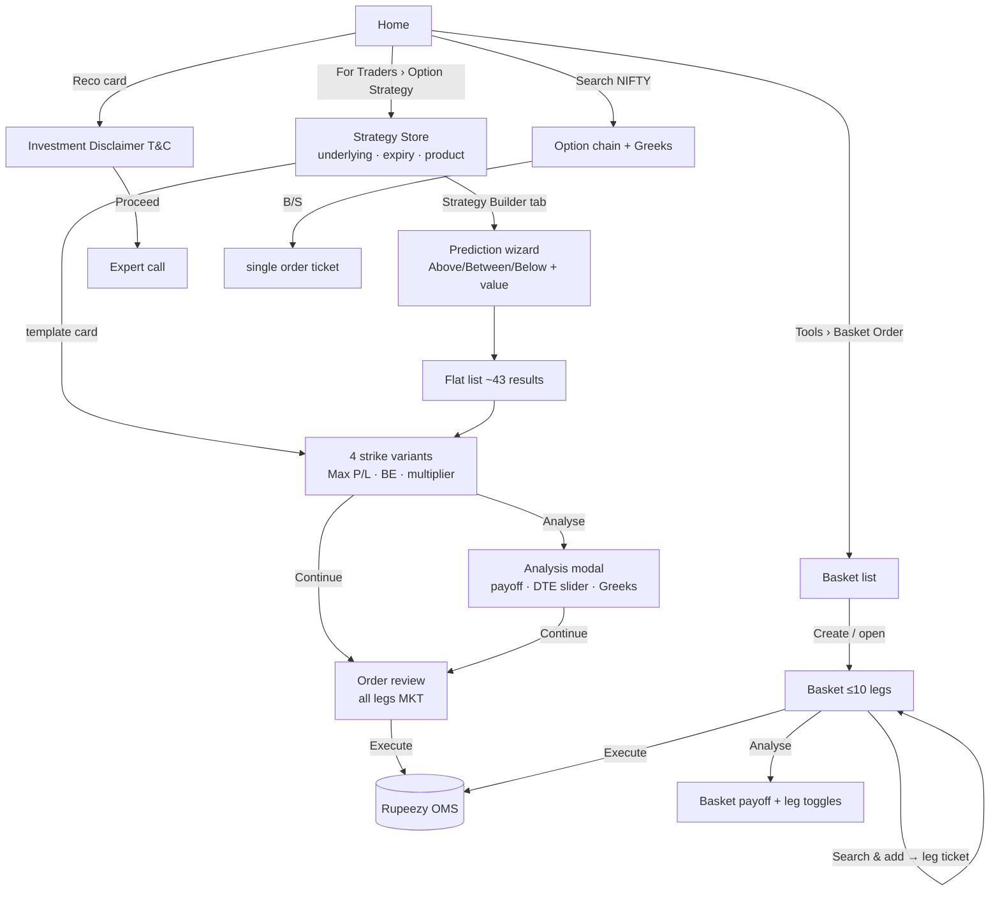
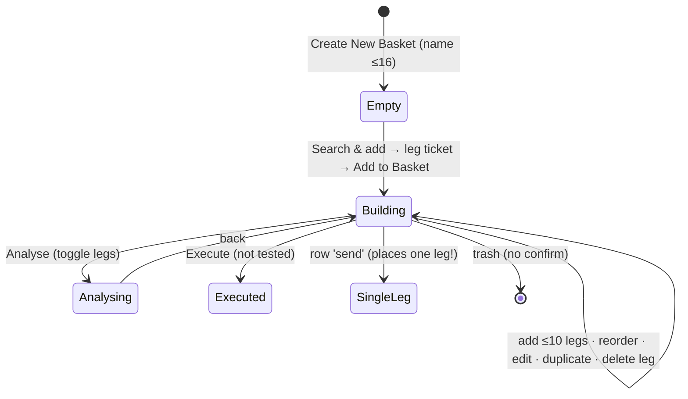

# 03 · Rupeezy / Aastha — F&O strategy study

**Source:** the live product at flow.rupeezy.in/web (Rupeezy's broker web app), logged in. Account funds were ₹0.00 available.
**When:** 25 Sep 2026, about 08:35–08:48 IST, pre-market with last-close data.
**Method:**
- Every control listed was clicked.
- The test basket "KANIDATEST" (2 legs) was created, analysed and deleted.
- The user's own 4 baskets were not touched.
- **Execute** was never clicked.
- A Terms & Conditions gate on expert recommendations was **not** accepted; it needs the owner's OK.

Raw notes: [raw/rupeezy_notes.md](raw/rupeezy_notes.md).

---

## 1. Screen inventory

| # | Screen | Entry | Purpose |
|---|---|---|---|
| R0 | Home | `/web` | Hub: expert recos, products, For Traders tiles, tools, P&L, mini chain |
| R0a | Investment Disclaimer | click a reco card | T&C gate before viewing expert F&O calls |
| R1 | Strategy Store | Home › Option Strategy → `/options-strategy/?tab=store` | 12 templates as relative-strike recipes |
| R2 | Template variants list | click a template | 4 auto-generated strike variants with Max P/L and breakeven |
| R3 | Strategy Analysis modal | **Analyse** | Payoff, DTE slider, Greeks, legs (read-only) |
| R4 | Order review | **Continue** | Leg table plus funds, then **Execute** |
| R5 | Strategy Builder (prediction wizard) | `?tab=builder` | Above/Between/Below + value → list of strategies |
| R6 | Option Chain | Search › NIFTY › Option Chain | Chain with full Greeks; single-leg B/S |
| R7 | Basket Order | Home › Tools › Basket Order or Orders › Basket | Manual multi-leg basket (≤10) with Analyse and Execute |
| R7a | Basket leg ticket | Search & add | B/S, product, lots, limit/market, SL, validity |
| R7b | Basket Analyse | basket **Analyse** | Payoff, Greeks, per-leg include toggles |
| R8 | FO Scanners | Market › FO Scanners | Most Active, OI/Price gainers and losers |
| R9 | Orders › GTT | Orders | GTT list (SL / Trail Jump / Target columns) |

---

## 2. Screen-by-screen detail

### R0 · Home
- **Purpose:** a broker home that surfaces products and expert calls.
- **What the user sees:**
  - **Header:** NIFTY and BANKNIFTY tickers, **Ask FinAI** (AI assistant pill), Home · Market · Orders · Portfolio · avatar.
  - **Left rail:** global search "Stocks & FO…" (tabs All/Equity/Options/Futures; CALL/PUT chips; NSE/BSE/MCX filter; B/S on each F&O row), 3 watchlist pages, and the empty watchlist state "Your watchlist is empty… Add Stocks".
  - **"RECOMMENDED FOR YOU by SEBI Registered Experts — Stocks and F&O":** cards like "NIFTY 06 October 2026 CE 23000 · Expected profit 50.38% · Target left 53.82%", plus View all.
  - Curated ETF Baskets and Trading Products.
  - **For Traders:** FO Scanner, T+5, **Option Strategy ("Build or use expert strategies")**.
  - **Tools:** Corporate Actions, **Basket Order**, User Preference, Keyboard Shortcuts.
  - Market News with importance and sentiment tags.
  - **Right:** Positions / Holding / MTF P&L card; a mini option chain with a scanner tab.
- **Interaction:** a reco card opens **R0a Investment Disclaimer** (market-risk bullets plus "By proceeding… I have read and accepted the Terms & Conditions") with Cancel / Proceed. I cancelled.

### R1 · Strategy Store
- **Header tabs:** **Strategy Store | Strategy Builder**.
- **Underlying chips:** NIFTY, BANKNIFTY, SENSEX, FINNIFTY, MIDCPNIFTY, NIFTYNXT50, BANKEX, plus **Search Option Symbol** for stocks (e.g. RELIANCE has monthly expiries only).
- **Select expiry:** a horizontal chip row of 18 expiries, 29 Sep 2026 … 24 Jun 2031.
- **Product Type:** Intraday | Carryforward, chosen *before* building.
- **12 template cards,** each with a payoff sparkline, a **relative leg recipe** and an ⓘ info icon:
  - Bull Call Spread: B 1 ATM CE · S 1 OTM CE.
  - Bull Put Spread: B 1 OTM PE · S 1 ITM PE.
  - Ratio Call Spread: B 1 ATM CE · S 2 OTM CE.
  - Ratio Put Spread: B 1 ATM PE · S 2 OTM PE.
  - Bear Call Spread · Bear Put Spread.
  - Short Strangle · Long Strangle.
  - Iron Condor (4 legs) · Iron Butterfly.
  - Short Straddle · Long Straddle.
- **Missing:** no bullish/bearish/neutral grouping.

### R2 · Template variants
- **Header:** ← NIFTY [INDEX][NSE], 29 Sep 2026, ₹23063.10 (chg).
- **Accordion list** of "Bull Call Spread 1…4" (progressively wider strikes). Collapsed rows show Max profit / Breakevens / Max loss and a Multiplier stepper.
- **Expanded row:**
  - Legs: "1x (B) 23050 CE 29 Sep · 152.55 · 264.60 (63.43%)". The change figure is wrong pre-open.
  - Funds bar: "⚠ Add more funds to execute this strategy" with **+ Add funds**.
  - Required 40,116.83 / Available 0.00.
  - **Analyse** | **Continue**.
- **Defect:** the collapsed breakeven is 23,078.85, but the analysis breakeven is **23,087.50** for the same strategy.

### R3 · Analysis modal
- Underlying and change.
- **Payoff chart:** expiry (red/green fill) plus T+0 (blue). The hover tooltip shows "Expected P&L at 23375 — Thu, Sep 24: 1075.45 — At expiry: 1374.75".
- **Days To Expiry** slider, 4 → 0. It moves the blue curve only; Greeks and breakeven do **not** update.
- **Right panel:** Breakeven points, Max profit, Max loss, strategy Delta / Gamma / Theta / Vega, Multiplier.
- **Legs are read-only:** no strike, qty or direction edit.
- Funds bar, Required / Available, **Continue**.

### R4 · Order review (broker handoff)
- **Title:** "Bull Call Spread 1".
- **Table:** Name (NIFTY [FO][NSE][RL-MKT], 29 September 2026 CE 23050) · Product Type (Intraday) · LTP (with change) · Order Price **MKT** · Lots/Qty 65.
- Funds bar; Required / Available; **Analyse** | **Execute** (not clicked).
- **No control over** limit price, leg order (buy-first), or slicing.

### R5 · Strategy Builder tab = prediction wizard
- **Selectors:** the same underlying, expiry and product selectors as the Store.
- **Card:** "Select prediction: Above | Between | Below" and "Enter predicted value" (two boxes for Between), then **Continue**.
- **Tested:** NIFTY Between 22900–23300. The result was a flat accordion of about 43 strategies:
  - 1 Short Straddle (Max profit 16,916.25; BE 22,789.75 / 23,310.25; Max loss **Unlimited**; Required 1,82,630.82).
  - About 41 rows **all titled "Short Strangle"** with different strikes; you must expand a row to see its strikes.
  - 1 Iron Condor at the very bottom (Max profit 923; Max loss 2,327).
  - There is **no ranking** (POP, return on margin, fit to range), no filters, and no dedupe. Unlimited-risk structures are listed first.
- **Validation defect:** after switching the underlying to RELIANCE (₹1,219), the NIFTY values 22900/23300 were kept. **Continue** did nothing. A toast "No strategies found — Try a different prediction or expiry" appeared later, after I had already navigated away.

### R6 · Option Chain (stock detail)
- **Header:** NIFTY [INDEX][NSE][**Reco**], price, **+ Add**.
- **Reco strip:** "B 06 Oct 2026 CE 23000 · Potential Gain 50.38% · Target left 53.82%", with View All.
- **Tabs:** Overview · Chart · **Option Chain** · Future Chain · News (AI Powered).
- **Chain:** expiry dropdown. Calls show Delta, Gamma, Theta, Vega, OI, IV, Volume, LTP (% chg); then Strike + **PCR (OI)**; then puts mirrored. An ATM spot pill.
- **Row hover:** **S / B / chart**. These open a *single* order ticket; you cannot multi-select legs into a strategy.

### R7 · Basket Order (the only custom multi-leg path)
- **Orders tabs:** Executed · Pending · Rejected · **GTT** · **Basket Order (n)**.
- **Basket list:** name and order count; **+ Create New Basket** opens an inline name field (≤16 chars) with ✕ / ✓; a global **Execute** button.
  - Defect: the first ✓ said "Basket name is required!" although a name was typed (focus bug).
- **Basket modal "KANIDATEST (0/10)"** (at most 10 legs):
  - Empty state: "Nothing is available in this basket. Search and click it to add to your basket."
  - A **Search & add to Basket** box.
- **R7a leg ticket:**
  - B/S toggle; Intraday | Carryforward (Max Qty).
  - Lots ("1 lot = 65 shares", Top Ask / Bid).
  - Limit | Market; Price.
  - **Stop Loss** toggle and trigger.
  - Validity DAY.
  - Required + **View Charges**, Available, **Add to Basket**.
  - Defect: the leg margin loads late and shifts the layout, so the button moves under the cursor.
- **Basket table:**
  - Columns: Name, Product, LTP, Order Price, Lots/Qty.
  - **Row hover:** drag-reorder · edit · duplicate · delete · **send** (places that single leg) · chart.
  - **Footer:** Required (approx) ₹38,336.94 · **Final (approx)** (net of hedge benefit) · Available · **Analyse** | **Execute**.
- **R7b Basket Analyse:**
  - Underlying selector; **per-leg include checkboxes**.
  - Breakeven 23,137.50 · Max profit 3,467.75 · Max loss 3,032.25 · Delta / Gamma / Theta / Vega.
  - Payoff chart. The T+0 curve appeared only after toggling a leg, and prices briefly showed 0.00 pre-open.
- **Delete:** hover the basket row → trash / eye / edit. Trash deletes **immediately, with no confirmation**, and shows the toast "Basket deleted successfully".

### R8 · FO Scanners
Filters Index / NIFTY / Expiry; chips Most Active, OI Gainers, OI Losers, Price Gainers, Price Losers. Columns Symbol, LTP, Change, % Change, OI, OI Change (%). Pre-open empty state: "No data found".

### R9 · GTT
Columns Symbol, LTP, Product Type, Lots/Qty, Status, StopLoss, **Trail Jump**, Target. It was empty. This is order-level, not strategy-level.

---

## 3. End-to-end flow

## 4. Feature map

| Area | Capability | Present | Notes |
|---|---|---|---|
| Discovery | Template store | ✅ 12 recipes, relative strikes | No intent grouping |
| | Auto strike variants per template | ✅ 4 variants | Unique idea, weak presentation |
| | Prediction wizard | ✅ Above/Between/Below | No ranking or filters; floods with strangles |
| | Expert F&O recommendations | ✅ SEBI-RA calls, T&C gate | Single-leg, % targets |
| | FO scanner | ✅ OI/price movers | |
| | AI assistant | ✅ Ask FinAI | Not tested |
| Build | Leg editing inside the strategy | ❌ | Read-only legs in the Store/Analysis |
| | Manual multi-leg | ◐ via Basket (search each contract) | ≤10 legs |
| | Chain → strategy | ❌ | Chain B/S is a single order |
| Analyse | Payoff expiry + T+0 | ✅ | DTE slider only |
| | Greeks (strategy) | ✅ static | Don't update with DTE |
| | P&L table, payoff table, POP, SD, IV what-if, spot what-if | ❌ | |
| Risk & cost | Required vs available funds | ✅ + hedge benefit in basket | Charges only per leg ("View Charges") |
| Manage | Save strategy | ❌ | Only baskets persist |
| | Duplicate / delete | ◐ legs duplicate; basket delete (no confirm) | |
| Simulate | Virtual trade / backtest | ❌ | |
| Execute | Execute strategy / basket | ✅ market orders; basket legs can be limit + SL | |
| Monitor | GTT (SL / trail / target) | ✅ order-level | No strategy-level P&L alerts |

## 5. PRD (reverse-engineered)
- **Product:** Rupeezy Option Strategy (Store + prediction builder) and Basket Order.
- **Users:** broker clients who want a quick, ready structure and one-click execution; less focus on analysis.
- **Goals:** turn a view into an executable multi-leg order in the fewest clicks inside the broker; show funds needed; drive expert-reco engagement.
- **Functional (as built):**
  1. Select underlying (7 indices plus stock search), expiry (all listed) and product type up front.
  2. **Store:** 12 templates defined as ATM/OTM/ITM recipes. On pick, generate N = 4 concrete variants of increasing width, each with Max P/L, breakeven, required margin and multiplier.
  3. **Analysis:** payoff (expiry + T+0), DTE slider, strategy Greeks, read-only legs.
  4. **Order review:** legs as market orders, required vs available funds, Execute.
  5. **Prediction builder:** Above/Between/Below and value(s) → list of candidate strategies with Max P/L, breakeven and margin.
  6. **Basket:**
     - Named baskets (≤16-char name), up to 10 legs.
     - Per-leg product, lots, limit/market, SL trigger and validity.
     - Reorder, edit, duplicate, delete, send a single leg.
     - Approximate required and final margin (with hedge benefit).
     - Analyse with per-leg include.
     - Execute all.
  7. Funds guard: an "Add more funds" banner with an Add-funds CTA on every execution surface.
- **Non-functional:** a dark theme; data appears only once the session is live (0.00 pre-open in places).
- **Not in scope (as observed):** saved strategies, paper trading, backtest, adjustments, strategy alerts, P&L table, IV/spot what-if.

## 6. Flowchart — basket lifecycle

## 7. Strengths
1. **Recipe-based templates** (B 1 ATM CE / S 1 OTM CE) teach *why* strikes are chosen and are expiry-agnostic.
2. **Automatic strike variants** (4 widths per template) with side-by-side Max P/L, breakeven and margin. A lightweight "compare structures" idea nobody else has.
3. **Product type and expiry chosen first.** Intraday vs Carryforward is explicit before building, which avoids surprises at order time.
4. **Basket with per-leg SL and limit and hedge-benefit margin** ("Final (approx)"), plus leg reorder.
5. **Funds guard everywhere:** required vs available, with an inline Add funds CTA.
6. **Full Greeks in the option chain** (Δ, Γ, Θ, Vega, IV, PCR per strike).
7. **Many underlyings** (7 indices including SENSEX and BANKEX, plus stocks) and very long expiry lists.

## 8. Weaknesses
1. **No real strategy builder.** You cannot edit a template's legs; custom structures require the Basket (searching each contract by name) or nothing.
2. **The prediction wizard floods results** (41 identically named "Short Strangle" rows, unlimited risk first, no ranking or filters).
3. **Shallow analysis:** no P&L table, payoff table, POP, SD, spot/IV what-if, and Greeks don't react to the DTE slider.
4. **Data inconsistencies:** breakeven differs between card and modal; LTP change % is nonsensical pre-open; prices show 0.00 in the basket before the open.
5. **No save, share, paper trading or backtest** for strategies.
6. **Execution risks:** strategy orders are **market-only**; a per-row "send" in the basket places a single leg (a leg-risk footgun); baskets are deleted without confirmation.
7. **Validation gaps:** stale predicted values carried across underlyings; silent Continue; late toasts; a basket-name focus bug.
8. **Expert-reco access requires accepting T&C** in a modal; the "Expected profit %" framing is promotional.
