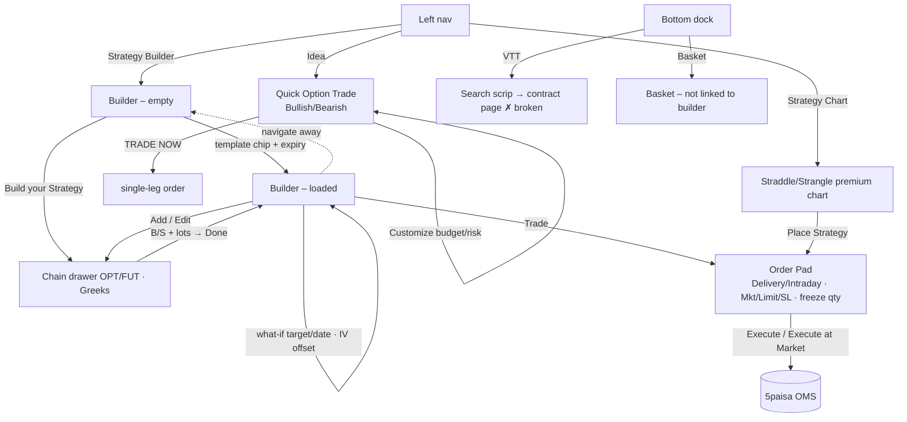
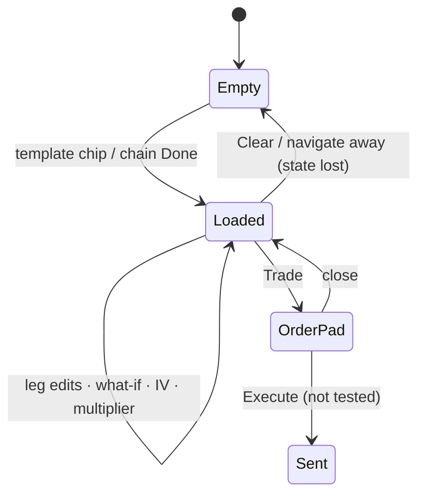

# 04 · 5paisa FNO 360 — F&O strategy study

**Source:** the live product at fno.5paisa.com, logged in. The account's MARGIN showed −88.50.
**When:** 25 Sep 2026, about 08:50–09:00 IST, pre-market with last-close data.
**Method:**
- Every control listed was clicked.
- A custom 3-leg strategy was built and analysed.
- The Order Pad was opened and closed; **Execute was never clicked**.
- A price-alert dialog was opened but not submitted.

Raw notes: [raw/5paisa_notes.md](raw/5paisa_notes.md).

> **Cross-cutting defect found here (it also partly affects Sensibull):** dates are rendered in the *browser's* timezone. The browser was in US Pacific time, so:
> - The Tuesday 29 Sep NSE expiry displays as **"28 Sep 2026"**. The Order Pad shows the true symbol "NIFTY 29SEP…", and the URL carries `expiry=2026-09-29T00:00:00Z`.
> - The last session shows as "Wed, 23 Sep 15:30" instead of Thu 24 Sep.
> - The date stepper walks through "Sun, 27 Sep".
> - The Strategy Chart's time axis reads 8:45 PM–2:55 AM.
>
> KANIDA must render every market time in **exchange time (IST)** regardless of client timezone.

---

## 1. Screen inventory

| # | Screen | Entry | Purpose |
|---|---|---|---|
| P0 | App shell | fno.5paisa.com | Left tool nav + bottom dock panels |
| P1 | Strategy Builder – empty | left nav › Strategy Builder | Pick a template or "Build your Strategy" |
| P2 | Strategy Builder – loaded | template chip / chain Done | Edit legs; payoff, P&L, Greeks, IV |
| P3 | Chain drawer | **Add / Edit** / **Build your Strategy** | Pick legs (OPT/FUT, Greeks toggle) |
| P4 | Order Pad | **Trade** | Per-leg order types → Execute |
| P5 | VTT (Virtual Trade) panel | bottom dock › VTT | Single-scrip virtual orders |
| P6 | Company Info (contract page) | search result | Contract stats, chart, depth, Price Alert, Add to Basket |
| P6a | Set Price Alert | **Price Alert** | LTP rises-above / falls-below alert |
| P7 | Idea › Derivatives | left nav › Idea (NEW) | Quick Option Trade (bullish/bearish → ATM/OTM calls/puts) and expert calls |
| P7a | Idea › Customize | **Customize ▾** | Budget, max-loss %, profit % for idea sizing |
| P7b | Idea › Basket Ideas | tab | Expert derivative baskets |
| P8 | Strategy Chart | left nav | Intraday straddle/strangle premium chart → Place Strategy |
| P9 | Basket panel | bottom dock | Multi-order baskets |
| P10 | Positions panel | bottom dock | Positions / Groups (New) |

---

## 2. Screen-by-screen detail

### P0 · Shell
- **Top bar:** logo · NIFTY / BANKNIFTY tickers · **MARGIN −88.50 [+]** · Search & Trade · Products · bell · settings · user (name and client code).
- **Left nav:** Overview · Option Chain · Open Interest · Scalper · **Idea (NEW)** · F&O Stats · Strategy Chart · **Strategy Builder** · Company Info.
- **Bottom dock:** Positions (P/L) · Orders · Holdings · **VTT** · **Basket** · Watchlist · Screener · News. These are slide-up panels that overlay the page. Clicking near the edge of a tab opened the neighbouring one (hit-target issue).

### P1 · Strategy Builder – empty
- Instrument search "NIFTY 23063.10 −1.63%"; **Clear** · refresh · ⚙.
- An empty card with a single **Build your Strategy** button.
- **Ready-made:** Bullish | Bearish | Neutral | Others and an expiry dropdown (28 Sep*, 05 Oct (W), 12 Oct (W), 18 Oct (W), 26 Oct, 02 Nov…; * = TZ bug). Templates are compact **pill chips** with a payoff sparkline:
  - **Bullish (11):** Buy Call, Sell Put, Bull Call Spread, Bull Put Spread, Call Ratio Back Spread, Long Calendar With Calls, **Long Call Diagonal Spread**, Bull Condor, Bull Butterfly, Range Forward, **Synthetic Long Call**.
  - **Bearish (11):** Buy Put, Sell Call, Bear Put Spread, Bear Call Spread, Put Ratio Back Spread, Long Calendar With Puts, **Long Put Diagonal Spread**, Bear Condor, Bear Butterfly, Risk Reversal, Synthetic Short Call.
  - **Neutral (8):** Short Straddle, Iron Butterfly, Short Strangle, Short Iron Condor, Batman, Double Plateau, Jade Lizard, Reverse Jade Lizard.
  - **Others (8):** Call Ratio Spread, Put Ratio Spread, Long Straddle, Long Iron Butterfly, Long Strangle, Long Iron Condor, Strip, Strap.

### P2 · Strategy Builder – loaded
Bull Call Spread was instantiated as 23050 / **23300**, 250 wide (Sensibull uses 200).
- **Leg table:**
  - Columns: [✓] · B/S pill · Expiry ▾ · – Strike + · CE/PE · – Lots + · Entry Price (editable) · LTP · 🗑. Master checkbox.
- **Footer:** "Net Premium **Pay 104.40**" · Lot Multiplier stepper · **Trade** · **Add / Edit**.
- **Absent:** Save, Save As, Share, Drafts, Charges, Shift/Width/Hedge, auto strategy name.
- **Summary strip** (each metric has an ⓘ tooltip):
  - Max. Profit 9,464.00 (22.86%) · **Prob. of Profit 42.87%** · **Margin Required 41,396.88** · **Funds Needed 44,526.63**.
  - Max. Loss −6,786.00 (−16.39%) · RR Ratio 0.72 · Breakevens 23,154.41 (0.40%).
- **Tabs:**
  - **Payoff charts:** expiry + T+0 curves, ±1SD/±2SD lines, "Price (23,063.10)" and "P&L (x)" markers.
  - **P&L Table:** Instrument, Target P&L, Target Price, Entry Price, LTP, Total.
  - **Greeks ⓘ:** per-leg Delta, Theta, Decay, Gamma, Vega + Total.
  - **Strategy Charts:** blank axes only, no data and no message (broken pre-market).
  - **MultiStrike OI:** "Please select strategy to draw charts" even with a strategy loaded (broken).
- **What-if:**
  - NIFTY **Target** stepper, % and slider, Reset.
  - "Target Date: 5 days to Expiry ⓘ" with ‹ ›, slider and Reset.
  - Tested target 23300 at 1 DTE: P&L 4,699.50, and **POP recalculated to 41.97%**.
- **Strikewise IV:** Offset stepper, Reset IV, per-leg IV steppers.
- **⚙ Builder settings:** Multiply By Lot Size · Manual P&L.
- **Custom 3-leg** (added S 22950 PE): Max profit 14,115 · **Max loss Unlimited** · POP 51.93% · Margin **2.01 L** · RR NA · BE 23,082.86. There is **no strategy name**, and the "Bull Call Spread" chip stays highlighted (stale).
- **Persistence:** leaving the page and returning shows an **empty builder**. There are no saved strategies at all.

### P3 · Chain drawer
- **Controls:** **OPT | FUT** · expiry ▾ · spot · **Greeks** checkbox · **Reset** · **Done**.
- **Rows:** Call LTP | **B S (always visible, no hover needed)** | OI value + bar | **Strike** | OI | **B S** | Put LTP. The ATM row is highlighted.
- **Greeks on:** Gamma · Vega · Theta · Delta · LTP on each side.
- **After a pick:** an inline **– 1 +** lot stepper appears under the B/S of that strike.
- **FUT:** 28 Sep / 26 Oct / 22 Nov (TZ-shifted) with B/S and LTP; no synthetic futures.

### P4 · Order Pad (broker handoff)
- **Header:** Delivery | Intraday.
- **Per leg:**
  - B/S badge and name "NIFTY 29SEP 23050 CE" (correct date here).
  - Product tag (DELIVERY).
  - **Market | Limit | SL** radio.
  - Qty stepper (65) with "**Freeze Qty 1755**".
  - Price, **Trigger**, LTP.
- **Buttons:** **Execute At Market** · **Execute** (not clicked).
- **Missing:** margin, charges, leg sequencing and a "not enough funds" warning, even though MARGIN is negative.

### P5 · VTT (virtual trading)
- **Empty state:** "No VTT orders placed" with **Start New VTT**.
- **Start:** "Search Scrip for VTT" (All / FNO / Equity / ETF, Recent View). Virtual trading is **single-scrip only**, not strategy-level.
- **Defect:** selecting a contract **navigated away** to the Company Info page, and the VTT search then showed "No Records Found!". I could not complete a virtual trade from the builder.

### P6 · Company Info (contract)
- **Header:** contract · LTP/chg · **Price Alert** · **Add to Basket** · **Add to Watchlist** · **Buy** · **Sell**.
- **Stats strip:** Open, High, Low, Pclose, Volume, Upper/Lower Circuit, ATP, Lot Size 65, OI 71.71L, Change in OI, Spot Rate.
- A TradingView chart (1m…MAX) and **Market Depth** (Best Bid/Ask, 5 levels, total buy/sell qty).
- **P6a Set Price Alert:** "Alert me when LTP price" **Rise Above | Falls Below** · Limit Price · Alert at [value] · Add Message · **Set Alert**. Contract-level only.

### P7 · Idea › Derivatives (discovery)
- **Tabs:** Derivatives (NEW) | Basket Ideas | Commodity (NEW).
- **QUICK OPTION TRADE:** NIFTY / BANKNIFTY / SENSEX cards, each "**Bearish ← Guess the trend → Bullish**".
- **Bullish NIFTY** returns 3 **single-leg** call cards:
  - ATM 23050 CE [RECOMMENDED][**HIGH RISK**]; OTM1 23100 CE [**LOW RISK**]; OTM2 23150 CE [**LOW RISK**].
  - Each shows CMP, Enter, **Target (entry × 1.4)**, **Stop Loss (entry × 0.7)**, Investment Req. (₹9.92K), Expected Loss / Expected Profit, a Lots stepper and **TRADE NOW**.
  - The risk labels are **misleading**: a far-OTM long option is not lower risk. It has a lower probability of profit and the same 100%-loss potential.
- **P7a Customize ▾:** Amount you want to trade with (10000) · **Max loss you are ready to take** 30 % ⇄ ₹3000 ("for calculating stoploss") · **Profit you'd like to book** 40 % ⇄ ₹4000 · **Save**. This is budget and risk-appetite sizing.
- **SHORT TERM / INTRADAY:** expert calls with View History / View All. Empty: "No active calls available at this time".
- **P7b Basket Ideas:** "Derivative Baskets by Vibhore Gupta ⓘ"; none active; View History.

### P8 · Strategy Chart
- **STRADDLE CHART | STRANGLE CHART** dropdown · NIFTY / BANKNIFTY / FINNIFTY / MIDCPNIFTY · Call strike ▾ · Put strike ▾ · Expiry 29 Sep'26.
- An intraday line of strangle premium vs NIFTY (dual axis) · **Place Strategy** CTA.

### P9 · Basket (dock)
Empty state "No Baskets — Create a basket and place multiple order at one time" with **Add New Basket**. There is no link from the builder to a basket.

### P10 · Positions (dock)
Positions | **Groups (New)**; All/Open/Closed/Day counts. Columns Company/Contract, B/S, Qty, Avg Price, LTP, P&L; Total Buy/Sell; Booked/Unbooked/Total P&L. Controls: refresh, search, collapse, filter, pop-out, close. Empty state "There are no open Positions".

---

## 3. End-to-end flow

## 4. Feature map

| Area | Capability | Present | Notes |
|---|---|---|---|
| Discovery | Template library | ✅ 38 incl. diagonals | Compact chips |
| | View-based wizard | ◐ "Guess the trend" → single-leg calls/puts only | No multi-leg suggestion |
| | Budget / risk-appetite sizing | ✅ Customize (amount, max-loss %, profit %) | Mechanical % targets |
| | Expert calls / baskets | ✅ (none active) | |
| Build | Chain drawer with persistent B/S + inline lots | ✅ | Best hit-targets |
| | Leg edit | ✅ strike ±, lots ±, expiry, price | |
| | Bulk shift / width / auto-name | ❌ | |
| | Futures | ✅ (no synthetic) | |
| Analyse | Payoff expiry + T+0 + SD | ✅ | |
| | P&L table, Greeks per leg | ✅ | |
| | POP (updates with what-if) | ✅ | |
| | IV what-if | ✅ offset + per strike | |
| | Payoff table, OI overlay, strategy price history | ❌ / broken | Strategy Charts and MultiStrike OI broken |
| Risk & cost | Margin Required + Funds Needed | ✅ | No charges breakdown; no shortfall warning |
| Manage | Save / duplicate / share / persist | ❌ | Lost on navigation |
| Simulate | VTT virtual trading | ◐ single-scrip, broken flow | |
| | Backtest | ❌ | |
| Execute | Order Pad (Mkt/Limit/SL, trigger, freeze-qty aware) | ✅ | Execute-at-market shortcut |
| Monitor | Price alert (contract) | ✅ | No strategy alerts |
| | Positions groups | ✅ (New) | |

## 5. PRD (reverse-engineered)
- **Product:** 5paisa FNO 360 — a trader terminal with a Strategy Builder.
- **Users:** active F&O traders on 5paisa who want fast construction and execution inside the broker.
- **Goals:** build → analyse → execute in one screen; discover quick directional trades; practise via VTT.
- **Functional (as built):**
  1. Instrument search; expiry dropdown with weekly tags.
  2. Template chips (38) by intent.
  3. Chain drawer: OPT/FUT, Greeks toggle, persistent B/S, inline lots.
  4. **Leg table:** include, B/S, expiry, strike ±, CE/PE, lots ±, entry price, LTP, delete; lot multiplier; net premium.
  5. **Metrics:** Max P/L (with % of margin), POP, Margin Required, Funds Needed, RR, breakevens.
  6. **Tabs:** payoff (expiry, T+0, SD), P&L table, Greeks, strategy charts, multi-strike OI.
  7. What-if: target spot and target date; IV offset and per-strike IV.
  8. **Order Pad:** product, per-leg order type (Mkt/Limit/SL), qty with freeze-qty hint, price, trigger; Execute or Execute at Market.
  9. **Idea:** quick option trade by trend, with Customize sizing (amount, max-loss %, profit %).
  10. VTT (virtual) by scrip; baskets; positions groups; contract price alerts.
- **Non-functional:** dark trader UI; dockable bottom panels. **Defect:** dates are shown in the client timezone.
- **Not built:** save/persist, share, strategy-level virtual trade, backtest, strategy alerts, adjustment helpers.

## 6. Flowchart — builder state

## 7. Strengths
1. **The best chain picker ergonomics:** B/S always visible on every strike, an inline lot stepper right where you clicked, and a Greeks toggle in the drawer.
2. **The most complete template set** (38, including **diagonal spreads** and synthetic long/short calls).
3. **Clear money metrics:** separate "Margin Required" and "Funds Needed"; Max P/L also shown as % of capital; **POP recalculates** with the what-if date and target.
4. **An Order Pad with real order controls:** Market/Limit/**SL with trigger**, a **freeze-quantity** hint, and an Execute-at-Market shortcut.
5. **Budget-first sizing** in Idea › Customize (trade amount, max loss %, profit %). A natural beginner framing.
6. **Straddle/strangle premium chart** with a direct Place Strategy CTA.

## 8. Weaknesses
1. **Nothing persists:** no save, no drafts, no share; the builder resets on navigation.
2. **Timezone bug** across expiries, target dates and chart axes (wrong day shown to any non-IST client, e.g. NRIs).
3. **Broken tabs:** Strategy Charts shows empty axes; MultiStrike OI says "select strategy" while one is loaded; neither has a clear empty or error state.
4. **VTT is single-scrip and its flow is broken** (it jumps to a contract page with "No Records Found").
5. **Discovery is shallow and misleading:** "Guess the trend" gives only single-leg calls or puts; "LOW RISK" is attached to far-OTM buys; targets and stops are fixed percentages.
6. **The Order Pad shows no margin or shortfall** even when account MARGIN is negative.
7. **No auto strategy naming;** the stale template highlight stays after custom edits.
8. **Builder and Basket are not connected.** There are no bulk Shift/Width/Hedge adjusters, no payoff table and no charges breakdown.
