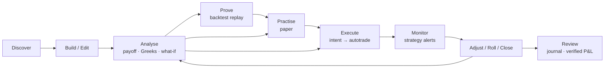

# KANIDA Strategy Builder — Build Blueprint (v1.0)

**Status:** proposal for owner review · **Date:** 25 Sep 2026 · **Author:** Claude (CTO/PM/UX role)
**Inputs:** hands-on study of Sensibull, TrendSpider, Rupeezy/Aastha and 5paisa in their live, logged-in products ([01](01_SENSIBULL.md) · [02](02_TRENDSPIDER.md) · [03](03_RUPEEZY_AASTHA.md) · [04](04_5PAISA.md) · [05 comparison](05_COMPARISON.md)), and the existing KANIDA stack:
- `engine/backend/autotrade` — broker adapters, risk, order ledger;
- `kanida-app/server/kanida_pilot` — IV solver, derivatives reader, Discover/strategy registry, simulation;
- the cloud derivatives store, which starts empty.

This document is meant to be complete enough for engineering and UX to build from **without reopening the competitor apps**. Every competitor idea is credited in Appendix A so it can be traced.

---

## 0. Non-negotiable principles
These are inherited from `~/.claude/rules/quant.md` and `docs/AGENTS_PLATFORM.md`. Every screen and endpoint below must satisfy them.

| # | Principle | What it forces in this product |
|---|---|---|
| P1 | **Point-in-time is law** | Discovery, backtests and "evidence" badges use only data available at the decision time. A historical occurrence counts only when `available_from_idx = entry_idx + MAX_HORIZON − 1 ≤ today_idx`. |
| P2 | **Entry = next open; costs and slippage on every simulated trade** | Backtests, paper fills and projected P&L are shown **net of F&O charges and a slippage model**. Paper fills use bid/ask, not LTP. |
| P3 | **ETV decides, not win rate** | Discovery ranks by the **95% lower bound of expectancy per rupee of margin**, computed by replaying the *exact* strategy (strikes rule, stop/target/trail/horizon) — never by POP or win rate alone. |
| P4 | **Never fabricate** | Every number carries a provenance tag: `broker` · `exchange` · `computed` · `model` · `backtest(n=…)`. Small samples (n < 30) are labelled. Model values (BSM, POP) are labelled "model". Nothing is shown that the system did not compute or receive. |
| P5 | **Discovery vs out-of-sample** | Any rule calibrated for ranking must show both its discovery and its OOS numbers. OOS decides the badge. |
| P6 | **Execution boundary** | The Strategy Builder **emits intents only**. Orders route through `backend/autotrade/` — paper by default, cert-gated per broker, armed by an operator. The UI never calls a broker. |
| P7 | **Exchange time** | Every date and time is rendered in **Asia/Kolkata**, whatever the client timezone. This is a fix for a bug seen live in 5paisa and Sensibull. |
| P8 | **No silent risk** | Unlimited-loss structures, naked shorts, a margin shortfall, freeze-qty breaches and illiquid legs are blocked or explicitly acknowledged before any order intent. Nothing defaults to the riskier choice (Sensibull's straddle picker defaults to *short*; KANIDA must not). |

---

## 1. Product definition

### 1.1 One object, one lifecycle
The core idea: **a single `Strategy` object** moves through every stage. Competitors split this across unrelated products: Sensibull's Builder / Drafts / Positions, and 5paisa's Builder / VTT / Basket.



`Strategy.status ∈ {draft, saved, paper, pending_live, live, closed, archived}`. Its versions are immutable snapshots. Every stage reads and writes the same `strategy_id`.

### 1.2 Personas and primary jobs
| Persona | Job to be done | Entry point | Competitor reference |
|---|---|---|---|
| **Starter** (new to F&O) | "I think NIFTY goes up a bit this week. What's safe?" | Discover → *Guided* | Sensibull Easy Options, 5paisa budget sizing |
| **View-holder** | "NIFTY between 22,900 and 23,300 by Tuesday. Best structure for ₹50k?" | Discover → *View* | Sensibull Wizard, Rupeezy prediction |
| **Structurer** | "Iron condor, 200 wings, weekly — show me the risk" | Build | Sensibull Builder, 5paisa chain |
| **Manager** | "My short strangle is being tested. Adjust or roll?" | Monitor → Adjust | *nobody does this* |
| **Evidence-seeker** | "Has this setup actually made money?" | Prove | TrendSpider Strategy Tester (not options) |

### 1.3 Success metrics
| Metric | Target (90 days after GA) |
|---|---|
| View → first analysed strategy | < 30 s median |
| Strategies analysed per active user per week | ≥ 5 |
| Save / paper rate among analysed strategies | ≥ 25% |
| Paper → live conversion (armed users) | tracked, no target (compliance) |
| Order intents rejected by pre-trade checks and then *fixed* by the user | ≥ 60% of rejects |
| Alert-to-action time on tested breakevens | < 2 min median |
| Data-provenance coverage (numbers carrying a tag) | 100% |

---

## 2. Information architecture and navigation

```
KANIDA ▸ Strategies (new top-level area)
 ├─ Discover            /strategies/discover        (Guided · View · Ideas)
 ├─ Builder             /strategies/build/:id?      (the workbench)
 ├─ My Strategies       /strategies/mine            (Saved · Paper · Live · Closed · Archived)
 ├─ Backtest Lab        /strategies/lab/:id?        (Prove: replay + results)
 ├─ Monitor             /strategies/monitor         (live + paper strategies, alerts, adjust)
 └─ Library             /strategies/library         (template recipes + learn)
```

- **Web:** a left rail with these six items, reusing the Falcon shell and locked mint theme. The Builder is also embeddable as a **Workspace widget** (`src/workbench`), following TrendSpider's composability, so a trader can dock Chain + Builder + Monitor side by side.
- **Mobile:** a bottom tab bar with Discover · Build · My Strategies · Monitor. Library and Lab are reachable from inside those screens.
- **Global context bar** (every Strategies screen): Underlying selector · spot (IST timestamp, provenance) · selected expiry with DTE · Paper/Live mode pill · margin available (broker-sourced, or "not connected").

---

## 3. User journeys

### J1 · Starter: from a view to a safe paper trade (≤ 6 taps)
1. **Discover › Guided.** Pick NIFTY → "Up a little / Sideways / Down a little / Big move either way".
2. **Budget and risk.** Amount ₹25,000, "I can lose at most ₹3,000" (slider with a % ⇄ ₹ toggle, from 5paisa).
3. See **3 cards**: *Defensive / Balanced / Aggressive* (Sensibull Easy Options). Each has:
   - a plain-English thesis;
   - max profit, max loss and breakeven;
   - **"Tested on 212 past weeks: avg +₹410/lot after costs, 95% low +₹60"**, or **"No reliable history — model only"** (P3/P4).
4. Tap a card to open **Explain** ("How this trade works", the Sensibull pattern) with a mini payoff.
5. **Practise on paper** (default CTA). *Trade live* is secondary and needs a connected, certified broker.
6. The strategy appears under My Strategies › Paper with live MTM, and an alert is auto-set at a breakeven breach.

### J2 · View-holder: ranked structures for a range view
1. **Discover › View.** Underlying, then *Above / Between / Below*, target(s), date (expiry or a specific date), budget and max loss.
2. **Filters** (collapsed by default): hedged only (on), premium Get/Pay, expiries, delta range, max legs, liquidity floor.
3. **Results:** at most **5 deduplicated structures** (fixing Rupeezy's 43-row flood). They are ranked by **backtested ETV 95% low per ₹ margin**, then by fit to the view. Each shows:
   - structure name and recipe;
   - max P/L, breakeven(s), margin, POP (model);
   - the evidence badge;
   - a *reason line* ("Profits if NIFTY stays in 22,850–23,340; wings cap the loss at ₹2,327").
4. **Compare** (2–3 selected): overlaid payoffs, side-by-side metrics (Rupeezy's variants idea, done properly).
5. **Open in Builder** loads the strategy with all what-if axes pre-set to the user's view.

### J3 · Structurer: build an iron condor from scratch
1. **Builder › + Add legs** opens the **Chain picker** (5paisa ergonomics + Sensibull modes): persistent B/S on every strike, inline lot stepper, and LTP/OI/Greeks views.
2. The legs appear in the **Leg editor**. Auto-recognition says "Short Iron Condor". The payoff, 4 key numbers and a warnings strip update live.
3. **Adjusters:** *Shift* all ±1 strike, *Width* ±, *Wings* ± (Sensibull's Shift/Width/Hedge).
4. **What-if bar:** "NIFTY at 23,250 on Mon 28 Sep with IV +2". This is one control.
5. **Analyse drawer:** payoff table, P&L by leg, Greeks by leg, SD bands, OI overlay, IV by strike.
6. **Save** (autosave is always on) → **Prove** (backtest) → **Paper** or **Trade**.

### J4 · Manager: a strategy under pressure
1. A push alert: "Short strangle NIFTY 29-Sep: spot 23,318 is within 0.2% of the upper breakeven 23,340; delta −0.42".
2. **Monitor › strategy card › Adjust** opens the **Adjustment assistant**, which offers three candidates:
   - Roll the call up +100;
   - Convert to an iron condor (buy the 23,500 CE);
   - Close the tested side.
   Each shows the *new* payoff overlaid on the current one, the cost/credit, the Δ change and the margin change.
3. Picking one creates **a new version** of the same strategy, and the Order preview shows only the *delta orders*.
4. Confirm → intent → autotrade (paper or live, as armed). The alert rule re-arms at the new breakevens.

### J5 · Evidence-seeker: prove before trading
1. **Builder › Prove** opens the Backtest Lab with the rule pre-filled from the strategy:
   - strike rule relative to ATM;
   - entry weekday and time;
   - exit rules (target %, stop %, time exit, expiry);
   - lots.
2. **Run** shows equity after costs, the trade list, expectancy with a 95% CI, drawdown, a random-entry control (TrendSpider), and discovery vs OOS split bars. A sample-size label is always present.
3. **Attach evidence** stores the run on the strategy. Discover can then show the badge.

---

## 4. Screen-by-screen design
Wireframes are ASCII at the web width (≥1280). Mobile variants are in §15. Every screen lists **states**: Loading · Empty · Error · Stale data · Market closed · Not connected.

### K1 · Discover — Guided (Starter)
```
┌ Context bar: NIFTY 23,063.10 ▼1.64% (exchange · 15:30 IST) | Expiry 29 Sep (4 DTE) ▾ | PAPER ● ┐
│  Where do you think NIFTY goes by Tue 29 Sep?                                                   │
│  [Up a little] [Sideways] [Down a little] [Big move either way] [Not sure → learn]              │
│  Budget ₹[25,000]   Max I can lose ₹[3,000] ⇄ %[12]                                              │
├──────────────┬──────────────┬──────────────┐                                                    │
│ DEFENSIVE    │ BALANCED     │ AGGRESSIVE   │  ← risk bar (green→amber→red)                      │
│ "Profits if  │ "Profits     │ "Profits if  │                                                    │
│ NIFTY stays  │ above 23,147 │ NIFTY > …"   │                                                    │
│ above 22,972"│ up to 23,200"│              │                                                    │
│ Max +₹1,826  │ Max +₹3,468  │ Max +₹8,554  │                                                    │
│ Max −₹4,674  │ Max −₹3,032  │ Max −₹8,554  │                                                    │
│ Margin ₹39k  │ Margin ₹33k  │ Premium ₹8.5k│                                                    │
│ ◉ Tested n=212 · 95% low +₹60/lot   | ◌ Model only — no reliable history                        │
│ [Explain] [Practise on paper ▸] [Trade]                                                         │
└─────────────────────────────────────────────────────────────────────────────────────────────────┘
```
- **Behaviour:**
  - Cards are generated by the Discovery engine (§7) with `max_legs ≤ 2` and `hedged=true`. Aggressive may be a single long option; it is never a naked short.
  - Budget and max-loss filter the candidates. Ones that exceed max loss are hidden and replaced by the next candidate, with a note: "2 structures hidden: loss above your limit".
- **Explain modal:** thesis bullets, a payoff mini-chart with hover, "Max profit when…", "Max loss when…", breakeven "needs a move of +0.4%", margin with a *Refundable* tag, what could go wrong, and the evidence detail (n, period, OOS).
- **States:**
  - **Market closed:** cards still render on last-close data with the banner "Prices as of Thu 24 Sep 15:30 IST". Never show "offline"; Sensibull's Wizard does.
  - **No candidates:** "No hedged structure fits ₹3,000 max loss for this view. Try a later expiry or a higher limit."

### K2 · Discover — View (View-holder)
```
┌ Underlying [NIFTY ▾]  View [Above|Between|Below]  Target [22,900]–[23,300]  By [29 Sep ▾|date]  ┐
│ Budget ₹[50,000]  Max loss ₹[5,000]   [Filters ▾]                        [Find strategies]       │
├───────────────────────────────────────────────────────────────────────────────────────────────── │
│ 5 structures · ranked by tested expectancy per ₹ margin (95% low) · as of 09:31 IST               │
│ ┌──┬───────────────────────────┬─────────┬────────┬──────────┬────────┬───────────┬──────────┐    │
│ │☐ │ Short Iron Condor 22.8/23.4│ +₹923   │ −₹2,327│ 22,736–  │ ₹31k   │ ◉ n=148   │ POP 58%  │    │
│ │  │ "wings cap loss; fits range"│ max P  │ max L  │ 23,336 BE│ margin │ +₹0.9/₹100│ (model)  │    │
│ │☐ │ Short Strangle 22.8/23.35 …│ …       │ Unltd ⚠│ …        │ ₹1.8L  │ ◌ model   │ …        │    │
│ └──┴───────────────────────────┴─────────┴────────┴──────────┴────────┴───────────┴──────────┘    │
│ [Compare (2)]  [Open in Builder]                                                                  │
└───────────────────────────────────────────────────────────────────────────────────────────────────┘
```
- **Filters drawer:**
  - Hedged only (default ON).
  - Premium Get/Pay; expiries (multi-select).
  - Max legs 2/3/4.
  - Delta range.
  - **Liquidity floor** (min OI, max bid-ask % per leg).
  - Strategy families (checkboxes with counts, from Sensibull).
  - IV assumption at target (per expiry, default = current ATM IV; a "model" tag appears when changed).
- **Unlimited-risk rows:** shown only if "Hedged only" is off. They carry an ⚠ Unlimited chip and sort *after* hedged rows of equal score.
- **Compare view:** overlaid payoffs (distinct colours), a metric table, and the evidence per row.
- **States:** "Finding structures…" skeleton (P50 < 1.5 s); an error with retry; "No structures fit" with the reason (which constraint excluded the most).

### K3 · Discover — Ideas
- The curated feed: KANIDA agent outputs (e.g. Chart Agent, and a future Options Agent). Each card is a strategy object with its evidence and author.
- **Compliance:** the idea's source and author are shown (e.g. "KANIDA Options Agent · rule v3 · OOS n=96"). There is no "Expected profit 50%" framing (a Rupeezy anti-pattern). A disclaimer is shown once per session as a dismissible banner; it is not a T&C gate.

### K4 · Builder (the workbench) — web layout
```
┌ Context bar ────────────────────────────────────────────────────────────────────────────────────┐
│ ◀ My Strategies   "NIFTY Iron Condor 29-Sep" ✎  v7 · autosaved 09:42:11 IST   [Prove] [Paper ▸] [Trade ▸] │
├──────────── LEFT 40% ─────────────────────────┬──────────── RIGHT 60% ──────────────────────────┤
│ Recognised: SHORT IRON CONDOR  ⓘ               │ KEY NUMBERS                                     │
│ ┌─┬──┬────────┬──────────┬────┬──────┬───────┬─┐│ Max profit +₹923   Max loss −₹2,327 (capped)   │
│ │✓│S │29 Sep ▾│−[23,300]+│ CE │−1 lot+│ 48.15 │⋯││ Breakevens 22,736 · 23,336   POP 58% (model)   │
│ │✓│B │29 Sep ▾│−[23,500]+│ CE │−1 lot+│ 12.25 │⋯││ Margin ₹31,420 (broker) · Funds needed ₹31,980 │
│ │✓│S │29 Sep ▾│−[22,850]+│ PE │−1 lot+│ 30.50 │⋯││ Net credit ₹1,846 · Charges ~₹96 (est.)        │
│ │✓│B │29 Sep ▾│−[22,650]+│ PE │−1 lot+│ 12.40 │⋯││ ◉ Tested n=148 · 95% low +₹41/lot · OOS ✓       │
│ └─┴──┴────────┴──────────┴────┴──────┴───────┴─┘│ ┌ PAYOFF ─────────────────────────────────────┐ │
│ [+ Add legs] [Shift −|+] [Width −|+] [Wings −|+]│ │  expiry ─── / target-date ─── / ±1σ ±2σ     │ │
│ Multiplier ×[1]   Price mode ( LTP | Mid | Custom )│ │  spot ▲  target ◆  "At 23,250 on 28 Sep:   │ │
│ ⚠ Warnings (2): • 23,500 CE spread 6% • expiry  │ │   +₹612 (net of costs)"                     │ │
│   in 4 days: gamma risk      [explain]          │ └─────────────────────────────────────────────┘ │
│                                                  │ WHAT-IF  NIFTY [23,250]◆  on [Mon 28 Sep 15:30]│
│ Tabs: Legs | Notes | Versions                    │ IV [+2]  [Reset]                               │
│                                                  │ [Analyse ▾]  Payoff table · P&L by leg · Greeks│
│                                                  │              · SD · OI overlay · IV by strike  │
└──────────────────────────────────────────────────┴─────────────────────────────────────────────────┘
```
**Leg row controls:**
- ✓ includes the leg in analysis (a what-if exclude; it never deletes).
- **B/S** toggle.
- **Expiry ▾** per leg, which enables calendars and diagonals.
- **Strike −/+** steps by the instrument's strike interval; typing snaps to the nearest valid strike.
- **Type** CE/PE/FUT.
- **Lots −/+.** Qty is shown in a tooltip as lots × lot size.
- **Price:** LTP by default. The price-mode switch offers LTP / Mid / Custom. Custom is marked ✎, and "Reset prices" appears.
- **⋯ menu:** Market depth (5-level) · Duplicate leg · Move to other expiry · Delete (undoable, 5 s snackbar).

**Adjusters:**
- **Shift** moves every strike by ±1 interval.
- **Width** changes the distance between short strikes (straddle ↔ strangle).
- **Wings** changes the long-to-short distance.
- **Roll expiry** moves all legs to the next expiry (in the ⋯ of the leg header).

**Auto-recognition:** the recognised name (from the template library) or "Custom (4 legs)". It updates live; the template highlight clears when the legs diverge (a 5paisa stale-highlight bug).

**Warnings strip** (explainable, with a fix CTA each):
- unlimited loss;
- margin shortfall;
- illiquid leg (spread > X% or OI < Y);
- freeze-qty exceeded (auto-slice note);
- expiry-day gamma;
- event before expiry (results / RBI, from the events calendar);
- short strike beyond 2σ without a hedge;
- ITM short near expiry (assignment/physical-settlement risk for stock options).

**Key numbers:** Max profit/loss ("Unlimited" in red), breakevens (at expiry, plus target-date breakevens in a tooltip), POP (model), margin (broker basket margin when connected, otherwise the KANIDA estimate labelled "est."), funds needed, net credit/debit, estimated charges, and the evidence badge.

**What-if bar:** one sentence control — NIFTY [value or % or slider] on [date/time picker in IST, with ‹ › trading-day steppers that skip holidays and weekends] with IV [±offset]; per-strike IV lives in Analyse. Reset.

**Analyse drawer tabs:**
- **Payoff table:** interval 10/25/50/100/200/auto, % toggle, rows = spot levels, columns = target date and expiry.
- **P&L by leg:** entry, target price, target P&L, LTP.
- **Greeks:** per leg and total, with ×lot-size and ×lots toggles.
- **SD:** fixed N days or dynamic to the target date; 1σ/2σ price levels.
- **OI overlay** toggle (OI vs ΔOI; expiries used).
- **IV by strike:** offset and per-strike steppers.
- **Strategy price history:** combined premium vs underlying, last 10 sessions, from stored snapshots only.

**States:**
- **Empty:** "Start from a template", "Pick from the chain" and "Paste legs (e.g. `S 23300CE, B 23500CE…`)".
- **Loading:** skeleton on the key numbers only; the payoff recomputes client-side.
- **Stale:** a banner "Prices from 15:30 IST (market closed)". When the last tick is older than 60 s in market hours, the badge turns amber.
- **Not connected:** margin shows "est.", and Trade shows "Connect broker".
- **Error:** a per-panel retry. The legs are never lost thanks to autosave.

### K5 · Chain picker (drawer over the Builder; full-screen sheet on mobile)
```
┌ NIFTY · Expiry [29 Sep (4 DTE) ▾] · Mode [Strikes | Straddles | Strangles | Futures] · View [LTP|OI|Greeks] · [Done (4)] ┐
│ Δ   │ Call LTP │ B  S │ OI▮▮  │  STRIKE  │ ▮▮OI │ B  S │ Put LTP │ Δ                                               │
│0.56 │ 152.55   │[B][S]│ 13.5L │  23,050  │ 27.9L│[B][S]│ 106.50  │−0.44                                            │
│     │          │ −1+  │       │  (ATM)   │      │      │         │   ← inline lot stepper under the chosen side    │
└──────────────────────────────────────────────────────────────────────────────────────────────────────────────────┘
```
- **Always-visible B/S** buttons (5paisa); ITM shading; the ATM row pinned in view; spot pill between strikes.
- **Straddles/Strangles modes:** the picker asks **Buy or Sell** explicitly. There is no silent short default (P8).
- **Futures:** real futures plus **synthetic futures** for weekly expiries (Sensibull).
- **Mode switch with legs present:** a non-destructive merge ("Add to current legs" / "Replace legs"). Sensibull's proceed-or-cancel modal clears the legs instead.
- **Footer:** "4 legs · net credit ₹1,846" live, plus **Done**.

### K6 · Library (template recipes)
- **Card:** mini payoff, name, intent (Bullish / Bearish / Neutral / Volatility), **recipe in words**, max-loss class (Capped / Unlimited), typical margin class, and "Tested" or "Model only".
  - Example recipe: "Sell 1 ATM CE · Buy 1 OTM CE (+2 strikes)".
- **Card click** gives a **variant strip**: 3–4 concrete strike variants (narrow → wide), each with max P/L, breakeven, margin and evidence (Rupeezy's variants). Pick one → Builder.
- **Surface:** 12 core templates; **More** reveals advanced ones (§6).
- **Learn tab:** per-template explainer, risk profile, when to use, and how it fails.

### K7 · Backtest Lab (Prove)
```
┌ Strategy: NIFTY Short Iron Condor · Rule v3 ─────────────────────────────────────────────────────┐
│ RULE  Entry: every Wed 09:20 IST (next bar open after signal) · Strikes: short ±1σ, wings +200     │
│       Exit: target 50% credit | stop 2× credit | time: expiry-day 14:30 | Lots 1                   │
│       Costs: KANIDA F&O charges + slippage ½ spread/leg (min ₹0.5)   Period: [2024-01 → 2026-09]   │
│       Split: Discovery 2024-01→2025-06 | OOS 2025-07→2026-09        [Run replay]                   │
├──────────────────────────────────────────────────────────────────────────────────────────────────┤
│ Equity (net) ▁▂▃▅▆▅▇  vs random-entry control ─ ─   | Drawdown ▔▔▔▁▁▔                             │
│ Expectancy/trade  +₹212   95% CI [+₹41, +₹383]  · per ₹100 margin +₹0.68                          │
│ Trades 148 (Disc 92 · OOS 56)  Max DD −₹9,420  Worst trade −₹4,110  Avg hold 5.1 d                 │
│ OOS: expectancy +₹164, 95% low −₹12  → badge: "Tested — OOS not significant"                      │
│ ⚠ Data: option prices from captured snapshots since 2026-09-23 (n live=4 sessions) + model-priced │
│   history before that (labelled 'model'). See provenance.                                         │
│ Trade list ▸  Behaviour fan ▸  Settings ▸  [Attach evidence to strategy]                          │
└──────────────────────────────────────────────────────────────────────────────────────────────────┘
```
Details are in §12. This screen never displays a number without n, the period and the data provenance.

### K8 · Order preview (the only path to execution)
```
┌ Place strategy — NIFTY Short Iron Condor v7 ─────────────── Mode: PAPER ● | LIVE ○ (Zerodha · cert ✓ · armed ✗) ┐
│ Sequence  Leg                     Side Qty   Type   Price     Est. fill  Slices                                   │
│ 1         NIFTY 29SEP26 23500 CE  BUY  65    LIMIT  12.30     12.25–12.40 1                                       │
│ 2         NIFTY 29SEP26 22650 PE  BUY  65    LIMIT  12.45     …          1                                        │
│ 3         NIFTY 29SEP26 23300 CE  SELL 65    LIMIT  48.10     …          1                                        │
│ 4         NIFTY 29SEP26 22850 PE  SELL 65    LIMIT  30.45     …          1                                        │
│ Buys first (margin benefit) ✓   Product [NRML|MIS]   Validity DAY   Protection: cancel rest if a leg rejects ✓    │
│ Margin needed ₹31,420 · Available ₹1,89,594 ✓ · Charges ~₹96 · Max loss capped ₹2,327 ✓ · Freeze qty ok ✓         │
│ Pre-trade checks: 7/7 passed                                   [Back]   [Send to paper]  /  [Send live intent]    │
└───────────────────────────────────────────────────────────────────────────────────────────────────────────────────┘
```
- **Defaults:** LIMIT at mid ± a tick-rounded buffer; **market orders are not the default** (a Rupeezy anti-pattern). "Market" requires an explicit toggle and a warning.
- **Sequencing:** hedges (buys) first. **"Cancel remaining legs if any leg rejects"** is on by default.
- **Slices:** auto-slicing above the exchange freeze qty, with the slices shown.
- **No per-leg "send" button** inside a multi-leg order (a Rupeezy footgun). Placing a single leg is possible only by editing the strategy down to one leg.
- **LIVE is disabled unless** `broker.cert_ok ∧ operator_armed ∧ user_live_enabled` (P6). Otherwise the button reads "Live not armed — see AutoTrade".
- **Outcome states:** Submitted → per-leg status (queued / open / partial / filled / rejected), with retry for the remaining legs and "Convert rejected leg to …" suggestions.

### K9 · My Strategies
- **Tabs:** Saved · Paper · Live · Closed · Archived.
- **Search** by name, underlying or tag. **Filters:** underlying, expiry, status, P&L sign.
- **Row:** name, recognised structure, underlying/expiry, status pill, live P&L (paper or live), margin, breakevens, next alert, last edited (IST).
- **Row actions:** Open · Duplicate · Paper · Archive · Delete.
  - **Delete = soft delete with a 10 s undo;** hard delete after 30 days.
  - Bulk selection is **never pre-ticked** (a Sensibull hazard). Bulk delete needs typed confirmation when more than 3 items are selected.
- **Portfolio view** (paper): aggregate P&L, decay and Greeks across ticked strategies (Sensibull Drafts).

### K10 · Strategy detail (paper or live)
- **Header:** name, status, mode, P&L (booked / unbooked / total, net of charges), decay per day, Greeks, margin in use.
- **Tabs:**
  - Positions: legs with avg, LTP and P&L.
  - Orders: the intent → broker order ledger.
  - Payoff: *current* legs vs *entry* legs.
  - Alerts.
  - Versions (every adjustment).
  - Notes (journal).
- **Actions:** Adjust · Add legs · Exit legs · Exit all · Convert paper → live (goes through K8) · Import broker trades (Sensibull) · Share snapshot.

### K11 · Monitor
- **Live board:** one card per active strategy, sorted by *risk proximity* (distance to breakeven / stop in σ).
- **Card:** a sparkline of strategy P&L today, spot vs the breakeven band, alert chips, and **Adjust**.
- **Alert centre:** fired alerts, acknowledgement, snooze, rule editor.

### K12 · Adjustment assistant
- **Input:** a strategy version plus the market now.
- **Output:** 3–5 candidate actions from a rules catalogue (§14), each with:
  - an overlay payoff (current vs adjusted);
  - the cost/credit, Δ change, margin change and new breakevens;
  - the evidence badge (whether this adjustment rule was backtested).
- **Choosing one** writes a new version and sends *delta orders* through K8.

### K13 · Share snapshot
- A read-only link `/s/<token>`: legs, payoff at share time, key numbers as of an IST timestamp, and author (optional). Live prices are **not** re-fetched for anonymous viewers. "Open in my Builder" makes a copy for logged-in users.

### K14 · Settings (Strategies)
- Units: lots | qty.
- Default price mode.
- Default product (NRML/MIS).
- Slippage model (the default is locked for backtests; users may add *more* slippage, never less).
- Default alert rules.
- Include existing positions in margin (Sensibull).
- The charges table version.

---

## 5. Feature list and phasing

| Feature | MVP (P0) | V1 | V2 |
|---|---|---|---|
| Context bar (IST, provenance) | ✅ | | |
| Library: 12 core templates + recipes + variant strip | ✅ | +advanced (26) | user-published templates |
| Builder: legs, chain picker, adjusters, auto-recognition | ✅ | paste-legs parser | voice/AI "build me…" |
| Payoff expiry + target date, key numbers, warnings | ✅ | | |
| What-if bar (spot, date, IV offset) | ✅ | per-strike IV | IV-surface scenarios (skew shift) |
| Analyse drawer (table, P&L, Greeks, SD) | ✅ | OI overlay, price history | |
| Margin: broker basket margin + KANIDA estimate | ✅ Zerodha | all 7 adapters | |
| F&O charges table | ✅ | per-broker brokerage | |
| Autosave + versions + notes | ✅ | | |
| My Strategies (saved / paper) + soft delete/undo | ✅ | live, closed, archived | |
| Paper trading (bid/ask fills, MTM, exits) | ✅ | import broker trades | |
| Discover Guided (3 cards) | ✅ model-only badge | evidence badges | |
| Discover View (ranked ≤5) | | ✅ | |
| Backtest Lab (replay) | | ✅ model-priced + live-captured | full chain history once captured ≥ 1 yr |
| Order preview → autotrade intent (paper) | ✅ | live (cert + armed) | |
| Strategy alerts (breakeven, P&L, Δ, time) | | ✅ | IV / event alerts |
| Adjustment assistant | | | ✅ (after the backtest of the adjustment rules) |
| Share snapshot | | ✅ | |
| Workspace widget embedding | | ✅ | |
| Mobile app parity | view + paper | full | |

---

## 6. Default strategies (library)

The strike notation is relative: **ATM** = the strike nearest the spot (ties go to the lower strike). **+k / −k** = k strike intervals above or below. **σ-strike** = the strike nearest spot × (1 ± σ√t). All defaults use the **selected expiry**. Calendars and diagonals add "next expiry".

### 6.1 Core 12 (shown by default)
| # | Name | Intent | Recipe (default) | Loss | Variants offered |
|---|---|---|---|---|---|
| 1 | Buy Call | Bullish | B 1 ATM CE | Capped (premium) | ATM / +1 / +2 |
| 2 | Buy Put | Bearish | B 1 ATM PE | Capped | ATM / −1 / −2 |
| 3 | Bull Call Spread | Bullish | B ATM CE · S +4 CE | Capped | width 2/4/6/8 |
| 4 | Bear Put Spread | Bearish | B ATM PE · S −4 PE | Capped | width 2/4/6/8 |
| 5 | Bull Put Spread | Bullish (credit) | S −1 PE · B −5 PE | Capped | width 2/4/6/8 |
| 6 | Bear Call Spread | Bearish (credit) | S +1 CE · B +5 CE | Capped | width 2/4/6/8 |
| 7 | Short Iron Condor | Neutral | S −σ PE · B −σ−4 PE · S +σ CE · B +σ+4 CE | Capped | wings 2/4/6 |
| 8 | Short Iron Butterfly | Neutral | S ATM CE · S ATM PE · B +4 CE · B −4 PE | Capped | wings 2/4/6 |
| 9 | Long Straddle | Volatility ↑ | B ATM CE · B ATM PE | Capped | — |
| 10 | Long Strangle | Volatility ↑ | B +2 CE · B −2 PE | Capped | width 1/2/4 |
| 11 | Short Strangle | Neutral | S +σ CE · S −σ PE | **Unlimited** ⚠ | σ 1.0/1.25/1.5 |
| 12 | Short Straddle | Neutral | S ATM CE · S ATM PE | **Unlimited** ⚠ | — |

Unlimited-loss templates carry a red ⚠ chip and are hidden in *Guided*. In the Builder and View they need an explicit acknowledgement before paper or live (P8).

### 6.2 Advanced (behind "More")
Sell Put · Sell Call · Call Ratio Back Spread · Put Ratio Back Spread · Call Ratio Spread ⚠ · Put Ratio Spread ⚠ · Long Calendar (Calls/Puts) · Long Call/Put Diagonal · Bull/Bear Condor · Bull/Bear Butterfly · Long Iron Butterfly · Long Iron Condor · Jade Lizard · Reverse Jade Lizard · Batman · Double Plateau · Risk Reversal · Range Forward · Strip · Strap · Buy/Sell Future · Long/Short Synthetic Future · Covered Call (stock + CE) · Protective Put.

Each template is a JSON definition (§18: `strategy_templates`) with `legs[] = {side, type, strike_rule, expiry_rule, ratio}`, an `intent`, a `loss_class` and a `variant_param`. This lets the Discovery engine and the Backtest Lab enumerate and replay the templates.

---

## 7. Strategy discovery

### 7.1 Inputs
`underlying, view ∈ {above(x), below(x), between(a,b), big_move, not_sure}, horizon (expiry | date), budget_rupees, max_loss_rupees, filters{hedged_only, premium, expiries[], max_legs, delta_range, liquidity{min_oi, max_spread_pct}, families[]}, iv_assumption{per_expiry}`.

### 7.2 Candidate generation
1. For each template allowed by the filters, and each variant parameter, instantiate concrete legs at the chosen expiry from the **current chain snapshot** (point-in-time: the snapshot's `received_at` must be ≤ now).
2. Drop candidates that fail:
   - liquidity (any leg spread > max_spread_pct or OI < min_oi);
   - max loss > max_loss_rupees;
   - margin (broker basket or estimate) > budget;
   - direction conflict with the view: payoff at the view's target must be > 0 and the net Δ sign must be consistent.
3. **Deduplicate:** keep the best variant per `template × expiry`, and never more than 2 per family.

### 7.3 Scoring (P3)
- **Primary:** `ETV95_low_per_margin` = the lower bound of the 95% CI of per-trade expectancy **after costs and slippage**, divided by the margin. It comes from the Backtest Lab replay of *this template × variant rule* (not these exact strikes), restricted to **OOS** trades.
  - If the OOS n is below 30, the score is `null` and the card shows **"Model only"**.
- **Secondary (tie-break, and when primary is null):** the view fit, a model-based score:
  `E[P&L | spot ~ lognormal(view-centred, IV at target)] / max_loss`, labelled "model".
- **Sort:** primary descending (nulls last), then secondary descending.
- **Multiple-testing guard:** because many templates × variants are evaluated, apply a **Benjamini–Hochberg FDR 10%** correction to the per-rule "expectancy > 0" tests. Only rules that survive get the green **"Tested ✓"** badge. The rest show "Tested — not significant" (grey).
  - This follows the 16 Sep finding that patterns showed no edge once multiple testing was corrected for.

### 7.4 Output (per card)
Structure name + recipe, the concrete legs, max P/L, breakevens, margin (with provenance), POP (model), evidence badge {Tested ✓ (n, OOS 95% low) | Tested — not significant | Model only}, a reason line (template-generated), and warnings.

### 7.5 Honesty copy (fixed strings)
- "Model only — no reliable history for this structure. Numbers assume current IV and a lognormal price."
- "Tested on N past cases (Disc a · OOS b). Expectancy after costs +₹x per lot; 95% low +₹y. Past results do not guarantee future results."
- **Never use:** "Expected profit X%", "Low risk" for any long OTM option, "Recommended" without evidence.

---

## 8. Build / edit

### 8.1 Leg model and validation
- **A leg** is `{instrument_token, tradingsymbol, underlying, expiry (IST date), strike, type CE|PE|FUT, side B|S, lots, price_mode, price, include}`.
- **Validation:**
  - Strike exists in the instrument master for that expiry.
  - Lots ≥ 1.
  - Qty = lots × lot_size (from the instrument master; changes mid-life are handled).
  - Freeze qty → auto-slice at order time.
  - Weekly vs monthly: flagged in the expiry picker (W / M).
  - Stock options: a physical-settlement warning if an ITM short is held into the expiry week.
- **Up to 10 legs** (matches Rupeezy's basket cap; enough for complex structures).

### 8.2 Recognition
- Match the leg set against the template definitions under strike and ratio normalisation. If it matches, show that name; otherwise "Custom (n legs)".
- Recognition also tags the `loss_class` by computing payoff limits at S → 0 and S → ∞.

### 8.3 Adjusters (deterministic)
- **Shift(k):** every leg's strike += k·interval.
- **Width(k):** short legs move apart symmetrically by k (straddle → strangle).
- **Wings(k):** long hedges move away from their shorts by k.
- **Roll(expiry):** replace each leg's expiry with the target, keeping the strike rule (ATM-relative) or the absolute strike (user choice).
- Each adjuster is **one version increment** in autosave (coalesced within 2 s).

### 8.4 Autosave and versions
- Every change is debounced by 800 ms and saved as `strategy_versions(n+1)`.
- Versions are immutable; each keeps the market snapshot reference (spot, IV, timestamps) used for its analysis. This makes "what did I see when I decided?" reproducible.
- Unsaved work cannot be lost (fixing Sensibull and 5paisa). The title defaults to `"{UNDERLYING} {Recognised} {DD-Mon}"`. Rename allows up to 60 chars, with tags and notes.

---

## 9. Payoff and Greeks (analytics spec)

- **Pricing model:** Black-Scholes-Merton, European, for NSE index and stock options. Reuse and extend `kanida_pilot/implied_vol.py`.
  - Rate = RBI 91-day T-bill (configurable, versioned).
  - Dividends: index = 0 (flagged); stocks use the known ex-dates before expiry when available, otherwise flagged as an assumption.
- **IV per leg:** solved from the leg price (price-mode dependent) with the snapshot's spot at the *same timestamp*. The quality tag becomes `iv_quality=stale` if the leg price is older than 60 s in market hours.
- **Time:** `t = (expiry_close_IST − valuation_time_IST) / year`. Trading-day steppers skip NSE holidays (reuse `autotrade/trading_calendar.py` and `nse_holiday_source.py`).
- **Curves:**
  - *Expiry:* piecewise-linear intrinsic.
  - *Target date:* the BSM value of each leg at the target time with IV(target) = IV(now) + offset (per-strike overrides allowed).
  - Grid: 400 points over [S·e^(−4σ√t), S·e^(+4σ√t)], plus exact kinks at strikes and breakevens.
- **Breakevens:** roots of the expiry curve (exact from the piecewise segments); target-date breakevens by bisection on the curve.
- **POP (model):** P(P&L_expiry > 0) under a lognormal with σ = ATM IV of the leg-weighted expiry, drift = r. Always labelled "model". Recomputed when the what-if date changes (5paisa does this).
- **SD bands:** ±1σ/±2σ = S·e^(±kσ√t). *Fixed* uses N days (default 7); *Dynamic* uses the target date.
- **Greeks:** per leg Δ, Γ, Θ (per day), Vega (per 1 IV pt), and **Decay (₹/day)** = Θ × qty. The total is the qty-weighted sum. Toggles ×lot size and ×lots.
- **Payoff table:** interval auto = strike interval, or 10/25/50/100/200; % from spot; target-date and expiry columns.
- **Performance:** compute client-side in a Web Worker (WASM optional) for instant what-if (< 16 ms per recompute for 10 legs × 400 points). The server recomputes for persistence and alerts. The two implementations must agree (golden tests, 1e-6).

---

## 10. Margin and risk

### 10.1 Margin
- **Primary:** the broker **basket margin** for the *exact* legs, via autotrade adapters. Add `BrokerAdapter.basket_margin(legs, product)`, backed by Zerodha `order_margins`/`basket_order_margins` and the equivalents on 5paisa, Rupeezy (Vortex), Angel, Dhan, Fyers and Upstox. Show **Margin needed** and **Funds needed** separately (5paisa), plus **hedge benefit** = Σ(single-leg margins) − basket (Rupeezy's "Final").
- **Fallback (not connected):** KANIDA SPAN-like estimate from published NSE SPAN risk arrays and exposure % (a daily-ingested file), labelled "est.". Never presented as broker truth.
- **Include existing positions:** toggle (default on when connected), per Sensibull.

### 10.2 Charges
- **A new F&O table:** `autotrade/charges.py` is equity-only, and its docstring flags F&O as a follow-up.
  - Options: brokerage per order (broker-specific; default ₹20 cap), STT 0.1% on sell premium (and on intrinsic at exercise), exchange txn (NSE options rate on premium), SEBI fee, stamp duty 0.003% on buy, GST 18% on (brokerage + txn + SEBI).
  - Futures: the corresponding rates on notional.
  - Rates are versioned rows (`charges_rates`) with `effective_from`. Output is labelled "estimate".

### 10.3 Slippage model (backtest and paper)
- Fill at the **far side**: buy at ask, sell at bid, from the snapshot at the fill timestamp.
- When bid/ask is missing (candle-only history), use mid ± max(½ × typical spread for that strike bucket and DTE, ₹0.5). Label the trade `fill_model=spread_proxy`.
- Market orders in live preview show the expected slippage from the current depth.

### 10.4 Pre-trade checks (server-side, in autotrade; the UI mirrors them)
| Check | Rule | Action |
|---|---|---|
| Margin | needed ≤ available (live) | block; show the shortfall and "reduce lots" |
| Max-loss cap | capped structures: max loss ≤ user cap; unlimited: explicit acknowledgement and per-user unlimited-risk permission | block / acknowledge |
| Freeze qty | per leg qty > freeze | auto-slice (shown) |
| Liquidity | spread % and OI thresholds | warn (block above a hard threshold) |
| Price sanity | limit within ±X% of mid; not below tick | block |
| Sequencing | buys before sells for hedged structures | enforce |
| Leg-rejection protection | cancel or square-off the remaining legs on reject (user default: cancel) | enforce |
| Market hours / holidays | IST calendar | block live; paper is allowed on last price with a "closed" tag |
| Duplicate intent | same strategy version already pending | block |

---

## 11. Save and manage
- **Autosave and versions** (§8.4). Explicit **Save** is just "name it"; everything is always saved.
- **Duplicate:** a new `strategy_id` with a version-1 copy, "(copy)" suffix.
- **Tags, notes (journal), starring.**
- **Delete:** soft, with a 10 s undo; purged after 30 days. **Archive** hides it but keeps it.
- **Share:** a read-only snapshot token (K13), revocable.
- **Import** from broker positions: group positions into a strategy (Sensibull's Groups + Import trades).
- **Export:** CSV/JSON of legs, versions, orders.

---

## 12. Backtest and simulation (Prove)

### 12.1 What a KANIDA backtest is (P1–P5)
- A **strategy replay**: the *rule* (not today's strikes) is re-instantiated at each historical decision time, and the **exact** entry/exit logic is simulated:
  - strike rule;
  - entry schedule or signal;
  - target, stop, trail, time exit;
  - adjustment rules (V2).
- **Entry happens at the next bar's open** after the decision time. Fills use §10.3. Costs use §10.2.
- An occurrence is **usable only when** `available_from_idx = entry_idx + MAX_HORIZON − 1 ≤ today_idx`; open trades are excluded from the statistics.
- **Discovery / OOS split** is mandatory, with a default split at the midpoint of the history. The OOS numbers decide the badge.
- **Reporting:** expectancy per trade and per ₹100 margin with a **bootstrap 95% CI**, trade count (Disc / OOS), max DD, worst trade, average hold, a **random-entry control** (same rule, random entry days), and equity net of costs. Win rate is context only.

### 12.2 Data reality (honest)
- **Cloud derivatives store:** it starts **empty** (decided 23 Sep). Live captured chains begin at the first cloud session, and only about 4 sessions exist on the laptop store.
- **90-day vendor backfill** is candles only (OHLCV + OI, no bid/ask).
- **So, in V1, the Lab runs in two labelled modes:**
  1. **Captured replay:** uses captured snapshots (bid/ask, OI) where they exist. The gold standard; n is small at first.
  2. **Model-priced replay:** option prices are reconstructed by BSM from underlying OHLC (corporate-action-adjusted) and a **point-in-time IV proxy**, i.e. ATM IV from captured data where available, else India VIX scaled by a per-DTE factor calibrated on captured data (the calibration window is shown).
     - Every trade is tagged `price_source=model`.
     - The result header says **"Model-priced backtest — not traded prices"**, and the badge can reach at most "Model-tested".
- The **green "Tested ✓"** badge is reserved for captured replay with OOS n ≥ 30 that passes the FDR test (§7.3).

### 12.3 Simulation (paper)
- **Paper orders** go through the same autotrade intent path with `mode=paper`, reusing the paper-default rails (`loadtest_paper.py` and the paper session model).
- **Fills:** limit orders fill when the snapshot's far side crosses the limit (with a 1-snapshot latency); market orders fill at the far side plus the slippage proxy.
- **MTM** every snapshot (5-min capture cadence decoupled from decision cadence; see [[five-min-capture-cadence]]), plus a live LTP overlay in the UI.
- **Exits:** manual (choose price or market), rule-based (target/stop/time), or expiry settlement at the exchange settlement price.
- **Paper portfolios** aggregate strategies (Sensibull Drafts), carry a notes journal, and support "Convert to live" through K8 (a new live intent; the paper record stays for comparison).

---

## 13. Monitoring and alerts

### 13.1 Strategy-level alert types
| Type | Trigger | Default |
|---|---|---|
| Breakeven proximity | spot within x% or kσ of any breakeven | on at 0.5σ |
| P&L | strategy P&L ≤ −₹A or ≥ +₹B (net) | on at −50% of max loss |
| Max-loss approach | P&L ≤ −80% of capped max loss | on |
| Delta drift | \|net Δ\| ≥ d | off |
| Short-strike ITM | a short leg goes ITM | on |
| Time | T−1 day / expiry day 13:30 IST | on |
| IV change | ATM IV ±v pts since entry | off |
| Event | results/RBI/holiday before expiry (events calendar) | on (info) |
| Liquidity | a leg's spread > s% while held | off |

### 13.2 Delivery
- In-app (Monitor), web push, mobile push, email digest.
- Deduplication window and escalation reuse the patterns in `autotrade/alerts.py`: dedup, acknowledgement, escalate when unacknowledged. That module is for ops incidents, so strategy alerts live in a **new user-facing service** with the same mechanics.
- **Every alert deep-links to K12 Adjust** with the market state at trigger time (IST).

### 13.3 Evaluation
- The server-side evaluator runs on every capture tick (5 min) and on a 15 s LTP poll for strategies with active alerts in market hours.
- Point-in-time: the evaluator uses only the tick it is processing; each alert record stores the tick id.

---

## 14. Adjustment assistant (V2 — only after its rules are backtested)
**Rules catalogue (initial):**
- Roll the tested short away (±k strikes).
- Roll out (next expiry, same moneyness).
- Add a hedge wing (strangle → condor).
- Close the tested side.
- Convert to a butterfly.
- Reduce lots by 50%.
- Close all.

For each candidate, compute the new payoff, cost/credit, Δ, margin and breakevens, plus **the historical outcome of that adjustment rule** (a Lab replay with the adjustment as part of the rule). If there is no evidence, label it "Model only". Do not auto-execute.

---

## 15. Broker handoff (execution boundary, P6)
1. **UI → intent:** `POST /api/strategies/{id}/intents` carries `{version, mode: paper|live, orders[] (sequenced, sliced), protections, idempotency_key}`. The UI never calls a broker.
2. **Intent → autotrade:** `backend/autotrade/` validates the pre-trade checks (§10.4), then:
   - in **paper**, routes to the paper engine;
   - in **live**, requires `broker.cert_ok ∧ operator_armed ∧ user.live_enabled` and routes to `broker/router.py` → the adapter (zerodha, fivepaisa, rupeezy, angel, dhan, fyers, upstox).
3. **Ledger:** every leg order is written to `order_ledger` with the strategy id, version and intent id. Status streams back over WebSocket to K8/K10.
4. **Partial failure:** apply the protection (cancel remaining / square-off filled), then raise a strategy alert with "manual action required" if the protection fails (reuse `send_urgent_deduped`).
5. **Per-broker capability matrix** (fed from the adapters, shown in K8):

| Capability | Needed for | Adapter method (add if missing) |
|---|---|---|
| Option chain + instrument master | picker, validation | `get_option_chain` (exists), `instruments()` |
| Basket margin | margin | `basket_margin(legs, product)` (**new**) |
| Order place/modify/cancel (options, NRML/MIS) | execution | exists in `execution/orders.py` |
| Freeze-qty / lot-size source | slicing | instrument master |
| Positions import | Import / group | `positions()` |
| Order updates stream | status | postback/WS per adapter |

Live-arming and cloud rolls stay **human-gated (Shyam)**. The Builder shows the arming state read-only.

---

## 16. Mobile and web behaviour

| Aspect | Web (≥1280) | Tablet (768–1279) | Mobile (<768) |
|---|---|---|---|
| Builder layout | 40/60 split: legs left, payoff and numbers right | stacked: numbers + payoff on top, legs below | **Payoff-first**: key numbers + payoff card; legs in a bottom sheet (drag up); adjusters as chips |
| Chain picker | left drawer | full-height drawer | full-screen sheet, sticky ATM row, swipe for OI/Greeks views |
| What-if | inline bar | inline bar | one "What if…" sheet with spot/date/IV dials |
| Analyse drawer | right tabs | tabs under payoff | separate screens via segmented control |
| Discover results | table with Compare | cards | swipeable cards, Compare as an overlay |
| Order preview | modal | modal | full-screen with sticky confirm; *hold-to-confirm* for live |
| Monitor | multi-card grid | 2-column | list sorted by risk proximity; push deep-links |
| Density | full | medium | minimal (progressive disclosure) |
| Offline / poor network | — | — | cached last snapshot with "as of" IST stamp; intents are queued **only for paper**; live requires online confirmation |

Accessibility:
- Colour is never the only signal: profit/loss also use signs and labels.
- Keyboard shortcuts on web: `B`/`S` on the focused strike, `+`/`−` for lots, `[` `]` for shift, `W` width, `Enter` Done.
- Charts are readable by screen readers through the payoff table.

---

## 17. Backend requirements

| Service / module | Location (proposed) | Responsibility |
|---|---|---|
| **strategy_service** | `engine/backend/strategies/` (new package, FastAPI router `/api/strategies`) | CRUD, autosave/versions, recognition, templates, share tokens |
| **analytics_core** | `engine/backend/strategies/analytics/` (pure, no I/O) + a shared TS/WASM port for the client | BSM pricing, IV solve (from `implied_vol.py`), payoff grid, breakevens, POP, SD, Greeks, payoff table |
| **market_snapshot_reader** | reuse `kanida_pilot/derivatives.py` patterns (read-only, `mode=ro`) against the cloud derivatives store | chain snapshots, spot, OI, bid/ask with `vendor/received/processed` stamps |
| **instrument_master** | `autotrade/execution/instruments.py` (extend) | lot size, strike interval, freeze qty, expiry calendar (weekly/monthly) |
| **margin_service** | `autotrade/broker/*` `basket_margin` + `strategies/margin_estimate.py` | broker basket margin; SPAN-like fallback |
| **charges_fo** | `autotrade/charges.py` (extend with an F&O table) | versioned F&O charges estimate |
| **discovery_engine** | `engine/backend/strategies/discovery/` | candidates → filters → dedupe → score (Lab evidence + model fit) → FDR badge |
| **backtest_lab** | `engine/backend/strategies/lab/` (async jobs via `jobs_router`) | captured and model-priced replay, CI bootstrap, random control, Disc/OOS |
| **paper_engine** | `autotrade` paper mode (existing rails) | fills, MTM, exits, settlement |
| **intent_gateway** | `autotrade/api/…` new `/intents` route | pre-trade checks, sequencing, slicing, protection, ledger |
| **strategy_alerts** | `engine/backend/strategies/alerts/` (user-facing; mechanics mirror `autotrade/alerts.py`) | rule store, evaluator, dedup, delivery |
| **events_calendar** | existing events data (results, RBI, holidays) | warnings, event alerts |
| **audit** | existing audit tables | who did what, when (IST) |

Agents (the Options Agent in the future) **only emit strategy intents or ideas** into `strategy_service`; they never call `intent_gateway` in live mode directly (P6).

---

## 18. Data requirements (schemas)

```sql
-- templates (library)
strategy_templates(
  id TEXT PK, name TEXT, intent TEXT, loss_class TEXT CHECK(loss_class IN ('capped','unlimited')),
  legs_json JSONB,            -- [{side,type,strike_rule:{ref:'ATM'|'SIGMA', offset:int|float}, expiry_rule:'selected'|'next', ratio:int}]
  variant_param JSONB,        -- {name:'width', values:[2,4,6,8]}
  tier TEXT CHECK(tier IN ('core','advanced')), explainer_md TEXT, version INT, active BOOL)

-- user strategies
strategies(
  id UUID PK, user_id UUID, name TEXT, underlying TEXT, recognised_template TEXT NULL,
  status TEXT CHECK(status IN ('draft','saved','paper','pending_live','live','closed','archived')),
  mode TEXT CHECK(mode IN ('paper','live')) NULL, tags TEXT[], starred BOOL,
  current_version INT, created_at TIMESTAMPTZ, updated_at TIMESTAMPTZ, deleted_at TIMESTAMPTZ NULL)

strategy_versions(
  strategy_id UUID, version INT, legs_json JSONB, whatif_json JSONB,
  snapshot_ref JSONB,         -- {spot, spot_ts_ist, chain_snapshot_id, iv_by_leg, source}
  analytics_json JSONB,       -- key numbers as computed at save time (for reproducibility)
  cause TEXT,                 -- edit|shift|width|wings|roll|adjust|import
  created_at TIMESTAMPTZ, PRIMARY KEY(strategy_id, version))

strategy_notes(id, strategy_id, version NULL, body_md, created_at)
share_tokens(token PK, strategy_id, version, created_by, revoked_at NULL, created_at)

-- evidence
backtest_runs(
  id UUID PK, strategy_id NULL, template_id NULL, rule_json JSONB, mode TEXT CHECK(mode IN ('captured','model')),
  period_from DATE, period_to DATE, split_date DATE, costs_version TEXT, slippage_model TEXT,
  n_disc INT, n_oos INT, exp_disc NUMERIC, exp_oos NUMERIC, ci95_oos_low NUMERIC, ci95_oos_high NUMERIC,
  exp_per_100_margin_oos NUMERIC, max_dd NUMERIC, random_control_exp NUMERIC, fdr_pass BOOL,
  data_provenance JSONB, created_at TIMESTAMPTZ, code_sha TEXT)
backtest_trades(run_id, idx, split TEXT, decision_ts, entry_ts, exit_ts, legs_json, entry_px_json, exit_px_json,
  price_source TEXT, fill_model TEXT, gross NUMERIC, costs NUMERIC, slippage NUMERIC, net NUMERIC, margin NUMERIC,
  available_from_idx INT)

-- execution (extends autotrade)
strategy_intents(id UUID PK, strategy_id, version, mode, orders_json, protections_json, checks_json,
  status TEXT, idempotency_key TEXT UNIQUE, created_at, decided_at)
-- order_ledger (existing) gains: strategy_id, strategy_version, intent_id, leg_index

-- paper
paper_fills(id, intent_id, leg_index, qty, price, fill_ts, snapshot_id, fill_model)

-- alerts
strategy_alert_rules(id, strategy_id, type, params_json, enabled, channels TEXT[], created_at)
strategy_alert_events(id, rule_id, strategy_id, fired_at_ist, tick_id, state_json, acked_at NULL, snoozed_until NULL)

-- reference
charges_rates(broker TEXT, segment TEXT, component TEXT, rate NUMERIC, basis TEXT, cap NUMERIC NULL, effective_from DATE)
span_files(date DATE, source_url TEXT, sha256 TEXT, parsed_at TIMESTAMPTZ)   -- fallback margin estimate
```

**Market data needed:**
- Instrument master (daily): lot size, strike interval, freeze qty, expiry type.
- Chain snapshots with bid/ask/LTP/OI/volume at 5-min cadence, with vendor/received/processed stamps (the cloud store).
- Underlying spot/futures.
- India VIX.
- Corporate-action-adjusted underlying OHLC (for model-priced replay).
- NSE holidays.
- Events calendar.
- SPAN risk-parameter files.
- Exchange settlement prices.

---

## 19. APIs and state

### 19.1 REST (FastAPI; JSON; every numeric field is paired with `{source, as_of_ist}` where relevant)
| Method | Path | Purpose |
|---|---|---|
| GET | `/api/strategies/templates?tier=` | library with recipes |
| POST | `/api/strategies/templates/{id}/variants` | `{underlying, expiry}` → concrete variants with analytics |
| GET | `/api/market/chain?underlying=&expiry=` | chain snapshot (LTP, bid, ask, OI, ΔOI, IV, Greeks, stamps) |
| GET | `/api/market/instruments?underlying=` | expiries (W/M), lot size, strike interval, freeze qty |
| POST | `/api/strategies` | create (from template / legs / import) → `{id, version:1}` |
| GET | `/api/strategies?status=&q=` | list |
| GET | `/api/strategies/{id}` | current version + analytics |
| PATCH | `/api/strategies/{id}` | `{legs?, whatif?, name?, tags?}` → autosave → `{version}` |
| POST | `/api/strategies/{id}/adjust` | `{op: shift|width|wings|roll, k|expiry}` → new version |
| GET | `/api/strategies/{id}/versions` · `/versions/{v}` | history |
| POST | `/api/strategies/{id}/duplicate` · DELETE `/api/strategies/{id}` (soft) · POST `/restore` | manage |
| POST | `/api/analytics/payoff` | `{legs, whatif, grid?}` → curves, breakevens, POP, SD, Greeks, table (server truth) |
| POST | `/api/risk/margin` | `{legs, product, include_positions}` → `{needed, funds, hedge_benefit, source}` |
| POST | `/api/risk/charges` | `{legs, broker}` → breakdown (estimate) |
| POST | `/api/discover` | inputs §7.1 → ≤5 cards |
| POST | `/api/lab/runs` | `{rule, mode, period, split}` → `{run_id}` (async) |
| GET | `/api/lab/runs/{id}` · `/trades` | status + results |
| POST | `/api/strategies/{id}/evidence` | attach run |
| POST | `/api/strategies/{id}/intents` | order intent (paper/live) → checks → `{intent_id, status}` |
| GET | `/api/intents/{id}` | per-leg status |
| POST | `/api/strategies/{id}/exit` | `{legs|all, price_mode}` → intent |
| CRUD | `/api/strategies/{id}/alerts` | rules |
| GET | `/api/alerts/events?since=` | fired alerts |
| POST | `/api/strategies/{id}/share` · DELETE `/api/share/{token}` · GET `/s/{token}` | snapshots |

### 19.2 Real-time
- `WS /ws/market?underlying=&expiry=` streams chain deltas (throttled to 1/s client-side).
- `WS /ws/strategies` streams strategy MTM ticks, intent/leg status and alert events for the user.

### 19.3 Client state (TypeScript, reuse the `src/workbench` context patterns)
```ts
type Provenance = { source: 'broker'|'exchange'|'computed'|'model'|'backtest'; as_of_ist: string; n?: number };
type Leg = { id:string; token:number; symbol:string; expiry:string /*YYYY-MM-DD IST*/; strike:number;
             type:'CE'|'PE'|'FUT'; side:'B'|'S'; lots:number; priceMode:'LTP'|'MID'|'CUSTOM'; price:number; include:boolean };
type WhatIf = { spot:number|null; atIst:string|null; ivOffset:number; ivByLeg?:Record<string,number> };
type BuilderState = {
  strategyId:string|null; version:number; name:string; underlying:string; expiry:string;
  legs:Leg[]; whatIf:WhatIf; recognised:string|null;
  analytics:{ maxProfit:number|'UNLIMITED'; maxLoss:number|'UNLIMITED'; breakevens:number[]; pop:number;
              greeks:{delta:number;gamma:number;theta:number;vega:number;decay:number};
              margin?:{needed:number;funds:number;hedgeBenefit:number;prov:Provenance};
              charges?:{total:number;prov:Provenance}; evidence?:EvidenceBadge };
  warnings:Warning[]; saveState:'saved'|'saving'|'error'; mode:'paper'|'live'; market:'open'|'closed'|'stale';
};
```
**Builder state machine:** `Empty → Editing ⇄ Analysing → (Saved, always, via autosave) → Previewing(K8) → IntentPending → (PaperActive | LiveActive) → Adjusting → … → Closed`.
- The client recomputes analytics locally on each edit; the server `PATCH` returns authoritative analytics, which replace the local ones if they differ beyond tolerance (logged as `analytics_mismatch`).

---

## 20. Non-functional requirements
- **Latency:** local what-if < 16 ms; `PATCH` autosave P95 < 300 ms; discover P95 < 1.5 s; margin P95 < 800 ms (broker-bound, with a cached "est." first); chain snapshot P95 < 400 ms.
- **Freshness:** market-hours LTP ≤ 15 s old in the UI (amber > 60 s); capture 5-min snapshots are the analytics truth for alerts and paper.
- **Correctness tests (CI):**
  - Golden payoff/Greeks vectors: Python ⇄ TS, 1e-6.
  - Breakeven exactness on piecewise curves.
  - IST rendering tests with the client TZ set to America/Los_Angeles, UTC and Asia/Kolkata. This is the exact bug found in 5paisa and Sensibull.
  - Freeze-qty slicing.
  - Charges tables against published examples.
  - Point-in-time tests for Lab (`available_from_idx`), and a leakage test where the future is removed and the result must be identical.
- **Auditability:** every version stores its snapshot reference; every Lab run stores the code SHA and data provenance.
- **Security:** broker tokens are held only in autotrade; the UI holds none. Share tokens carry no PII by default.
- **Reliability:** autosave with retry and a local IndexedDB journal, so legs are never lost; intents are idempotent.

---

## 21. Build plan and acceptance criteria

| Phase | Scope | Acceptance (all must pass) |
|---|---|---|
| **P0 · Foundations (2–3 wks)** | analytics_core (py + ts), instrument master, chain reader, templates (core 12), strategy_service CRUD + autosave/versions, IST utilities | Golden tests green; IST tests green in 3 TZs; a strategy survives a page reload; recognition correct for all 12 templates |
| **P1 · Builder MVP (3 wks)** | K4 Builder, K5 chain picker, K6 library + variants, what-if bar, Analyse drawer (table, P&L, Greeks, SD), warnings, F&O charges, margin (Zerodha basket + est.) | Screen-by-screen UX test vs this doc; payoff numbers match Sensibull within tolerance for 5 reference strategies (a spot check, recorded); no unlabelled number |
| **P2 · Paper + preview (2 wks)** | K8 preview → intent_gateway (paper), paper_engine fills/MTM/exits, K9 My Strategies, K10 detail | Bid/ask fills; charges applied; a pre-trade check blocks a margin breach; leg-reject protection simulated; soft delete + undo |
| **P3 · Discover Guided + View (2 wks)** | discovery_engine (model score), K1, K2 with "Model only" badges | ≤5 deduped results; hedged-only default; no "low risk"/"expected profit" copy; no-candidate reasons shown |
| **P4 · Lab (3–4 wks)** | backtest_lab captured + model modes, K7, evidence attach, FDR badge; Discover primary score switches on | `dev-quant-auditor` PASS: PIT, next-open entry, costs + slippage, Disc/OOS, sample labels, random control |
| **P5 · Monitor + alerts (2 wks)** | strategy_alerts, K11, push | Alert fires within one tick of a breakeven breach in replay; dedup works |
| **P6 · Live (gated)** | live intents via autotrade (cert + armed), multi-broker `basket_margin` | Human sign-off (Shyam); per-broker cert; kill switch; ledger reconciliation |
| **P7 · Adjust (V2)** | K12 with backtested adjustment rules | Each rule has a Lab run attached or shows "Model only" |

**Definition of done per screen:**
- Every state in §4 (loading/empty/error/stale/closed/not-connected) is implemented and screenshot-verified on web and mobile.
- Every number has provenance.
- Keyboard and screen-reader paths work.

---

## Appendix A — Competitor idea traceability

| KANIDA feature | Borrowed from | What KANIDA changes |
|---|---|---|
| Intent-grouped library | Sensibull, 5paisa | Adds recipes in words + variant strip + evidence per template |
| Relative recipes + auto variants | Rupeezy | Ranked, deduped, with margin and evidence; presented as a strip, not a 43-row list |
| Diagonals, synthetic calls | 5paisa | In Advanced |
| View wizard with filters | Sensibull | Ranked by backtested ETV 95% low; works when the market is closed (last-close tag) |
| Beginner risk tiers + plain English | Sensibull Easy Options | Same engine as View; evidence badges; paper is the default CTA |
| Budget / max-loss sizing | 5paisa Idea | Filters candidates; no fixed-% targets; no "low risk" on OTM buys |
| Persistent B/S + inline lots in chain | 5paisa | Plus Sensibull modes; explicit Buy/Sell for straddles (no short default) |
| Shift / Width / Hedge | Sensibull | Plus Roll expiry; each is a version |
| Two-curve payoff, SD, OI overlay, IV what-if | Sensibull | A single what-if sentence control; analytics in a drawer |
| POP recomputed on what-if | 5paisa | Labelled "model" |
| Margin vs funds, hedge benefit | 5paisa, Rupeezy | Multi-broker `basket_margin` + estimate fallback |
| Charges breakdown | Sensibull | Versioned F&O table |
| Draft portfolios lifecycle | Sensibull | The same Strategy object; bid/ask fills; net of costs |
| Basket depth, re-arrange, per-leg SL/limit, freeze qty | Sensibull, Rupeezy, 5paisa | Limit by default, buys-first, reject protection, no single-leg send |
| Strategy tester honesty (random control, n, equity vs asset) | TrendSpider | For options; PIT; costs on (TrendSpider defaults cost to 0%) |
| Widget workspace; alerts as first-class | TrendSpider | Strategy-level alert types |
| — (new) | nobody | Autosave + versions; adjustment assistant; exchange-time correctness; provenance on every number; FDR-corrected evidence badges |

## Appendix B — Defects seen in competitors that KANIDA must test against
1. Expiry and times rendered in the client TZ (5paisa everywhere; Sensibull basket).
2. Builder state lost on navigation (Sensibull, 5paisa).
3. Bulk selection pre-ticked and reused for delete (Sensibull Drafts).
4. Delete with no confirmation or undo (Rupeezy basket).
5. Single-leg send inside a multi-leg basket (Rupeezy).
6. Market-only strategy execution (Rupeezy).
7. Breakeven disagreeing between two views of the same strategy (Rupeezy).
8. Greeks not reacting to the DTE what-if (Rupeezy).
9. Broken tabs without empty or error states (5paisa Strategy Charts, MultiStrike OI).
10. A tool offline outside market hours (Sensibull Wizard) and stale "check back by" times (Sensibull Expiry Trades).
11. Stale inputs carried across an underlying change, a silent submit and late toasts (Rupeezy).
12. A risky default direction (Sensibull straddle = short) and misleading risk labels (5paisa "LOW RISK" OTM).
13. Margin shortfall not shown on the order screen (5paisa).
14. A stale template highlight after custom edits (5paisa).
15. Backtest trade cost defaulting to 0% (TrendSpider).
