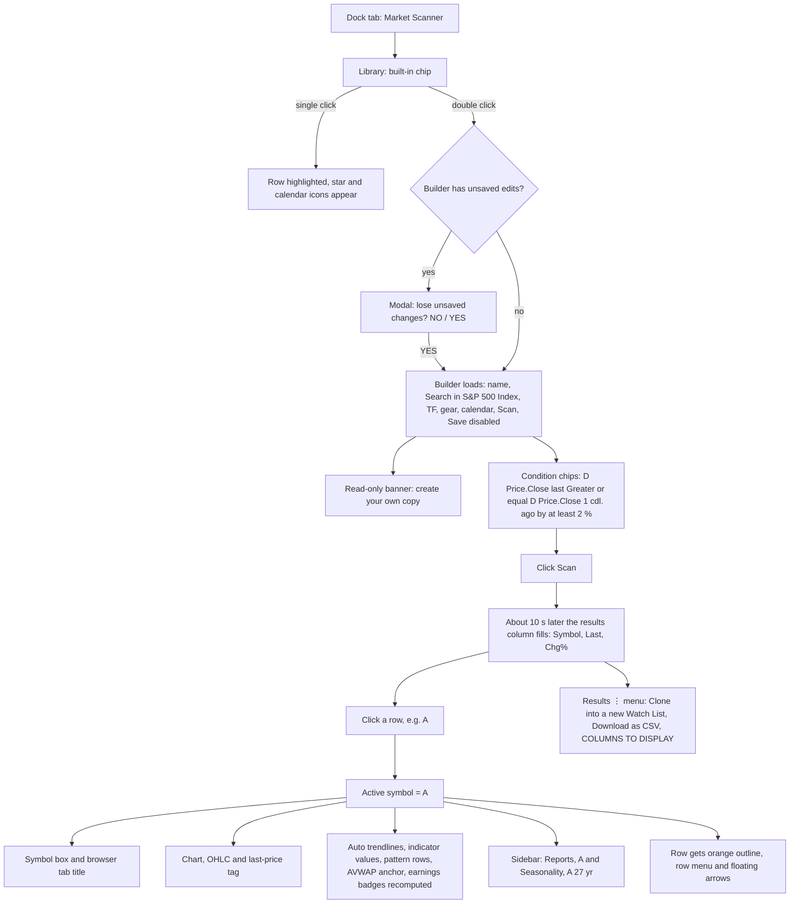
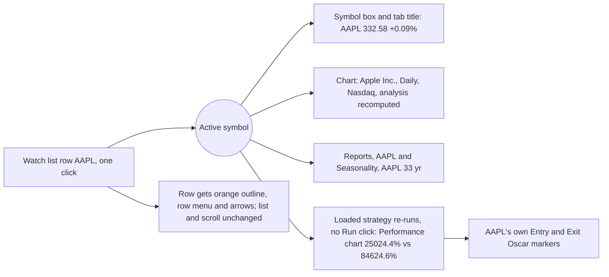

# TrendSpider study: layout, workflows and unique features, for the KANIDA redesign

**Date:** 2026-09-13
**Status:** reference and proposal document. **No code has been changed.** Section 10 needs the user's approval before any build work starts.

---

## 0. Scope, method and honesty labels

**Scope**
- Map every visible micro element, workflow and cross-panel interaction of TrendSpider (charts.trendspider.com).
- Identify TrendSpider's unique features and how each could be rebuilt for NSE.
- Propose a KANIDA layout at TrendSpider's quality that **keeps every current KANIDA feature** and obeys the KANIDA quant rules.

**Method**
1. **Live, read-only study** of the user's logged-in TrendSpider session. Viewport was about 1366×543 (a short laptop screen). Captured through screenshots, page text and the accessibility tree. Only built-in scanners and strategies were run.
2. **Public documentation inventory**: the help KB, product pages and changelogs from Dec 2025 to Aug 2026, covering 25 modules.
3. **KANIDA code read**, for structure only: `README.md`, `UX_FIXES.md`, `src/PilotShell.tsx`, `src/Workspace.tsx`, `src/PatternCanvas.tsx`, `src/ReplayStudio.tsx`, `src/SimulationDesk.tsx`, `src/PlanReview.tsx`, `src/PilotScreens.tsx`, `src/TraderDesk.tsx`, `src/Sheets.tsx`, `src/decision.ts`, `src/constants.ts`, and the `app/` routes.

**What was NOT done in the live study**
- Nothing was saved. No scanner, strategy, watch list, alert, bot, drawing or setting was created or changed.
- No alert or bot was created. Alert dialogs were only opened and then cancelled.
- No trading, SignalStack or broker actions.
- No Sidekick AI prompt was sent, because prompts use the user's credits.
- The **OPRA exchange agreement was not accepted**, so the options chain rows stayed hidden.
- **ML Quant Lab was not studied.** It was locked as "already in use" by another session.
- No support message was sent. The support chat was opened once and collapsed.
- Accidental layout changes were all reverted and verified: MTFA, Fibs and Heatmap toggles, a timeframe slip to 90 min, the dock minimise, the active symbol, and a result-grid column. One cosmetic residual remains: the legend row order.

**Honesty labels used throughout**
- **(live)**: seen directly in the user's session.
- **(docs)**: taken only from public documentation and not confirmed live.
- **(unknown)**: neither source settles it.
- An unlabelled statement about TrendSpider is **(live)**.
- KANIDA statements come from the code and docs listed above.

---

## 1. Executive summary

**Ten layout and flow lessons**
1. **One screen, five coordinated regions** (live): global toolbar, drawing rail, chart pane with legend, right widget sidebar with icon rail, and a bottom module dock. **The chart never leaves the screen** while you scan, backtest, read events or browse maps. KANIDA today replaces the chart with Simulate, Replay or AutoTrade screens.
2. **A single active-symbol context** (live). Scanner results, watch-list rows, map tiles, event symbol cells and the search box all *set* it. The chart, automated analysis, legend, symbol-bound widgets and the loaded strategy all *follow* it.
3. **The loaded backtest re-runs automatically** when the symbol changes (live). Flipping through a watch list shows each stock's own backtest and trade markers.
4. **The legend is the control centre** (live). Each overlay row shows live values, visibility per timeframe, remove and edit. Patterns show their boundary values, or an explicit **"Not found on this chart"**. Hovering switches every value to the hovered bar and shows "n/a" where a value is undefined.
5. **Split toggle buttons** (live). The label turns an analysis family on or off (green when on); its ⋮ opens that family's preferences.
6. **One condition grammar everywhere** (live). A chip sentence with shortcut codes and All/Any/None groups is reused, identically, by the Scanner, Strategy Tester and Multi-factor Alert.
7. **Library | builder | results in three columns** (live). Built-ins are read-only, forkable templates. Results sit beside the builder, so you can edit and re-run without losing the list.
8. **Backtest results are visual first** (live): a Price behaviour explorer with a random-entry control, an equity curve against buy-and-hold, and trade markers named after the exit condition that fired. **More…** leads on to the Group Strategy Tester, a four-step wizard whose button shows the live combination count, and a results matrix with a bubble-chart explorer.
9. **Chart objects are first-class** (live). Right-clicking an auto trendline offers "Create an alert at this line", Lock, Remove and "Remove all related". A **Truth-in-Analysis timestamp** plus **Refresh & Lock** records when the automated analysis was computed.
10. **Workspaces are purpose-built surfaces** (live): Main View for deep work, Dashboard (sections × widgets, with per-widget error states), Multi Symbol View (grids up to 7×6 live; 8×6 per docs) and Mobile. Each opens in its own browser tab with an "in use" lock.

**Top unique features for NSE** (full list of 36 in §7)
- Auto trendlines with editable scoring formulas.
- Dynamic alerts on moving lines.
- MTFA overlays with per-timeframe badges in the legend.
- The Group Strategy Tester matrix.
- The Price behaviour explorer's random-entry control.
- NSE event feeds: SEBI PIT/SAST filings, bulk and block deals, corporate actions.
- A sector treemap with an evidence-based colour metric.
- **KANIDA's point-in-time pattern evidence.** TrendSpider **cannot backtest or alert on chart patterns** (docs). This is KANIDA's biggest differentiator.

**Where KANIDA already beats TrendSpider**
- Costs and slippage are on by default. TrendSpider's default trade cost is 0% (live).
- Walk-forward and later-test evidence. No out-of-sample (OOS) split was seen in TrendSpider's tester (live).
- Ranking by expectancy.
- Sample-size badges.
- A data-staleness gate.

---

## 2. TrendSpider information architecture

### 2.1 Workspace model

| Workspace type | Purpose | Seen | Notes |
|---|---|---|---|
| **Main View** ("Default Workspace") | Deep analysis of one symbol: chart, sidebar, dock | live | Theme is per workspace (dark here). Browser tab title carries the live price: "CINF: 169.8 (0.00%) — TrendSpider [Default Workspace]" |
| **Dashboard** | "Your personal markets control center": titled sections of widgets | live | URL `/dashboard`. No drawing rail and no dock. Module launchers open Main View |
| **Multi Symbol View** | "Large grid of charts" | live | URL `/multi_symbol_view`. Layout picker is a 7×6 hover grid (live); docs say up to 8×6 = 48 charts |
| **ML Quant Lab** | No-code ML classifiers | locked ("in use") | Docs only (M20) |
| **Mobile Device** | "Default workspace for the mobile application" | live (menu row only) | App itself is docs only (M24) |

**Workspace picker** (entry page, live)
- **Left column, "Open a workspace of yours"**: cards with a name, a description, and an "already in use" lock or a "default" heart. A plan limit note reads "up to 10 workspaces, you already have 5".
- **Right column, "Or create a new workspace"**: template cards titled "<type>, <persona>". Examples are Main View Day Trader / Swing Trader / Investor / TrendSpider Official / Dan's Workspace / blank; Dashboard Semiconductors / blank; Multi Symbol View blank.

**Workspaces switcher** (grid icon, top right, live)
- Menu header: "WORKSPACES AND SCREENS".
- Rows: Default Workspace "current", Mobile Device, Multi Symbol View, Dashboard, ML Quant Lab "in use", then "Manage workspaces...".
- Choosing a workspace **opens a new browser tab**. That workspace is then marked "in use".

**Shared vs per-workspace** (docs): alerts, strategies, notes, scanners, watch lists, annotations and scripts are shared across workspaces. Chart setup is per workspace.

### 2.2 Main View screen regions

```
┌───────────────────────────────────────────────────────────────────────────────────────────────┐
│ [CINF____] [≡+] [↻] [■▾] MTFA Fibs Trends⋮ Indicators⋮ Cdl.P⋮ Chrt.P⋮ Heatmap⋮ Other⋮          │ ← 1 GLOBAL TOP BAR
│ Alerts&Bots⋮ VisualScripts                                    ✦Sidekick  [▦ Workspaces] ? 👤  │
├──┬────────────────────────────────────────────────────────────────┬──────────────────────┬────┤
│✎ │ [🕯▾][Daily ▾] ⚙ ┆ ⇵ 🕒 ✺ Lin      "To: 13 Sep 2026 @ 22:01" ✦ ⛶ 📷│ Dow Jones 30 ▾  ⋮⛶✕ │watch│
│╱ │ Cincinnati Financial Corporation, Daily, Nasdaq                │ AAPL 332.58 +0.09%   │alert│
│→ │ O 170.86 H 172.38 L 168.84 C 169.80 Period −1.06 (−0.620%)     │ …                    │news │
│⫽ │ SMA (50, 0, close) 176.02                  👁 ✕ ⋮ (on hover)    ├──────────────────────┤analy│
│▭ │ VWAP⚓ (lowest low, 8, no bands, ohlc4)                          │ Reports, CINF   ⛶✕  │seas.│
│📏│ Volume (20, SMA) 431.29K                                        │ [Revenue, Non-GAAP▾] │notes│
│◯ │ Triangle.Asc (Short term, No)  Not found on this chart          │ ▇▇▆▇ bars + line     │insid│
│Tx│ Channel.Desc (Short term, No) 177.18 166.75                     ├──────────────────────┤repor│
│↓ │ Rel.Performance (spx500, yearly) 49.6 · Earnings · Trend Lines  │ Seasonality, CINF    │check│
│| │ Drawings · "Collapse indicator list"                           │ (33 yr) ✦ ? ⛶ ✕     │optio│
│1 │    candles + auto trendlines + "LL" + E 2.85 badges            │ [Monthly▾][Change%>0▾]│bots │
│2 │    ─ ─ period separators ─ ─          last-price tag 169.80 ▶   │ 73% 55% 61% 78% …    │learn│
│3 │ Rel.Performance subpane ─── 50.0 ───                            │                      │trade│
│⌃ │ "Your local time zone" · ICE data attribution                   │                      │     │
├──┴──────────────── 3 CHART PANE (+ chart toolbar + legend) ───────┴─ 4 SIDEBAR ───────────┴5 RAIL┤
│ Strategy Tester │ Market Scanner* │ What's Happening Now │ Stock Market Map │ Options Data │      │
│ Segments and KPIs │ Custom Indicator Editor │ ML Quant Lab ↗                 [Add a feed...] ? ⛶ ✕│ ← 6 BOTTOM DOCK
│ ┌library──────────┐ ┌builder / AI prompt ─────────────────────┐ ┌results──────────────┐       │
│ │Search · all yours│ │"Describe what you are after…" 🎤         │ │Symbol | Last | Chg% │       │
│ │built-in subscr   │ │skip to point&click · examples · recent  │ │…                    │       │
│ │store  #tags      │ │                                          │ │                     │       │
│ │[NEW SCANNER]     │ └──────────────────────────────────────────┘ └─────────────────────┘       │
└───────────────────────────────────────────────────────────────────────────────────────────────┘
  2 = left DRAWING RAIL (✎ tools, numbered presets 1 support · 2 resist · 3 abcd · ⚑4 · create)
  Floating: orange "Chat with us" launcher (bottom-right); Shoutbox panel (closable)
```

**Region responsibilities** (live)
1. **Global top bar**: symbol, watch-list add, refresh, layout, analysis-family split toggles, alerts, scripts, AI, workspaces, help, account.
2. **Drawing rail**: manual annotation tools and numbered custom presets.
3. **Chart pane**: its own toolbar (type, timeframe, settings, separators, extended hours, breakouts, scale), the Truth-in-Analysis timestamp, the AI-explain / maximise / snapshot icons, and the legend overlaid top left.
4. **Right sidebar**: stacked widgets, each with a header of ⋮ / ⛶ maximise / ✕ remove.
   - Docs: at most 2 columns and 8 widgets; vertically resizable since July 2026.
5. **Far-right icon rail**: adds widgets to the sidebar.
6. **Bottom dock**: module tabs.
   - Each module can host several instances: "Add a feed...", "Add a map...", "Add a widget...".
   - Dock-level controls: help, full screen, close. The close collapses the dock to its tab bar.

---

## 3. Screen-by-screen micro-element catalogue

### 3.1 Global top bar (Main View, live)

| # | Element (exact label) | Type | Behaviour |
|---|---|---|---|
| 1 | Symbol box ("CINF") | Textbox and typeahead | See §3.2. Escape restores the previous symbol |
| 2 | Watch-list add/remove (list+ icon) | Icon button | Adds or removes the active symbol from a watch list |
| 3 | Refresh ↻ | Icon button | Refreshes the analysis with recent data (Ctrl+R) |
| 4 | Workspace Layout (colour square ▾) | Picker | Chart layout. Docs: 1–4 charts per Main View |
| 5 | **MTFA** | Toggle | "Add Multi-Time Frame Analysis". No dialog (§4g) |
| 6 | **Fibs** | Toggle | "Add Auto-Fibs" |
| 7 | **Trends** ⋮ | Split toggle | ⋮ opens "AUTOMATED TREND LINES SETTINGS" (§3.6) |
| 8 | **Indicators** ⋮ | Split toggle | ⋮ opens the "Manage Indicators" modal (§3.5) |
| 9 | **Cdl.P** ⋮ | Split toggle | Candlestick patterns. ⋮ opens a list (§3.8) |
| 10 | **Chrt.P** ⋮ | Split toggle | Chart patterns. ⋮ opens "CHART PATTERNS" (§3.7) |
| 11 | **Heatmap** ⋮ | Split toggle | ⋮ opens Heatmap Settings (with Cancel) |
| 12 | **Other** ⋮ | Split toggle | "DISPLAY OTHER TYPES OF DATA" (§3.10) |
| 13 | **Alerts&Bots** ⋮ | Split toggle | The label shows or hides alert and bot markers. ⋮ opens "Create an alert or a strategy bot" (§4f) |
| 14 | **Visual Scripts** | Toggle and menu | Active state plus "Open the Visual Script Manager". No panel rendered at this viewport |
| 15 | **✦ Sidekick** | Button | AI window (Ctrl+K). Turns green when open (§4h) |
| 16 | Workspaces (grid icon) | Menu | §2.1. Does **not** close when the icon is clicked again. Blocks other top-bar clicks until Escape or an outside click |
| 17 | Help ? | Menu | 12 items (§3.14) |
| 18 | Account and subscription (person icon) | Menu | §3.14. An outside click did not close it; clicking the icon again toggles it |

**Convention:** the split-button pattern. One click on the label toggles the overlay (green fill when on). ⋮ opens that family's preferences.

**Multi Symbol View top bar** (live) is a variant:
- Layout "2x2" (7×6 hover grid picker showing a live "NxM" label).
- ↻.
- "All Charts…" to change parameters on all charts.
- Auto Fib · Trends⋮ · Indicators⋮ · Cdl. Patterns⋮ · Chart Patterns⋮ · Other data⋮ · Alerts&Bots.
- Right side: Deep Analysis · Market Scanner · Strategy Tester · Trading, then workspaces, help and account.

**Dashboard top bar** (live) is a reduced version:
- "5 columns ▾" and ↻.
- Auto Fib · Trends⋮ · Indicators⋮ · Cdl. Patterns⋮ · Chart Patterns⋮ · Other data⋮ · Alerts&Bots, applied to all chart widgets.
- The same module launchers.

### 3.2 Symbol search (live)
- **Opening:** focus and type to open a large panel. It updates on every keystroke, and the typed text stays in the box.
- **Asset-class chips:** **all** (default) · stock · ETF · OTC · forex · futures · index · market breadth · cryptos · options · custom.
- **Result row:** a coloured type tag (`etf`, `c-futures`) · ticker · full name · a venue tag on the right for multi-venue instruments (LIGHTER, CRYPTOCOM, COINCALLFTS, LIGHTERRH).
- **Weakness:** ranking is prefix-based. For "MSF", MSFT itself was not in the top rows.
- **Escape** closes the panel and restores the previous symbol. Nothing changes until a row is chosen.
- **Prefix syntax** (docs): `^` FX/crypto · `$` index/breadth · `!` continuous futures · `=` composite · `#` custom upload.

### 3.3 Chart pane toolbar and header (live)

**Toolbar**

| Element | Behaviour |
|---|---|
| Chart type (candle icon ▾) | Line · Bars · Candles · Hollow Candles · Raindrop · Heikin Ashi |
| Timeframe combobox ("Daily ▾") | Scrollable list with a ☆ favourite on each entry: … 30 min · 45 min · 1 hour · 65 min · 90 min · 2 hours · 4 hours · **Session** · Daily · Weekly · Monthly · Quarterly · Yearly. Closes on select. **Trap:** a second click on the combobox can pick the hovered row (a Daily → 90 min slip happened this way) |
| ⚙ Chart settings | Docs: Style tab and Data tab |
| Add Trading Period Separation Lines | Vertical dashed period lines |
| Add Non-Regular Trading Hours data (clock) | Extended hours |
| Add Highlight Breakouts (burst) | Circles where a candle closes through a line (docs) |
| "Lin" | Y axis, linear or log |
| Truth-in-Analysis | "To: 13 Sep 2026 @ 22:01" + "What is this?" + "Refresh & Lock" |
| Top right of the pane | ✦ "Ask Sidekick to explain you this chart" · ⛶ "Toggle maximize this chart" · 📷 Share |

**Header**
- Line 1: "Cincinnati Financial Corporation, Daily, Nasdaq".
- Line 2: "O 170.86 H 172.38 L 168.84 C 169.80 Period −1.06 (−0.620%)", coloured red or green, plus "Market closed".

**Canvas**
- Candles.
- Auto trendlines, coloured by scoring formula (§3.6).
- A "LL" pivot label.
- An anchored VWAP "⚓LL" marker.
- Monthly dashed separators.
- Earnings badges "E 2.85" … and "E ?" / "E ?1.89" for the next estimate.
- A relative-performance subpane with a 50.0 midline.
- The last-price tag and dashed line.
- "Your local time zone".
- ICE attribution and an "as-is / informational" disclaimer.

**Multi Symbol View tile** (live)
- Title "SYMBOL, Candles, Daily" and an "Edit this chart" link.
- Legend, e.g. "Earnings (nongaap)" with the orange note **"Not available for a given type of asset"**.
- A faint symbol and name watermark.
- Hover buttons: Sidekick explain · maximise · Share · menu.

### 3.4 Legend (chart key), the control centre (live)

| Row example | State semantics |
|---|---|
| `SMA (50, 0, close) 176.02` | Colour matches the plot. The value is at the last bar, or at the hovered bar |
| `VWAP⚓ (lowest low, 8, no bands, ohlc4)` | Shows **"n/a"** when hovering before the anchor |
| `Volume (20, SMA) 431.29K …` | Two values: volume and its average |
| `Triangle.Asc (Short term, No)` **Not found on this chart** | Explicit "absent" state in orange |
| `Channel.Desc (Short term, No) 177.18 166.75` | Found: upper and lower boundary values at the last bar |
| `Rel.Performance (spx500, yearly) 49.6` | Lower-pane indicator |
| `Earnings (nongaap)` · `Fibs` · `Heatmap` · `Current strategy` · `Trend Lines` · `Drawings` | Data, overlay and strategy rows appear when those features are on |
| Footer: "Collapse indicator list" | Collapses the legend |

- **Hover actions on each row** (accessibility names): "Toggle visibility for resolution D" · "Remove this indicator from your charts" · "Edit properties of this indicator" (👁 ✕ ⋮).
- **MTFA state:** rows gain `[D][M]` badges, with the higher-timeframe value in parentheses, e.g. `SMA (50, 0, close) [D][M] 317.97 (215.65)`.

### 3.5 Manage Indicators modal (live)
- **Title and closing:** "Manage Indicators" ✕. **Escape does not close it.** Footer: **CANCEL · APPLY** (orange). Changes are batched, not applied live.
- **Left column (catalogue):**
  - Search (with a clear ✕).
  - "All indicator types ▾".
  - A–Z list with hundreds of entries: Absolute Price Oscillator, Acceleration Bands, Accumulation/Distribution Line, … Alphatrends Anchored VWAP, Analyst Estimates, Anchored Acc/Dist …
  - A click adds the indicator as a card on the right.
- **Right column (active cards):** the title is in the plot colour, with ✕ and inline fields.
  - **Simple Moving Average:** Length [50] · Offset [0] · Price source [Close/Right ▾] · Line swatch.
  - **Alphatrends Anchored VWAP** (how-to ↗): Anchor to [Lowest low ▾] · Window [80] · Bands [No bands ▾] · Price source [OHLC4 ▾] · Anchors [✓] · Line.
  - **Relative Performance** (how-to ↗): Benchmark [S&P 500 ▾] · Type [Yearly (4Q weighted) ▾] · Low/Middle/High [20/50/80] with style swatches · Positive and Negative colours · Axis Type [Lower ▾].
- **Docs:** categories are Technical, Fundamentals, AI Strategies, FRED, Market Breadth, Relative Performance, Custom (JS). An indicator can be computed on another symbol (max 3 symbols per chart).

### 3.6 Automated Trend Lines settings (live)

**Popover "AUTOMATED TREND LINES SETTINGS"**

| Field | Value seen | Options (docs) |
|---|---|---|
| Analysis Type | Standard ▾ | Original · Standard · Enhanced |
| Drawing Input | Wick (H/L) ▾ | Wick · Body |
| Islands (Gaps) | Respect ▾ | Respect · Ignore |
| Quality | Most Relevant ▾ | Most Relevant (top ~1%) · More Lines · All (~2,000) |

Footer: **ADVANCED · APPLY**.

**ADVANCED** opens a full-height left panel with tabs **ANALYSIS | TRENDS** and an orange ✕.

**ANALYSIS → "Base Points"**
- A plain-language explainer: lines start from Williams-fractal base points; fractal length depends on timeframe; ATR matters.
- H/L Length fields: all / 1h / Daily / Weekly / Monthly, each [11].
- ATR Length [14].
- ATR factor (islands) [3], "Size of a gap required to create a new island".

**ANALYSIS → "Lines"**
- Rule: a line is dismissed if its distance to the last price is greater than ATR(14) × factor.
- Factors: 1/5/10/15/30 min 5 · 1 hour 6 · 2 hours 7 · 4 hours 7 · Daily 7 · Weekly 8 · Monthly 8 · Other TFs 5.5.
- "ATR peaks? (1/0)" [0].
- Warning: changing these could make locked trend lines disappear.

**TRENDS tab: editable scoring formulas**
- Each formula has a title, a JS-like formula and a colour. The colour is the colour of the lines that formula ranks.
- Formulas seen:
  - `(peaksUp - violations) / length` (orange)
  - `((pointsHigh + pointsHigh2x * 2) …` (orange)
  - `(Math.max(peaksDown, bounceDown) …` (green)
  - `(Math.max(peaksUp, bounceUp) - vi…` (green)
  - "lotta-points/closer + less vi…"
- Docs variables: `length, seriesLength, priceDev25/50/75, hits, violations, bounceUp/Down, peaksUp/Down, points, points2x`.

### 3.7 Chart Patterns list (Chrt.P ⋮, live)
- **Header:** "CHART PATTERNS". A scrollable checklist where each row has a checkbox, the name and a grey "docs" link to `automated-chart-pattern-recognition#<ID>`. Footer: CANCEL · APPLY (APPLY greyed out until something changes).
- **Patterns:**
  - Broadening: Ascending · Asymmetrical · Descending · Right-Angled and Ascending · Right-Angled and Descending · Symmetrical.
  - Channel: Ascending · Descending (enabled) · Horizontal.
  - Cup and Handle.
  - Double Bottom · Double Top.
  - Head and Shoulders · Inverse Head and Shoulders.
  - Triangle: Ascending · Descending · Symmetrical.
  - Wedge: Falling · Rising.
  - **19 named entries** in total.
- **Legend parameters:** "(Short term, No)". The first is the term. The second flag is (unknown); it may mean "include forming".
- **Docs limits:**
  - Patterns **cannot be used in alerts or backtests**.
  - Only live patterns are kept, so a pattern may disappear later.
  - Docs conflict on whether cup & handle is supported.

### 3.8 Candlestick Patterns list (Cdl.P ⋮, live)
- **Header and controls:**
  - "Candlestick Patterns, 2 picked" and "(clear selection)".
  - Source filter: All Patterns · The Strat · The Pattern Site · Newsome Candles.
  - "Search Patterns".
- **Rows:** checkbox · name · source tag (`thestrat`, `tps`) · optional docs link · candle-count tag (`3cdl` … `13cdl`). The list is virtualised, so only about 12 rows render at a time.
- **Examples:** 1-2d Inside Break · 1-2d-2u Reversal · 1-3 Reversal · 1-3-1-2u Volatility Expansion · 10/12/13 New Price Lines · 2d-1-2d Measured Move Reversal …
- **Footer:** Cancel · Apply.
- **Chart:** labels on candles such as "hm" and "ss", seen on the Dashboard.

### 3.9 Crosshair, hover readout and context menus (live)
- **Crosshair on hover:**
  - The header OHLC and every legend value switch to the hovered bar, e.g. "O 114.34 H 115.73 L 113.85 C 114.54 Period +0.20 (+0.175%)".
  - A date tag appears on the time axis ("Apr 01, 2026") and a price tag on the price axis.
  - "n/a" is shown where a value is undefined.
- **Right-click on empty chart background:** no menu, and nothing changes.
- **Hover on an auto trendline:** the price-axis tag shows **the line's value at the cursor x**.
- **Right-click exactly on a line** (a click about 10px away misses it):
  1. **Create an alert at this line**
  2. **Lock this trend line** (hint "Double Click")
  3. **Remove this trend line** (hint "Shift + Click")
  4. **Remove all related trend lines**
  - Escape closes this menu.
- **Right-click a drawing** (docs): Create Dynamic Price Alert · Remove · remove all rays · remove all drawings for the symbol · Properties.

### 3.10 "Other data" menu (live)
- **Header:** "DISPLAY OTHER TYPES OF DATA". Each row has a checkbox, the name and scope, and a "docs" link.
- **Checkbox rows:**
  - Analyst Estimates (US stocks)
  - Dark Pool Volume (US Equity)
  - Dividends (US stocks)
  - **Earnings (US stocks)** ✓
  - Fear&Greed Index (Crypto)
  - Retail Traders Activity Percentage (US stocks & ETFs)
  - Short Volume, FINRA Reg SHO (US stocks & ETFs)
  - Splits (US stocks & ETFs)
- **Second group** (these open Manage Indicators): Federal Reserve Economic Data (FRED) · Fundamentals · Market Breadth · Relative Performance.
- **Footer:** CLOSE.

### 3.11 Fibs and Heatmap (live)
- **Fibs:** labelled levels stacked at the right edge, e.g. ".618 (34x.xx)", ".382 (338.8x)". Adds a "Fibs" legend row. Toggling again removes the levels and the row.
- **Heatmap:**
  - Full-width red horizontal bands whose intensity shows zone strength. Adds a "Heatmap" legend row.
  - The bands visually dominate the candles.
  - Docs: needs a manual refresh, doesn't work on a log scale, and is computed in the browser.

### 3.12 Drawing rail (live and docs)
- **Icons (live):** line, ray/extended, arrow, parallel/fork, rectangle, measure, circle, Tx, arrow-down, vertical marker, ⌃ expand. Then numbered presets **"1 support · 2 resist · 3 abcd · ⚑ 4 · create"**.
- **Accessibility weakness (live):** no hover tooltips (1s hover on 10 icons) and no accessible names.
- **Tools and hotkeys** (docs): see Appendix C.
- **Behaviours** (docs):
  - Magnet snap (hold Alt to disable).
  - Style memory per tool.
  - Visibility by timeframe.
  - Scope: all workspaces or the current one.
  - Ctrl+drag clones; Shift+click removes; double-click opens properties.
  - "Save as Custom Annotation" gives the first 10 annotations Alt+1…0 hotkeys.

### 3.13 Right sidebar widgets and rail (live)

**Rail icons:** watch, alerts, news, analysts, season, notes, insiders, reports, checklist, options, bots, learn, trading.

**Addable widgets** (accessibility tree): Watch list or Scanner · Alerts · News · Analyst Estimates · Seasonality · Notes · Insider Trades · 10Q Reports · Smart Checklist · Unusual Options · Strategy Bots.

| Widget | Micro elements (live) |
|---|---|
| **Watch list "Dow Jones 30 ▾"** | Accessible header button "List currently selected: Dow Jones 30". Columns Symbol / Last / Chg%. Header ⋮ ⛶ ✕ ("Remove this Watch list or Scanner widget"). Selected row: orange outline, row ⋮, floating ↓↑ affordances. The list and row menus did not render visibly at this sidebar size |
| **Reports, CINF** | Combobox "Revenue, Non-GAAP + Projections ▾". Quarterly bars with a growth line. Legend "3d price change%" vs "surprise%". Table Qtr / Value / YoY Chg% / Surp% / 3d Chg%. Footnote "* Non-GAAP data, to make future projections comparable to past numbers." |
| **Seasonality, CINF (33 yr)** | "Sidekick: Explain seasonality for CINF". Help "How do I use Seasonality data?". Comboboxes "Monthly" and "Change% > 0". Views: Positive periods · Mean Change% · P25% / P75% · Raw data. Settings: Granularity, type, Since date, exclude periods. Hover sentence: "In 55% of all "Apr" Change% was positive". **The year count in the title signals short history, e.g. "(3 yr)"** |

Docs cover the other widgets: Smart Checklist, Insiders, Analysts, News, Notes (with sentiment), Unusual Options, Alerts, Bots, Trading, Company KPIs.

### 3.14 Help, Account and support (live)
- **Help menu (12 items):**
  - Chat with us
  - Check System Status
  - Join Our Official Discord Server
  - Open the Hotkey Guide
  - Read the Docs & Knowledgebase
  - Schedule 1-on-1 Training
  - Schedule Help Session
  - See Software Updates
  - Take Feature Tour
  - Visit Support Center
  - Watch TrendSpider TV
  - Watch Videos in TrendSpider University
- **Account menu:**
  - Account & Settings
  - Color Theme ▸ (per workspace)
  - Terms & Disclaimer
  - Request a Feature
  - Log out
- **"Chat with us" launcher (bottom right):** opens a "Contact Us" panel with avatars, "We usually reply in a few hours.", channel icons, a message box, attach, send and collapse.

### 3.15 Bottom dock: shared library pattern and per-module elements (live)
- **Library column** (Scanner, Strategy Tester, Custom Indicators):
  - "Search for scanners/strategies/…".
  - Chips: all · yours · built-in · subscr · store.
  - Rows with green #hashtags.
  - A collapse chevron.
  - An orange CTA pinned at the bottom: **NEW SCANNER / NEW STRATEGY / NEW INDICATOR**.
- **Row interaction:**
  - A single click highlights the row and shows ☆ favourite and 📅 schedule.
  - A **double-click opens it**.
- **AI-first entry:**
  - "Describe what you are after and let AI help you" with 🎤.
  - Links: "skip to point&click editor" · "examples" · "your recent prompts".

| Module | Specific elements |
|---|---|
| **Market Scanner** | Header: name (playful default "Dangerous Symbol Finder") · "Search in [S&P 100 Index ▾]" · chart type/timeframe · ⚙ · 📅 · **Scan** (disabled tooltip "Define the scanning criteria in order to be able to scan") · **Save** · ⋮. Read-only banner for built-ins with a "create your own copy" link. Results grid Symbol \| Last \| Chg% (skeleton rows before a run). Scan settings §4a |
| **Strategy Tester** | 3 mode cards: "Test a strategy on a single symbol" · "…across a list of symbols" · "Test multiple strategies on a single symbol". Header: name · [Daily ▾] · [7000 candles ▾] · ⚙ · More... · **Run** · Save ⋮. Built-in banner "This is either a pre-made strategy or the one you have subscribed to…". Entry Conditions \| Exit Conditions columns (block type "Script" ✕) |
| **What's Happening Now** | "Favorite templates (13)" cards: coloured category, ★, orange title, one-line definition (§4d) |
| **Stock Market Map** | "Favorite templates (2)" and "Other templates" (tile and bubble), with the spec line "<Universe>: ⇱ <size> 💧 <colour>" (§4e) |
| **Options Data** | "Available templates (2)": Options Chain, Options Map. Chain header "Options Grid" + "AAPL: Customize…". Expiry strip grouped by month (day over "N dte", "M" marks monthlies). Context line "AAPL contracts expiring at 14 Sep'26, 0 days to expiration" ⋮. **Data gate** (orange): "An exchange agreement is required in order to access this data. Click here to review and accept." (not accepted) |
| **Segments and KPIs** | "Segments and KPI data CINF: Customize…" · ⬇ export. Metric rows by quarter (Q4 '23 → Q2 '26), in sections (REVENUE, NET PREMIUMS WRITTEN, NET PREMIUMS EARNED, EBIT…). Per-row mini-chart icon |
| **Custom Indicator Editor** | "Open examples…" · orange APPLY · laptop, history, Save, ⋮. JS editor with line numbers. Inline "Build a new indicator using AI". Collapsible Console. Empty library: "You have not created any custom indicators yet. Create your first indicator." DSL: `describe_indicator`, `input.number`, `sma`, `for_every`, `paint` |
| **ML Quant Lab ↗** | Opens in a separate window. Locked during the study |

### 3.16 Error, empty and guard states captured (live)

| State | Exact wording or behaviour |
|---|---|
| Unsaved-changes guard | "You have not saved your changes to "<name>" scanner. Are you sure you want to proceed and lose unsaved changes?" NO / **YES** (orange). Fires on library switches **and on dock tab switches**, even for read-only built-ins that were only run |
| Read-only built-in | Dark-red banner with a "create your own copy" link |
| Disabled CTA with reason | Scan tooltip "Define the scanning criteria in order to be able to scan". CREATE ALERT disabled until a condition exists |
| Pattern absent | "Not found on this chart" |
| Data not applicable | "Not available for a given type of asset" |
| Undefined value | "n/a" in the legend while hovering |
| Service outage (Dashboard) | "⚠ Scanning service is temporarily not available. Check out status.trendspider.com for more details." |
| Data licence gate | OPRA agreement banner (above) |
| Delivery nudge | "You have not added or enabled a phone number. To receive alerts via text message, please add one" |
| Empty library | "You have not created any custom indicators yet…" |
| Short history | "Seasonality, PDC (3 yr)" |
| Coach mark | Alert-on-object flow (§4f), "GOT IT" |

---

## 4. Workflow maps, step by step

### (a) Market Scanner: open → run → results → click a result (live)



Notes (live):
- The watch-list widget does **not** change when a result row is clicked.
- The builder stays open, so you can edit and scan again next to the results.
- Chg% in the grid is the latest session's change, not the change on the scan date. The grid shows quote data.
- **SCAN SETTINGS** popover: ☐ Incorporate extended hours data · ☑ **Incorporate the current candle** · APPLY. There's no Cancel; click outside to close it.
- **COLUMNS TO DISPLAY** options:
  - Symbol (fixed)
  - Last, colored ✓ · Last
  - Change%, since close ✓ · Change$, since close
  - 52wk + Yesterday Range
  - Change% vs 52wk Low · Change% vs 52wk High
  - Color Mark ✓
  - Week to Date Change(%)
  - 7 Calendar Days Change(%)
  - Month to Date Change(%)
  - 30 Calendar Days Change(%)
  - Year to Date Change(%)
  - …more
  - Columns apply live and widen the grid, which squeezes the builder. Escape does not close this menu.
- The unsaved-changes guard also fires when switching dock tabs after only running a scan.

### (b) Strategy Tester: full chain (live)

1. **Open the dock tab.** The chart legend immediately gains a **"Current strategy"** row.
2. **Pick a mode** (3 cards) or double-click the library item "AAPL 8/21 EMA Cross Strategy". The built-in banner appears.
3. **Header:** name · [Daily ▾] · [7000 candles ▾] · ⚙ · More... · **Run** · Save ⋮.
4. **Body:** **Entry Conditions** block "Script" with a card auto-named **"Delta"**: `[D] EMA (8, 0, close) (last) Crossed Up [D] EMA (21, 0, close) (last)`, then "add a condition" and "Add an entry condition...".
   **Exit Conditions** block with card **"Oscar"**: `… Crossed Down …`, then "Add an exit condition...".
5. **⚙ STRATEGY SETTINGS** (no Cancel, APPLY):
   - Chart type [Hollow Candles ▾]
   - Extended hours ☐
   - **Execution price [Next Open ▾]**, greyed out and not changeable
   - Direction [Long only ▾]
   - **Trade cost [0] [% ▾]**
   - No slippage field.
6. **Run.** About 10 seconds later the header gains **✦ Explain**, and the results appear *above* the conditions:
   - **Price behavior explorer:**
     - Forward % by bars after entry (+10…+160), with draggable ▲▼ range handles.
     - Toggles: Mean change% · Median change% · **Random control (mean)** · # Of winning / losing positions · Min/Max for winners and losers · 96% of winners / losers (also pre-entry) · Raw data, winners / losers (paginated "1/2").
     - Caption: "139 positions analyzed across 26.8 years of A data (6743 candles). Mean trade return: 1.84%".
   - **Performance chart: "482.1% vs 371.3% for Asset Perfor…":**
     - Toggles: Equity · Equity (Asset A) · Positions · Drawdown · Drawdown (Asset) · Sharpe · Sharpe (asset) · Sortino · Sortino (asset) · R.vol · R.vol (asset) · Correlation.
     - A range navigator brush.
     - **Position contribution**: "losers 61% (85) … (54) 39% winners", plus a strip of trade bars.
   - **Tabular Data**, 13 rows plus Market:
     - Market A,D · Trade cost 0%
     - **Net Perf, all 482.1%** · Asset Perf. 371.3% · Beta 0.34
     - Positions 139 · Wins 39% · Losses 61%
     - Max DD −54.1%
     - Average Win 12.03% · Average Loss −4.63% · Average Return 1.84%
     - Rew/Risk 2.60 · Expectancy 0.4
   - There is no trade-list table in this view.
7. **Chart markers:** "Entry, long 146.97" (white ▲) and **"Exit +18.97% ("Oscar")"** / "Exit −6.87% ("Oscar")". Each exit names the condition that fired.
8. **Symbol binding:** the backtest runs on the **active chart symbol (A)**, even though the strategy is named after AAPL.
9. **More… menu:**
   1. Deploy as a Strategy Bot
   2. **Test in Group Strategy Tester**
   3. Download test results as TSV
   4. Download test results as CSV
   5. Clear test results
   - The menu overlaps its own button, so close it by clicking empty space.
10. **Group Strategy Tester** (full-screen modal, blue header, ? ✕). Subtitle: "Test multiple combinations of strategies, symbols and time frames." A 4-step vertical wizard:
    1. Strategies multi-select, pre-filled with the current strategy.
    2. Resolutions multi-select, pre-filled `4 hours, Daily, Weekly` (badge "3").
    3. Depth: `# Candles ▾` + `3000 candles ▾`.
    4. Symbols: "Type in a symbol to test at, or load a watch list", ADD A SYMBOL, chip "A".
    - Button **"Test 3 combinations"**, where the count = strategies × resolutions × symbols.
11. **Group results:**
    - The wizard collapses into a one-row config bar ending in **RUN (3)**.
    - **Table:** Market · Net Perf, all · Asset Perf. · Beta · Positions · Wins · Max DD · Max DD (Asset) · Average Return · Rew/Risk · Expectancy · Exposure · Return St.dev · ⬇.
    - **Three charts**, each with dropdowns:
      - Bubble (X Rew/Risk, Y Wins, radius Positions), with a red "unfavourable" zone.
      - Bubble (Average Return vs Return St.dev, radius R/R).
      - Column (Exposure) with a "Median: 59.1" line.
    - Rows are labelled by resolution ("240", "D", "W").

    | Market | Net Perf | Asset Perf | Positions | Wins | Max DD | Avg Ret | R/R | Expectancy | Exposure |
    |---|---|---|---|---|---|---|---|---|---|
    | 240 | 17.9 | 48.5 | 70 | 33 | −45 | 0.38 | 2.48 | 0.1 | 57.2 |
    | D | 112.2 | 259.2 | 66 | 39 | −38.1 | 1.49 | 2.57 | 0.4 | 62.4 |
    | W | 64.3 | 386.7 | 34 | 35 | −56.2 | 4 | 3.01 | 0.4 | 59.1 |

    The strategy lost to buy-and-hold on every timeframe, at 0% costs.
    - Clicking a row does **not** change the chart. The Market header has a sort arrow and ⋮. Docs: right-click a row to colour-flag it or send it to a watch list (not seen live).
    - At a window height of 543–599 px the **table body collapses to about one row**.
12. **Close ✕:** the workspace is unchanged. The single-symbol results, the markers and the "Current strategy" row remain.
13. **Leave the Strategy Tester tab:** the **"Current strategy" row and all markers disappear**. No guard appears, because nothing was edited.

### (c) Watch-list click propagation and strategy auto re-run (live)



### (d) What's Happening Now event feed (live)

1. **Open a template.** One click on the "CEO buying own stock" card replaces the gallery with the feed, and the dock tab bar gains **"Add a feed..."**.
2. **Feed header:** "CEO buying stock (Insider Trades)" · **"Customize (2 filters)…"**, plus the AI icon · ⬇ · ✕ on the right.
3. **Table:** Date ↓ · Symbol · Name · Position ▼ (filter) · Action ▼ (filter) · Shares traded · Dollar amount · Shares owned · Filing URL ("Form 4 ↗").
   - "buy" is shown in green; numbers are right-aligned.
   - Example row: Thu Sep 10, 2026 · RGCO · President & CEO · buy · 500 · 10,650 · 134,213.
4. **Click a non-symbol cell** (Name): the **row is highlighted only**. The chart doesn't change.
5. **Click the Symbol cell** (dotted underline): **the active symbol changes** to RGCO, and the chart, analysis, Reports and Seasonality all update. The cell's underline becomes solid.
6. **Not synced:**
   - The watch list keeps its AAPL selection.
   - **No insider-event marker** is added to the chart.

### (e) Stock Market Map (live)

1. Gallery → open "30 Days Movers in Technology" (one click). The tab bar gains **"Add a map..."**.
2. Header: "Technology: ⇱ 30 Calendar Days Change% 💧 Piotr[oski F Score]" ✕.
3. **Treemap:**
   - Tile size is the size metric, largest at top left.
   - Tile colour is the F-Score band.
   - Big tiles show the ticker and value; small tiles show the ticker only.
4. **Hover tooltip:** "RFAIR RF Acquisition Corp II / 30 Calendar Days Change% = +40.00% / Piotroski F-Score = 2.0".
5. **Click a tile** (PDC):
   - The active symbol changes and all subscribers update.
   - The legend showed "Channel.Desc (Short term, No) 3.42 0.98", now found.
   - The sidebar shows "Seasonality, PDC (3 yr)".
   - The header gains "Customize..." and 🔍.
6. A second tile (ARBB) showed "Triangle.Asc (Short term, No) 4.52 4.29". This **confirms the found-pattern legend semantics**.
7. **Docs:** colours are percentile ranks; maps over 300 symbols show the top 300 tiles by size; right-click to flag or add to a watch list; drag to zoom.

### (f) Alerts (live, except where marked)

- **Alerts&Bots ⋮** menu:
  1. Create an alert on an indicator or a trend
  2. Create a multi-factor alert
  3. Create a strategy bot
- **Item 1 opens a coach mark, not a form.** The chart dims and a tooltip reads: "Right click on a trend line, Fib level or indicator (except of lower) on your chart to create a Simple Dynamic Alert. Use Multi-Factor Alert if you need an alert on a lower indicator." [GOT IT]
- **Dynamic alert path:** right-click exactly on an auto trendline → "Create an alert at this line". The resulting form was not opened live.
  - **Form fields** (docs): trigger Break Through / Touch / Bounce · Sensitivity buffer · confirmation-candle timeframe · extended hours · name · notes (used as the webhook body) · expiry duration **and** max triggers.
  - **Semantics** (docs): Bounce needs 2 closed candles; a triggered alert can't be edited.
- **Item 2, the multi-factor dialog "Create multi-factor alert on A"** (symbol baked into the title):
  - Red banner: SMS phone-number nudge.
  - **Settings row:**
    - Chart [candle icon ▾]
    - **Alert Name** "Nostalgic Meninsky" (auto-generated)
    - Your Note
    - **Expires when [10 Days Passed ▾]** (… 9 … 13 Days Passed …)
    - **or when triggered [once ▾]** (once · twice · 3 times … 6 times …)
    - Use ext.hours ☐
    - Fire during [Market hours ▾] (greyed out while ext. hours is off)
  - Body: the AI prompt box, with "skip to point&click editor" swapping in the **identical** condition card.
  - Footer: CANCEL · CREATE ALERT (disabled). **Cancelled; nothing was created.**
- Delivery channels are account-level (docs): email / SMS / webhook. **SMS is not supported in India** (docs).

### (g) MTFA, Fibs and Heatmap toggles (live)

- **MTFA on** (no dialog):
  - The chart toolbar shows "Daily ▾ **vs** Monthly ▾". The vs list is Weekly · Monthly · Quarterly · Yearly · none, so only higher timeframes are offered.
  - Legend rows gain [D][M] badges with the higher-timeframe value in brackets. Pattern rows are evaluated on both timeframes.
  - A **dashed orange monthly SMA** is drawn across the daily chart, with an ▶ edge tag.
  - Lower panes (Rel.Performance) and Volume stay [D] only.
- **MTFA off:** badges, the vs selector and the overlay are all removed (verified).
- **Fibs** and **Heatmap:** see §3.11. Each adds a legend row, and toggling off removes everything (verified).

### (h) Sidekick (live, with no prompt sent)

1. Entry points:
   - Top bar ✦ Sidekick (Ctrl+K)
   - The chart's ✦ "explain this chart"
   - Seasonality "Explain seasonality"
   - Tester ✦ Explain
   - The feed header AI icon
   - Right-click an indicator → Explain (docs)
2. Opens as a **large floating centred window**, and the top-bar button turns green.
   - Header: "✦ TrendSpider Sidekick" · ? · ⧉ · ✕.
   - A purple promo strip: "Redeem Free Sidekick Bonus" [Claim offer] (not clicked).
3. **Welcome state:**
   - "What would you like to do today, <user's first name>?"
   - Subtitle "Perform fast, reliable research powered by real-time market data".
   - **Analyst personality [Neutral analyst ▾]**.
   - **Model "Claude Sonnet 4.6"** with a **Fast ↔ Smart slider** (4 stops; the last one hatched as premium).
   - Four prompt cards: data and capabilities · bull and bear case for "my current symbol" · "What is my current chart telling me?" · "Type in your request".
4. **Docs:** tool actions (scan, alerts, annotate, watch lists, code), chart vision, Deep Research with sub-agents per symbol, per-message billing, no trading advice or execution.

### (i) Workspace switching (live)
- Grid icon → "WORKSPACES AND SCREENS" → choose Dashboard.
- A **new browser tab** opens: "Dashboard — TrendSpider", `/dashboard`.
- The original tab stays on Default Workspace, and the menu now marks Dashboard "in use".
- Closing that tab releases the lock.
- The picker at login shows the same locks ("already in use").
- The menu needs Escape or an outside click to close.

### (j) Dashboard sections (live)

| # | Section | Widgets and columns |
|---|---|---|
| 1 | Market Overview | Chart tiles "AAPL, Candles, Daily" (candlestick labels "hm", "ss"), "$MA5SP500, Line, Daily" (breadth as a symbol: "Symbols above sma(5), S&P 500"), PLTR, WMT. Each tile has "Edit this chart" ✕ |
| 2 | Movers & Shakers | **Treemap** "NASDAQ 100 Index: ⇱ 30 Calendar Days Change% 💧 Change%, since close" Customize… · **Bubble** "7 Calendar Days Change% vs Change%, since close" (S&P 100) · **Scanner widgets** "2% or more above prev close", "Today's Gainers (10% or more)", "Today's Losers (5% or more)", with the outage error state · NVDA tile |
| 3 | Insider & Government Activity Tracker | **Congress Trading**: Transaction date, Symbol, Name, Action, Value range, House, Party, Value from/to · **Insider Trades**: Date, Symbol, Name, Position, Action, Shares traded, Dollar amount, Shares owned, Filing URL · KO tile |
| 4 | Analyst Estimates & Market News Feed | **Analyst Estimates**: Date, Symbol, Analyst, Prev. Price Target, Price Target, Action, Rank · **News**: Date ("Today, 01:55 NY (2 minutes ago)"), Symbol, Author, Title, Teaser · IONQ tile |
| 5 | Unusual Options Flow | Date&Time, Symbol, Summary ("14 Sep'26 $763 PUT"), DTE at Order, Prem, Size ("185 (94% of OI)"), OI, Tags (sweep/trade · bullish/bearish/neutral · etf · at_bid/at_ask/at_midpoint · call/put · otm/atm/itm) |
| 6 | Corporate Events: Dividends, Earnings & Splits | **Earnings**: Date, Symbol, Revenue, Rev. Estimate, Rev. Chg%, Rev. Surpr%, EPS, EPS Estimate, EPS Change%, EPS Surprise%, Session, Year, Period, Method · **Dividends** ("Customize (1 filters)…"): Date, Symbol, Dividend, Yield%, Event · **Splits**: Date, Symbol, Direction, Ratio ("1:25"), Event |
| 7 | Pattern Breakouts Happening Now | Scanner widgets "Any Triangle Break Up", "Falling Wedge Break Out", "Descending Channel Break Out" (outage error at capture) · COP tile |

- Every section has a bold title, "+" controls and "+ Add content".
- **Docs:** clicking a symbol in a widget re-targets every chart in the same section. Not tested live.

---

## 5. Cross-panel linking model

**Sources and subscribers** (live unless marked)

| Element | Role | Sets active symbol? | Follows active symbol? | Notes |
|---|---|---|---|---|
| Symbol search box | Source | Yes, on choosing a row. Escape cancels | Shows it | Also drives the browser tab title |
| Scanner results grid | Source | Yes, click anywhere on the row | No | Orange outline plus ↓↑ |
| Watch-list widget | Source | Yes, click anywhere on the row | No. List and scroll are kept | Selection **isn't cleared** when another source changes the symbol |
| Event feed table | Source | **Symbol cell only** | No | Other cells only select the row |
| Market map tile | Source | Yes, one click | No | Hover shows a tooltip only |
| Group Strategy Tester row | — | **No** (a click only selects) | — | Docs: right-click → flag or watch list |
| Main chart + automated analysis + legend | Subscriber | — | Yes, fully recomputed | Trendlines, patterns, AVWAP anchor, earnings badges |
| Reports widget | Subscriber | — | Yes | "Reports, <SYM>" |
| Seasonality widget | Subscriber | — | Yes | Year count updates |
| Loaded strategy (Tester tab open) | Subscriber | — | **Yes, re-runs automatically** | Results and markers are replaced |
| Options Grid | Subscriber | — | Yes ("AAPL: Customize…") | Data gated |
| Segments & KPIs | Subscriber | — | Yes (docs: can lock a ticker) | |
| Multi-factor alert dialog | Snapshot | — | Captures the symbol at open ("…on A") | |
| Group Tester wizard | Snapshot | — | Pre-fills the active symbol and strategy | |
| Dashboard widgets | Section-scoped sources (docs) | Re-target charts in the same section | — | Not tested live |

**Overlay lifetimes** (live)

| Overlay | Created by | Removed when |
|---|---|---|
| "Current strategy" legend row + trade markers | Opening the Strategy Tester tab / Run | **Leaving the Strategy Tester tab**. "Clear test results" also removes them (label seen) |
| Group Tester modal | More… → Test in Group Strategy Tester | ✕. The underlying results survive |
| MTFA/Fibs/Heatmap rows and overlays | The toggle | Toggle off |
| Scan results | Scan | New scan / module change after the guard. Kept while flipping through symbols |
| Feed / map instances | Opening a template | ✕ on that instance |

**Unsaved-changes guards** (live)
- Scope is the whole module. The guard fires on library item switches **and dock tab switches**.
- Running a scan or opening its settings counts as a change.
- A strategy that was only run (not edited) did **not** trigger it.

**What is NOT synced** (live)
- Cross-source selection highlight.
- Event markers on the chart after navigating from a feed.
- Clicks on Group Tester rows.
- Linking between charts in the 1–4 chart layouts is (unknown).

---

## 6. Shared condition grammar (live; docs where marked)

**One component** renders the same card in three places:
- Scanner
- Strategy Tester entry and exit
- Multi-factor Alert

Docs add Strategy Bots and Smart Checklist, all managed in the Visual Script Manager.

**Card header**
- Logic selector **"All of the following ▾"**: Any of the following (OR) · All of the following (AND) · None of the following (NOT).
- **"happened ▾"** timing, with the hover hint "happened within". Docs: 1–30 candles.
- An **auto codename** at top right (NATO style: "Delta", "Oscar").
- **Tx** (text view) and **⋮** "Actions for this group of conditions".
- The block has a comment box ("Type your comment for this block here"), "Edit this block in human language", and "remove this line" per line.

**Adding:** "Add a condition" → Condition · Condition group (And/Or), which can be nested · Load from template….

**Sentence structure** (each step is a searchable picker, "Shortcut or search"; Enter doesn't pick; typing the code does)

| Step | Picker | Options with shortcut codes |
|---|---|---|
| 1 Subject | "Pick a subject" | Price `pr` · Indicator `i` · Candlestick pattern `ca` · Chart pattern `cha` · ML Quant Model `ai` · Fundamentals `f` · Relative performance `r` · Analyst estimates `an` · News content `n` · Earnings dates `e d` · Earnings values `e v` · Dividends dates `d d` · Dividends values `d v` · Splits `s` · Watch lists `w` (15) |
| 2 Timeframe | "Pick time frame" | 5 min, 6, 10, 12, 15, 30, 45 min, 1 hour, 65, 90 min … daily …; the chip gets a badge ("[D] Price.Daily") |
| 3 Field / bar | "(last)" placeholder | Which value or bar. Built-in example: "Price.Close" |
| 4 Operator | "What should happen?" | Equal `eq` · Greater than `gt` · Greater or equal `ge` · Less than `lt` · Less or equal `le` · Is within range of `r` · Increased `in` · Decreased `d` · **Crossed Up / Crossed Down** (seen in strategy) · docs: exists in watch list, **Evolved** (pattern completes) |
| 5 Second subject | "What's the second subject?" | Price `pr` · Indicator `i` · Chart pattern `ch` · Constant value `co` |
| 6 Offset | inline number + "cdl. ago" | e.g. `[1] cdl. ago` |
| 7 Margin | "by at least" [2] "%" | Applies to comparison operators |

**Examples**
- `[D] Price.Close (last) Greater or equal [D] Price.Close [1] cdl. ago by at least [2] %`
- `[D] EMA (8, 0, close) (last) Crossed Up [D] EMA (21, 0, close) (last)`

**Docs extras**
- A nested block can target a different symbol.
- K/M/B number suffixes.
- A Date & Time indicator for time-of-day filters.
- Up to 3 timeframes in scans.
- AI (text or voice) → blocks; this doesn't support custom indicators.
- Warnings about repainting indicators (fractal, ZigZag) and offsets.

**Why it matters for KANIDA:** one abstract syntax tree (AST) can feed four runtimes:
- batch scan
- vectorised backtest
- streaming alert
- checklist

Point-in-time checks then live in one place: no future offsets, closed candles only by default, and repaint flags.

---

## 7. Unique functionalities, point by point

**How each entry is laid out**
- **What/how:** what it is and how it works (with its source label).
- **Why:** why it matters.
- **NSE:** the data needed and whether India has it.
- **Diff.:** build difficulty. L = weeks, known methods, data in hand. M = medium. H = new research, heavy compute or licensing.
- **KANIDA fit:** what exists today and the gap.
- **Quant:** point-in-time (PIT), repainting, cost and OOS notes.

**India data sources referred to below**
- **Kite Connect:** historical OHLCV, WebSocket ticks, instruments, quotes with open interest (OI).
- **NSE/BSE bhavcopy:** end-of-day files, including delivery quantity. The F&O bhavcopy carries OI.
- **Corporate filings:** NSE/BSE corporate announcements and corporate actions, and XBRL results filings.
- **Ownership:** SEBI PIT insider disclosures and SAST filings; quarterly shareholding patterns; bulk/block deal files.
- **Participants:** participant-wise F&O OI.
- **AMFI:** MF monthly portfolios.
- **Surveillance:** ASM/GSM lists and the F&O ban list.

### A. Automated chart analysis

**1. Auto trendlines with editable scoring formulas**
- **What/how:** fractal base points (with a per-timeframe H/L length) generate candidate lines. Each line gets stats: touches, bounces, violations, length, distance in ATRs. Lines too far away are dropped by an ATR × factor filter. Several formulas rank the lines, and each formula draws in its own colour. Quality presets and gap ("island") handling are available (live: §3.6).
- **Why:** gives an objective structure on every symbol and timeframe in a single click, and power users can tune it.
- **NSE:** Kite OHLC is enough. NSE has frequent gaps, so "respect islands" matters. It **must run on corporate-action-adjusted prices**, or a split looks like a gap.
- **Diff.:** M–H.
- **KANIDA fit:** `patternGeometry.ts` and the detector already compute pivots and boundaries. **Gap:** line statistics, ranked formulas, and a user-facing settings panel with a plain-language explainer.
- **Quant:** use only *confirmed* fractal pivots (lag = fractal half-length). Store `computed_at` for every line.

**2. Truth-in-Analysis timestamp with Refresh & Lock**
- **What/how:** shows when the automated analysis was computed ("To: 13 Sep 2026 @ 22:01") and lets you freeze it. Docs: a dotted line that turns red when stale.
- **Why:** you can see exactly which data a drawing was based on.
- **NSE:** no data needed.
- **Diff.:** L–M.
- **KANIDA fit:** the data-age badge and `DATA_STALE` gate exist. **Gap:** a per-object `computed_at`/`available_from` marker on the chart, plus a "view as of date" replay lock.
- **Quant:** directly implements the point-in-time rule.

**3. Lock / remove / remove-related actions on auto objects**
- **What/how:** right-click an object for Lock (double-click), Remove (Shift+click) and Remove all related. The price-axis tag shows the line's value while hovering (live).
- **Why:** turns automated drawings into objects the user owns.
- **NSE:** not data-dependent.
- **Diff.:** M (needs hit-testing on SVG).
- **KANIDA fit:** PatternCanvas draws boundaries but has no object menu; tapping a candle shows only its date and close. **Gap:** hit-testing, a context menu, and the axis value tag.
- **Quant:** "Lock" = freeze the object as it was detected at time *t*; never recompute it silently.

**4. Auto Fibonacci**
- **What/how:** picks a significant swing automatically and labels the levels with prices. Adds a legend row (live). Docs: wick/body, Original/Enhanced.
- **Why:** quick stop and target references.
- **NSE:** OHLC.
- **Diff.:** L.
- **KANIDA fit:** none today. Useful as reference levels in PlanReview.
- **Quant:** use the last *confirmed* swing only.

**5. Support/resistance heatmap**
- **What/how:** horizontal zones of varying intensity (live). Docs: Horizontal, Depth and Trends views; a 40×60 trendline-density grid.
- **Why:** shows at a glance where price has reacted before.
- **NSE:** OHLC. Could be precomputed on the server.
- **Diff.:** M (after #1).
- **KANIDA fit:** none. **Gap:** a subtle design; TrendSpider's bands hide the candles.
- **Quant:** cluster only bars at or before *t*.

**6. Chart-pattern recognition with a found / not-found legend**
- **What/how:** 19 patterns. Each enabled one shows its boundary values or "Not found on this chart". Patterns can be scanned (live). **They cannot be alerted on or backtested** (docs).
- **Why:** explicit absence is honest, and boundary values are actionable.
- **NSE:** OHLC.
- **Diff.:** M for extra families.
- **KANIDA fit:** **strong.** The detector covers cup & handle, flag & pole, channel, three triangles, two wedges and H&S, with **per-stock PIT evidence**. **Gap:** broadening (6), double top/bottom, inverse H&S, channels split by direction, and legend rows with found/not-found states.
- **Quant:** KANIDA's evidence plus the exit plan is the differentiator. Keep `available_from` on every occurrence.

**7. Candlestick library tagged by methodology and candle count**
- **What/how:** source filter (The Strat / The Pattern Site / Newsome), `3cdl`–`13cdl` tags, docs links, labels on the chart (live).
- **Why:** The Strat is popular with Indian retail traders, and patterns are cheap to compute.
- **NSE:** OHLC. TA-Lib covers about 60.
- **Diff.:** L–M.
- **KANIDA fit:** none.
- **Quant:** a pattern completes on the bar's close. Evaluate evidence from next-open entries.

**8. Breakout highlighting**
- **What/how:** a circle where a full candle closes through a line (toolbar toggle live; semantics from docs).
- **Why:** shows failed and successful breaks.
- **NSE:** OHLC.
- **Diff.:** L.
- **KANIDA fit:** SimulationDesk has a "Breakout" trigger, but nothing is marked on the chart. **Gap:** chart markers.
- **Quant:** use closed candles only.

**9. Multi-Timeframe Analysis (MTFA) overlay**
- **What/how:** "Daily vs Monthly" selector (only higher timeframes); [D][M] legend badges; higher-timeframe values in brackets; higher-timeframe lines drawn dashed; patterns evaluated on both (live).
- **Why:** puts context such as "daily triangle inside a weekly channel" on one screen.
- **NSE:** multi-resolution OHLC from Kite.
- **Diff.:** M.
- **KANIDA fit:** timeframes 1H/4H/1D/1W exist independently. **Gap:** overlay plus badges.
- **Quant:** use **only completed higher-timeframe bars** as of each lower bar. Label a forming higher-timeframe bar as such.

**10. Raindrop-style volume-profile candles**
- **What/how:** each bar is split into two halves with volume-at-price and a VWAP per half (chart type live; mechanics docs).
- **Why:** puts volume location into the candle itself.
- **NSE:** needs 1-minute data at least (Kite historical minute bars); ticks are better. Trademark is an IP concern, so use our own name.
- **Diff.:** M–H.
- **KANIDA fit:** a 1-minute engine exists in R&D (memory: 1-minute tick backtest).
- **Quant:** fills must still use raw OHLC (as TrendSpider docs state).

**11. Anchored indicators with automatic anchors**
- **What/how:** AVWAP anchored to "lowest low" etc., shown with a ⚓ marker. Shows "n/a" before the anchor (live). Docs: continuous re-anchoring for scans and backtests.
- **Why:** anchors that track what institutions watch.
- **NSE:** OHLCV. India-specific anchors: results date, ex-date, F&O expiry.
- **Diff.:** L–M.
- **KANIDA fit:** none.
- **Quant:** the anchor must be chosen from data at or before *t*.

### B. Legend, chart and workspace UX

**12. Legend as control centre with a hover readout**
- **What/how:** each row has values, visibility per timeframe, remove and edit. Values follow the crosshair, with explicit "n/a" (live).
- **Why:** one place to understand and control everything on the chart.
- **NSE:** none needed.
- **Diff.:** M.
- **KANIDA fit:** PatternCanvas has a candle inspector (date and close) and chart-window chips (Fit pattern / Recent 40 / All history). **Gap:** a full legend with pattern boundary values, evidence badges and the hover readout.
- **Quant:** show "n/a" rather than back-filling.

**13. Single active-symbol context with automatic re-computation**
- **What/how:** described in §5 (live).
- **Why:** you can flip through candidates without losing context. This is the core of the layout quality.
- **NSE:** none.
- **Diff.:** M (frontend store).
- **KANIDA fit:** `context.tsx` holds `workspace.selected`, but Simulate, AutoTrade and Watch are separate routes that replace the chart. **Gap:** a store plus subscribers.
- **Quant:** never reuse cached evidence for a different symbol; every result carries symbol, timeframe, `data_end` and sample size.

**14. Loaded backtest re-runs automatically on symbol change**
- **What/how:** described in §4c (live).
- **Why:** "this rule on every stock in my list" in seconds.
- **NSE:** the backtest engine.
- **Diff.:** M (needs fast per-symbol evidence; the numba arena exists in R&D).
- **KANIDA fit:** Replay/evidence is per match. **Gap:** a "pinned study" that follows the symbol.
- **Quant:** costs, next-open entry and the OOS label must be shown on every re-run.

**15. Split toggle buttons per analysis family**
- **What/how:** the label toggles; ⋮ opens preferences (live).
- **Why:** one click to turn something on or off, with settings right next to it.
- **NSE:** none.
- **Diff.:** L.
- **KANIDA fit:** none. Pattern overlays and scenarios have "Replay drawing" and hide-scenario controls.

**16. Workspaces: persona templates, types, in-use locks and a new tab per workspace**
- **What/how:** described in §2.1 and §4i (live).
- **Why:** each workflow gets a purpose-built surface.
- **NSE:** none.
- **Diff.:** M.
- **KANIDA fit:** a single workspace. **Gap:** saved layouts and a Dashboard.
- **Quant:** a lock prevents two sessions editing the same plans (relevant to AutoTrade).

**17. Dashboard: sections × widgets, per-widget errors, section-scoped linking**
- **What/how:** described in §4j (live); section-scoped linking from docs.
- **Why:** a morning monitoring surface.
- **NSE:** see §10.4.
- **Diff.:** M.
- **KANIDA fit:** none (former dashboard exports are unrouted).

**18. Multi Symbol View grid with "All Charts…"**
- **What/how:** up to a 7×6 picker (live), 48 charts (docs), bulk edit, and a maximise button per tile.
- **Why:** scan many charts at once.
- **NSE:** OHLC.
- **Diff.:** M (performance of many SVG charts).
- **KANIDA fit:** none. Could render a "For review" grid of PatternCanvas tiles without animation.

**19. Configurable result-grid columns, "Clone into a new Watch List" and CSV**
- **What/how:** described in §4a (live).
- **Why:** turns scan output into a working list.
- **NSE:** OHLC-derived returns, 52-week distance.
- **Diff.:** L.
- **KANIDA fit:** Discover rows have fixed content; Replay has "Export CSV". **Gap:** a column picker (evidence metrics, 95% low, sample, data age) and "save results as watch".

### C. Strategy research

**20. One condition grammar shared by scanner, strategy, alerts, bots and checklist, with AI → blocks**
- **What/how:** described in §6 (live).
- **Why:** learn it once; build a rule once and use it everywhere.
- **NSE:** whatever the condition references.
- **Diff.:** H (AST plus 3 runtimes); M for the natural-language layer.
- **KANIDA fit:** the Discover FilterSheet is a flat filter list; Simulate has form fields. **Gap:** the whole grammar.
- **Quant:** the PIT validator lives in the AST: no negative offsets, closed-candle default, repaint-flagged subjects.

**21. Price Behavior Explorer with a random-entry control**
- **What/how:** forward-return curves (mean, median, winner and loser bands) against a random-entry baseline; a caption with position count and years of data (live).
- **Why:** answers "is this better than chance?" visually.
- **NSE:** backtest trades plus OHLC.
- **Diff.:** M.
- **KANIDA fit:** ReplayStudio shows favourable/adverse moves, median hold and a money curve. **Gap:** path curves and a random control.
- **Quant:** the random entries need the same cost and next-open model; label small samples.

**22. Trade markers named after the exit condition that fired**
- **What/how:** "Exit +18.97% ("Oscar")" (live).
- **Why:** you see *why* each trade ended.
- **NSE:** backtest.
- **Diff.:** L.
- **KANIDA fit:** ReplayStudio has Entry/Exit markers and an "Every executed trade" list. **Gap:** an exit-reason label (stop / target / time / trail).

**23. Buy-and-hold benchmark, beta and position contribution**
- **What/how:** "482.1% vs 371.3% for Asset", the Beta row, a contribution histogram (live).
- **Why:** reveals strategies that lose to holding, or profits that depend on a few trades.
- **NSE:** OHLC. The benchmark could be NIFTY 50 or NIFTY 500 TRI.
- **Diff.:** L.
- **KANIDA fit:** equity curve exists. **Gap:** benchmark, beta and contribution.
- **Quant:** use a total-return index where possible.

**24. Group Strategy Tester: wizard, live combination count, results matrix, bubble and column explorer**
- **What/how:** described in §4b (live).
- **Why:** robustness across timeframes and symbols.
- **NSE:** OHLC universe.
- **Diff.:** M (the arena exists).
- **KANIDA fit:** SimulationDesk has universe studies (Backtest / Walk-forward, patterns × timeframes × stocks) and ReplayStudio has "Stock comparison". **Gap:** a matrix view, a live count on the button, the bubble explorer, and a watch-list loader.
- **Quant:** add discovery vs OOS columns, PIT index membership (to avoid survivorship), and multiple-testing caveats (TrendSpider has none).

**25. Strategy settings: chart type, execution price, direction, trade cost**
- **What/how:** described in §4b (live).
- **Why:** explicit execution assumptions.
- **NSE:** Indian cost stack (STT, exchange charges, stamp duty, GST, brokerage).
- **Diff.:** L.
- **KANIDA fit:** **ahead of TrendSpider.** It has next-open entry, round-trip fees and slippage per side in basis points, CNC delivery vs MIS intraday, and ATR stop/target. **Gap:** a chart-type option (Heikin Ashi) would need a "signal on HA, fill on raw OHLC" note.

**26. Repainting detection and bot kill switch**
- **What/how:** at bot creation, repainting indicators are detected; a bot stops if its signals shift (docs).
- **Why:** protects against look-ahead leaking into live use.
- **NSE:** signal snapshots.
- **Diff.:** M.
- **KANIDA fit:** the `check-lookahead` skill and quant auditor exist in R&D. **Gap:** an automatic gate in the product.
- **Quant:** a hard gate before any plan is armed.

**27. ML Quant Lab**
- **What/how:** TP-before-SL labels, last 20% held out with a ~100-candle embargo, bounded features only, a confidence-vs-win% chart against random, crossbreeding (docs; locked live).
- **Why:** no-code ML with sensible leakage defaults.
- **NSE:** OHLC plus features.
- **Diff.:** M–H.
- **KANIDA fit:** none in the app.
- **Quant:** add walk-forward folds and cost-aware labels, and judge on expectancy, not win%.

**28. Custom JavaScript indicators with an AI coding assistant**
- **What/how:** described in §3.15 (live); runs in every module (docs).
- **Why:** unlimited extensibility.
- **NSE:** none.
- **Diff.:** H (sandbox, performance budget, PIT enforcement).
- **KANIDA fit:** none. Lower priority.

### D. Alerts and automation

**29. Dynamic alerts on moving objects**
- **What/how:** right-click a line → "Create an alert at this line"; the coach mark explains it (live). Break / Touch / Bounce with a buffer and a confirmation timeframe (docs).
- **Why:** an alert on a sloped boundary follows the pattern as it moves.
- **NSE:** Kite ticks → a 1- or 5-minute candle builder. SMS in India needs DLT registration, so use push, email or WhatsApp.
- **Diff.:** M.
- **KANIDA fit:** Watch compares refreshed scans "while KANIDA is open"; there are no notifications. **Gap:** a line-alert evaluator.
- **Quant:** evaluate on closed candles and say so; an alert is an *intent*, never an order.

**30. Multi-factor alert with auto-expiry (days OR triggers)**
- **What/how:** described in §4f (live).
- **Why:** prevents stale alerts building up.
- **NSE:** the same as #20.
- **Diff.:** M (after #20).
- **KANIDA fit:** none.
- **Quant:** show "Fire during Market hours" as NSE 09:15–15:30 IST.

**31. Strategy bots and on-platform trading via SignalStack webhooks**
- **What/how:** More… → "Deploy as a Strategy Bot" (live label); position-aware bots with webhooks (docs).
- **Why:** backtest to live in one step.
- **NSE:** Kite order APIs; the SEBI retail-algo framework applies.
- **Diff.:** H.
- **KANIDA fit:** AutoTrade paper plans are evidence-gated and "LIVE ORDERS DISABLED". **Keep the boundary:** agents emit intents only; execution goes through `backend/autotrade/` (paper default, operator-armed).

**32. Smart Checklist**
- **What/how:** a saved script evaluated against the active symbol, with a bar per condition (docs; rail icon live).
- **Why:** a pre-trade discipline check.
- **NSE:** the same as #20.
- **Diff.:** L after #20.
- **KANIDA fit:** `decision.ts` has verdict / why / next / caution, and ExitPlan has gate reasons. **Gap:** a per-condition checklist widget ("Data fresh ✓ · Tested exit rule ✗ · Sample ≥20 ✗").

### E. Market research data

**33. Event feeds ("What's Happening Now") with symbol-cell navigation**
- **What/how:** described in §4d (live).
- **Why:** event-driven ideas.
- **NSE, available:** SEBI PIT/SAST, bulk/block deals, promoter pledges, results calendar, corporate actions, F&O ban, ASM/GSM, shareholding patterns (13F analogue), AMFI MF portfolios.
- **NSE, not available:** Congress trades (no equivalent) and options sweeps (no aggressor-side prints; proxy with abnormal per-strike OI change).
- **NSE, paid only:** analyst ratings.
- **Diff.:** M (many ingestion jobs).
- **KANIDA fit:** Activity is the user's own event trail only. **Gap:** a market events module.
- **Quant:** event timestamp = **filing dissemination time**, not transaction date, for PIT use.

**34. Stock Market Map (tile and bubble)**
- **What/how:** described in §4e (live).
- **Why:** spot outliers across a universe.
- **NSE:** performance metrics from bhavcopy or kanida.db (free); fundamentals need XBRL or a vendor; NSE sector/industry classification.
- **Diff.:** M.
- **KANIDA fit:** none. **KANIDA-specific map:** size = historical trade count, colour = expectancy 95% low.

**35. Seasonality widget with year count, percentiles and period exclusion**
- **What/how:** described in §3.13 (live).
- **Why:** calendar tendencies, with honest depth shown.
- **NSE:** OHLC, plus Indian calendars (Muhurat, Budget day, expiry week, results season).
- **Diff.:** L.
- **KANIDA fit:** none.
- **Quant:** show the number of years; exclude the current incomplete period.

**36. Other-data overlays, options chain/map, Reports/Segments, breadth-as-symbol, composites**
- **What/how:**
  - Other data menu (live).
  - Options expiry strip with DTE and a data-licence gate (live).
  - Reports with a 3-day price reaction vs surprise (live).
  - `$MA5SP500` breadth series as a symbol (live, Dashboard).
  - Composite symbols `=A/B` (docs).
- **Why:** context next to the chart.
- **NSE:**
  - Earnings dates: NSE/BSE results filings.
  - Dividends, splits, bonus: NSE corporate actions (**also required for price adjustment**).
  - Dark pool / FINRA short volume: **no NSE equivalent**. Proxy with delivery % (bhavcopy) plus bulk/block deals.
  - Retail %: aggregate client-category turnover only.
  - Fear & Greed: India VIX / breadth.
  - FRED: RBI DBIE.
  - Options: Kite quotes with OI; Black-76 greeks; the NSE data-vending licence applies.
  - Breadth: computable from kanida.db.
  - Consensus estimates: paid.
- **Diff.:** L (corporate-action markers, breadth, composites), M (options chain/map, XBRL reports), H (segments).
- **KANIDA fit:** none. Corporate-action ingestion is a **prerequisite** for fixing the unadjusted-price gap in UX_FIXES.

**Count: 36 unique functionalities.**

---

## 8. Where TrendSpider is weak (KANIDA differentiators)

| # | Weakness | Evidence | KANIDA stance |
|---|---|---|---|
| 1 | **0% default trade cost; no separate slippage input** | STRATEGY SETTINGS "Trade cost [0] [%]"; Tabular Data "Trade cost 0%" (live). Docs: perfect fills, zero slippage | Costs are always on: 0.40% round trip in research (`ROUND_TRIP_COST_PCT`), with separate fees and slippage in basis points in Simulate. Show "costs included" on every result |
| 2 | **No OOS or walk-forward split in tester results** | Tabular Data and the Group matrix have no discovery/test column (live). Docs are silent | Walk-forward mode, "Walk-forward periods" and later-test evidence gating (`tradable_evidence`) already exist |
| 3 | **Group results table collapses on short screens** | About one visible row at 543–599 px height (live) | Give the table priority height; charts collapse. Replay chart sizing was already fixed (UX 3.1) |
| 4 | **No tooltips or accessible names on drawing tools** | 10 icons hovered, no tooltip (live) | Labelled tools and accessibility names (UX 3.6 pattern) |
| 5 | **Menus that depend on click position and don't close with Escape** | Manage Indicators, the results column menu, the Workspaces menu (didn't close on re-click and blocked other clicks), the Account menu (outside click ignored), More… overlapping its own button, the timeframe re-click slip (live) | Every popover closes with Escape and an outside click; menus never overlap their trigger |
| 6 | **"Incorporate the current candle" repaints** | SCAN SETTINGS shows it **on** (live). Docs say pattern scans may be wrong without it | Closed candles by default; opt-in labelled "results may change before the close" |
| 7 | **Win rate shown prominently** | "Wins 39%" next to Net Perf; the Group bubble's default Y axis is Wins (live) | Expectancy leads; 95% low ranking (UX 1.2); win rate is secondary |
| 8 | **Selection bias / best-of-many** | Group matrix and maps rank without any multiple-comparison warning (live) | "Partly luck, not corrected for comparing many stocks" caveat; winner's-curse label (UX A3/A4) |
| 9 | **Price adjustment not stated** | No doc says whether prices are split- or dividend-adjusted (docs §6.2) | **KANIDA's own gap too:** research prices are unadjusted (UX_FIXES "Outside scope"). Disclosed today; fix before launch |
| 10 | **Chart patterns can't be backtested or alerted** | Docs (M5.6) | KANIDA's core: per-stock PIT pattern evidence plus an exit plan |
| 11 | **Relative Performance is not backtestable and has survivorship bias** | Docs admit it (M4) | Build RP with PIT index membership |
| 12 | **Guard fires on dock tab switches even for unedited built-ins** | Live (§5) | Keep a draft per module; warn only after real edits |
| 13 | **No event marker after navigating from an event** | Live (§4d) | Drop a dated event marker on the chart |
| 14 | **Selection isn't cleared across source lists** | Live | Show one active-symbol highlight everywhere |
| 15 | **Heatmap bands hide candles** | Live (§3.11) | Subtle opacity; candles stay on top |
| 16 | **Symbol search ranks by prefix, not exact match** | "MSF" didn't show MSFT near the top (live) | Exact match first, then prefix, then name |
| 17 | **Group Tester row click does nothing** | Live | Clicking a row sets the active symbol and timeframe and loads that study |
| 18 | **Hotkey collisions** | Ctrl+R/C/P vs the browser; Option+R used twice on macOS (docs) | Avoid browser-reserved chords |
| 19 | **Docs conflicts** | Cup & handle support; workspace limits; options backtesting (docs §6) | Keep one source of truth and a changelog |
| 20 | **Relies on US data; SMS unsupported in India** | Docs M25, M11 | NSE-native data; push, email or WhatsApp |
| 21 | **Playful auto-names** ("Dangerous Symbol Finder", "Nostalgic Meninsky") | Live | Descriptive defaults ("Cup & handle · 1D · Nifty 500") help auditability |

---

## 9. KANIDA today vs the benchmark

**KANIDA today, from code**
- **Shell** (`PilotShell.tsx`):
  - Header: logo, a desktop tab list (Discover `/` · Watch `/watch` · Simulate `/simulate` · AutoTrade `/autotrade` · Activity `/activity` · Account `/account`), "Private pilot", and an "Open on iPhone" icon.
  - Phone: 5 bottom tabs, with Account moved to a header icon.
  - A research-unavailable banner with Retry, a toast, and the `ProductSheets` modals.
  - Breakpoints (`ui.tsx`): desktop 1050, tablet 760, sheet 700.

| KANIDA feature / screen (file) | What it has today | TrendSpider equivalent | Layout gap | Keep |
|---|---|---|---|---|
| **Discover** feed (`Workspace.tsx`, `TraderDesk.tsx`) | Search "Search stocks or patterns" and guided commands; Filters (FilterSheet); "Positive average only"; sort by "95% low of avg ↓" or fit; For review / Watch / Pass chips and counts; sample badge; data age; separate section for losers; "Chart Agent" / "Your agents" sheet; previous/next stock | Scanner results + library + watch list | Feed and chart sit side by side on desktop, but there's no dock, no condition builder, and no configurable columns | Verdicts, 95% low ranking, caveats, sample badges, staleness, filters kept |
| **FilterSheet** (`Sheets.tsx`) | Patterns (searchable chips), past-average band, minimum trades (default 10), timeframe incl. "My timeframes", direction, market coverage (with incomplete-index note), sector; "Show N setups" | Scanner universe + conditions | Flat form in a modal. Could become grammar blocks plus a universe picker | Honest notes, live count on the button (like "Test 3 combinations") |
| **PatternCanvas** (`PatternCanvas.tsx`) | 3.3 s animated pencil reveal of boundaries and swings; levels; conditional long/short scenarios ("Scenario only"); apex extensions; "Replay drawing"; chart window Fit pattern / Recent 40 / All history; candle inspection (date + close); previous/next candle; reduced motion | Main chart + auto trendlines + chart-pattern overlay | No legend control centre, no hover OHLC readout, no object menu, no MTFA, no toolbar | **The animated drawing (unique)**, scenario honesty, reduced motion |
| **StockWorkspace tabs** (`Workspace.tsx`) | Setup · Historical replay · Summary (phone) | Legend + sidebar + dock | Tabs replace each other within the stock pane | All content |
| **AgentCase / ExitPlan** (`AgentCase.tsx`, `ExitPlan.tsx`) | Verdict, "Avg. net / trade", "Trades that won", "See evidence", "Prepare AutoTrade" (gated); exit rule "This rule · later net avg. / trade", "Win rate · N later trades", "Maximum hold"; policy states Default benchmark / Limited evidence / History supported / Exit test failed; unadjusted-price disclosure | Tabular Data + checklist | Lives inside one pane; no sidebar summary widget | Evidence gate and every label |
| **Historical replay** (`ReplayStudio.tsx`) | Modes: Results · Visual replay · Trades · Stock comparison · Walk-forward periods · Rules & data; "What the evidence says"; metrics (Average net / trade, Profitable trades, Maximum equity decline, Largest favourable/adverse move, Median hold, Total fees assumed…); account equity; step candle; Export CSV; skipped signals | Strategy Tester results + chart markers | A separate surface from the main chart; no random control or benchmark | Walk-forward, fees, skipped signals, cash replay |
| **Simulate** (`SimulationDesk.tsx`, `/simulate`) | "What would your money have done?"; Backtest / Walk-forward; stocks & universe, sector; patterns; timeframes; CNC delivery / MIS intraday; Qualified setup / Breakout; capital, allocation, max positions, reinvest; risk per trade, ATR stop (0 = time exit), target multiple; round-trip fees and slippage in basis points; "Entry is at the next candle open, with the chosen slippage."; learning/test windows and minimum learning trades; saved studies, compare, cancel | Group Strategy Tester | Full-page route; the chart disappears; no matrix or bubble explorer; no live combination count | Every setting, walk-forward, cost model |
| **Watch** (`TraderDesk.tsx` WatchDesk, `/watch`) | "My watch": saved setups compared with refreshed scans while open; bullish/bearish baskets; Remove / Keep watching; sparkline | Watch-list widget | Separate page; doesn't set a global active symbol | Per-stock statistics, honesty ("no background notifications") |
| **PlanReview** (sheet, `PlanReview.tsx`) | "One plan. Every rule visible."; capital; paper account risk budget; whole shares; Custom · untested; Restore suggested exits; "PAPER ONLY"; Save paper plan / Save as illustrative draft; short-borrow note | Position drawing tool + bot deploy | Modal on top of everything | Everything, plus the evidence identity |
| **AutoTrade** (`PilotScreens.tsx`, `/autotrade`) | "A plan. A controlled next step."; plans; synthetic workflow simulation ("NOT CAPITAL · NOT MARKET RESULT"); advance scenario; exit simulation; stale-data card; LIVE ORDERS DISABLED; Kite connection management | Strategy Bots / Trading widget | Separate page | Paper-only, operator-armed boundary |
| **Activity** (`/activity`) | "Every decision has a trail."; filters by event kind; IST dates | Alerts widget / notifications | Separate page | The trail |
| **Account / Billing / Access** | Membership, Razorpay test mode, Kite, devices, sessions, pilot owner controls, invitations/recovery | Account menu | Full page (fine) | All |
| **Connect / onboarding** | QR to the phone; onboarding timeframes feed Discover defaults | Mobile workspace | — | All |

**Summary of gaps**
- KANIDA's *evidence honesty* is stronger than TrendSpider's.
- KANIDA's *layout* uses **routes that replace one another**, where TrendSpider **coordinates regions around a chart that stays put**.

---

## 10. PROPOSED KANIDA LAYOUT (for the user's approval)

**Design principles**
1. The chart never leaves the screen on desktop.
2. There is one active symbol.
3. Every current KANIDA feature keeps its content, gates and labels. Only its *location* changes.
4. The quant rules show up in the UI: costs-included badge, next-open note, sample badge, data age, OOS status, closed-candle default.
5. Every control has a label, a tooltip and an accessibility name, and every popover closes with Escape.

### 10.1 Main workspace wireframe (desktop ≥1050 px)

```
┌──────────────────────────────────────────────────────────────────────────────────────────────────┐
│ KANIDA.AI │ [🔎 Symbol / pattern / command ▾]  [+Watch] [↻ Data: 31 Jul 2026 · STALE 44d]              │ ← GLOBAL TOP BAR
│ Patterns⋮  Trends⋮  MTFA  Fibs  Zones⋮  Candles⋮  Events⋮  Alerts⋮(paper)      ✦ Ask   ▦ Workspaces ? 👤 │
├───┬──────────────────────────────────────────────────────────────────────┬───────────────────────┬─┤
│ ✎ │ [Candles▾] [1D▾] vs [1W▾] ⚙ │ Fit pattern · Recent 40 · All │ Analysis as of 31 Jul 15:30 IST 🔒│ WATCH  ▾ My watch ⋮⛶✕│W│
│Trend│ APCL · Asian Paints…, 1D, NSE EQ   O 2,810 H 2,842 L 2,796 C 2,831 +0.7%   ⛶ 📷 ✦ │ APCL  ● For review    │E│
│Horiz│ ─ LEGEND (control centre) ─────────────────────────────────────────  │ TCS   ● Watch         │S│
│Rect │ ▣ Cup & handle · 1D [D][W]  rim 2,842 · handle low 2,760  ✅ Found │ …                     │C│
│Meas.│    Evidence: +1.9% avg/trade · 95% low +0.3% · 34 trades · Larger  │───────────────────────│A│
│Pos. │    sample · costs 0.40% incl. · next-open · OOS: Limited evidence  │ EVIDENCE SUMMARY  ⛶✕  │N│
│Text │ ▣ Asc. triangle · 1D  Not found on this chart                        │ Verdict: For review   │o│
│1 sup│ ▣ Channel · 1W  (dashed) 2,905 / 2,640                               │ Exit rule: History    │t│
│2 res│ ▣ Scenarios (conditional) 👁   ▣ Events: Div ex 12 Jul  👁           │ supported · 22 later  │e│
│3 nkl│ ▣ Current study: Cup&handle 1D · CNC · 0.40% · 1:2   👁 ✕            │ trades · Prepare ▶    │s│
│   │  ~~~~ PatternCanvas: animated pencil reveal (3.3 s), boundaries, swings ~~ │───────────────────────│ │
│   │  ~~~~ apex dotted extensions · scenario zones · entry/exit markers ~~~~~~  │ SEASONALITY (17 yr)   │ │
│   │  ~~~~ event badges D/B/S/R along the bottom · crosshair readout ~~~~~~~~~  │───────────────────────│ │
│   │  "Replay drawing"  ◀ ▶ candle            last close tag 2,831 ▶            │ CORP. ACTIONS  │ NOTES│ │
├───┴──────────────────────────────────────────────────────────────────────┴───────────────────────┴─┤
│ Discover │ Evidence/Replay │ Simulate │ Plans/AutoTrade │ Events │ Market Map │ Activity   [+ Add] ? ⛶ ▾│ ← BOTTOM DOCK
│ ┌Library──────────┐┌Builder (shared conditions)──────────────────┐┌Results──────────────────────────┐│
│ │Presets: For     ││ Universe [Nifty 500 ▾] TF [1D ▾] ☐ forming  ││Stock│Pattern│Verdict│95%low│n│Age││
│ │review · Cup&H 1D ││ ALL of ▾ happened within [3] candles         ││APCL │Cup&H 1D│Review │+0.3% │34│44d││
│ │Mine · Built-in  ││ [1D] Pattern.Cup&handle  is  Found           ││…  (click row = active symbol)    ││
│ │[NEW SCREEN]     ││ [1D] Evidence.95%low  >  0   [Scan 500 ▶]    ││Columns ⋮ · Save as watch · CSV  ││
│ └─────────────────┘└──────────────────────────────────────────────┘└─────────────────────────────────┘│
└──────────────────────────────────────────────────────────────────────────────────────────────────┘
```

**Legend (control centre), row by row**
- **Pattern rows:**
  - Found / not found on this chart.
  - Boundary values at the last bar, or at the hovered bar.
  - Evidence badges: avg/trade, 95% low, n, sample label, costs included, next-open, OOS state (Default benchmark / Limited evidence / History supported / Exit test failed).
  - 👁 visibility per timeframe [D][W], ✕ hide, ⋮ detector settings.
- **Hover:** the header shows OHLC and % for the hovered candle; every row shows its value, or "n/a".
- **Object menu** (right-click or long-press on a boundary):
  - Alert me at this line (paper intent)
  - Lock as detected at *t*
  - Hide
  - Hide related
  - Show evidence

**Left tool rail** (labelled, with tooltips)
- Trendline · Horizontal · Rectangle · Measure (% and candles) · **Position** (entry/stop/target → PlanReview) · Text.
- Presets: 1 support · 2 resistance · 3 neckline.

**Right widget sidebar** (icon rail adds widgets; each widget has ⋮ ⛶ ✕)
- **Watch:** the current My watch, as a source.
- **Evidence summary:** AgentCase and ExitPlan, compact.
- **Seasonality:** with the year count.
- **Corporate actions:** dividend, bonus, split, results dates.
- **Notes:** with sentiment.
- **Later:** Checklist (evidence gates), Alerts (paper), Insider/SAST.

**Bottom dock tabs** (resizable, full screen, collapse to tab bar; one draft kept per tab)

| Dock tab | Content (existing feature, re-homed) |
|---|---|
| **Discover** (scanner) | Current Discover feed plus FilterSheet as the shared builder; verdict chips, "95% low of avg ↓", "Positive average only", sample and age columns; library of presets; results grid with column picker, "Save as watch", CSV |
| **Evidence/Replay** | ReplayStudio modes: Results · Visual replay · Trades · Stock comparison · Walk-forward periods · Rules & data. Markers are painted on the main chart while this tab is open. Adds exit-reason labels, a benchmark and a random control later |
| **Simulate** (group tester) | SimulationDesk settings as a 4-step wizard (Patterns → Timeframes → Stocks/universe → Execution & costs) with a live "Run N studies" count. Results matrix plus a bubble explorer (default axes: expectancy 95% low vs max equity decline, size = trades) with OOS columns. Saved studies; compare |
| **Plans/AutoTrade** | AutoTrade plans list and synthetic workflow simulation ("NOT CAPITAL"), PlanReview in the dock, LIVE ORDERS DISABLED banner |
| **Events** | NSE event feeds: corporate actions, results calendar, SEBI PIT/SAST, bulk/block deals. The Symbol cell navigates and drops a chart marker |
| **Market Map** | Treemap of Nifty 500 by sector (size = trades or mcap; colour = 95% low or N-day change) |
| **Activity** | The current Activity timeline ("Every decision has a trail."), IST |

**Overlay lifetimes (proposed)**
- Study markers stay while the Evidence or Simulate tab is open, or while pinned via the legend's "Current study" row (the user decides; better than TrendSpider's automatic removal).
- Leaving a tab with edited conditions keeps the draft instead of showing a discard modal.

### 10.2 Single active-symbol store

**State:** `{symbol, timeframe, matchId?, side?, asOf, source}`, plus a history for back/forward.

| Sources (write) | Subscribers (read and recompute) |
|---|---|
| Search box / command bar | PatternCanvas and legend (detections for symbol × timeframe) |
| Discover results row (whole row) | Evidence summary widget (AgentCase / ExitPlan) |
| Watch widget row | Evidence/Replay dock tab (pinned study re-runs for the new symbol) |
| Simulate matrix row / bubble | Seasonality, Corporate actions, Notes widgets |
| Events feed **symbol cell** | PlanReview (only when opened; a snapshot is taken at save) |
| Market Map tile | Browser tab title "APCL · For review — KANIDA" |
| Replay "Stock comparison" row | URL (`/?s=APCL&tf=1D&m=<matchId>`) for deep links and restore |
| Previous / next stock buttons, ↑/↓ keys | |

**Rules**
- The source's selection highlight follows the store. When the symbol comes from elsewhere, every list shows a faint "active" marker instead of a stale selection.
- Evidence is keyed by (symbol, pattern, timeframe, side, rule, data_end). It is never reused across keys.
- Alerts, plans and wizards take a *snapshot* of the symbol at creation (like "Create multi-factor alert on A").
- Filters and the Discover list are **not** reset by a symbol change (keeps UX 2.5).

### 10.3 Shared condition engine UI

- **One component** with three hosts: Discover screen, Simulate entry trigger, Alerts (paper). Later: the Checklist widget.
- **Sentence of chips:** `[TF] Subject.Field (bar) Operator Subject2 [N] candles ago by at least [X]%`.
- **Groups:** All / Any / None, nestable. "happened within N candles".
- **Descriptive auto-names** instead of whimsical ones: "Cup & handle found · 1D".

**KANIDA subjects**

| Subject | Shortcut | Examples |
|---|---|---|
| Price | `pr` | Close, Open, High, Low |
| Pattern | `pa` | Cup & handle / Triangle / … is Found / Breakout confirmed / Boundary value |
| Evidence | `ev` | Avg net/trade, 95% low, trades (n), sample label, exit-rule state |
| Verdict | `ve` | For review / Watch / Pass |
| Indicator | `i` | SMA, ATR, RSI |
| Corporate action | `ca` | ex-date within N days, results date |
| Delivery % | `dl` | bhavcopy delivery % > X |
| Watch list | `w` | in My watch |
| Sector / universe | `u` | Nifty 500, sector |

**Operators:** eq, gt, ge, lt, le, within range, increased, decreased, crossed up, crossed down, is found, evolved.

**PIT guards built into the component**
- Closed candles by default; "include forming candle" is an amber opt-in.
- Negative offsets are rejected.
- Repaint-prone subjects are flagged.
- The builder shows "Data as of <date> IST" and blocks Run when the data is stale beyond the configured limit (reuses `DATA_STALE`).

### 10.4 Dashboard workspace for NSE (morning control centre)

Separate route `/dashboard`; opens in the same tab on phone, or a new tab on desktop (decision Q9).

| Section | Widgets |
|---|---|
| Market Overview | NIFTY 50, BANKNIFTY, India VIX, breadth "% above SMA 50 (Nifty 500)" chart tiles |
| KANIDA Setups Now | Scanner widgets: For review (closed candles), Watch → review transitions, "Exit test failed" alerts. Each shows data age |
| Movers | Sector treemap (1D / 5D change), delivery % spikes |
| Promoter & Insider | SEBI PIT/SAST disclosures, pledge changes |
| Deals & Flows | Bulk/block deals, FII/DII cash flows |
| Corporate Calendar | Results dates, dividend/bonus/split ex-dates |
| F&O | OI build-up (long/short build-up, unwinding), F&O ban list |
| My Plans | Paper plans status, Activity last 10 |

- Every widget has "Customize…", ✕ and an **explicit error state with a status link** (e.g. "Research refresh failed — data ends 31 Jul 2026. Retry").
- Clicking a symbol in a section re-targets that section's charts and offers "Open in Main workspace".

### 10.5 Phone layout (<760 px) and tablet (760–1049 px)

**Phone**
- **Top bar:** logo · search/command · data-age pill · Account icon.
- **Chart first:** PatternCanvas full width (about 45% of the height) with a collapsible one-line legend ("Cup & handle · Found · +1.9% · 95% low +0.3% · n 34 ▾"). A tap expands the full legend as a sheet.
- **Bottom tabs** (keep 5): Discover · Watch · Simulate · AutoTrade · Activity. **Each tab opens its dock content as a bottom sheet over the chart** with snap points (peek / half / full), so the chart remains visible at peek and half.
- **Sidebar widgets** become a horizontal swipe of cards under the chart (Evidence summary, Seasonality, Corporate actions, Notes).
- **Gestures:** long-press a boundary for the object menu; swipe left/right on the chart to change stock (previous/next); crosshair on press-and-hold.
- Events and Market Map are reachable from the Discover sheet header ("More ▾").
- **Tablet:** chart plus dock (no sidebar); widgets live in a slide-over from the right edge.

### 10.6 Mapping: current route or screen → new location

| Current | New location | Notes |
|---|---|---|
| `/` Discover (Workspace feed) | Dock tab **Discover** + chart centre | Feed becomes the results grid; verdicts, sorting, caveats unchanged |
| FilterSheet (Sheets.tsx) | Discover builder (shared condition UI) + "Filters" quick sheet kept | Quick chips retained for simple use |
| StockWorkspace "Setup" tab | Chart legend + Evidence summary widget | |
| StockWorkspace "Historical replay" tab | Dock tab **Evidence/Replay** | Markers on the main chart |
| StockWorkspace "Summary" (phone) | Phone legend sheet + swipe cards | |
| "Chart Agent" / "Your agents" sheet | Workspaces menu → agent picker (future agents) | |
| Stock overview sheet (StockContent) | Sidebar widget "All timeframes" + symbol search result | |
| `/simulate` SimulationDesk | Dock tab **Simulate** (wizard + matrix); full-screen dock toggle for long studies | Route kept as a deep link opening the dock full screen |
| ReplayStudio (from Simulate) | Evidence/Replay tab (per study) | |
| `/watch` WatchDesk | Sidebar **Watch** widget (source) + dock full-view option | Route kept as a deep link |
| PlanReview sheet | Dock tab **Plans/AutoTrade** "New plan" panel; also launched from the Position tool | Evidence identity unchanged |
| `/autotrade` AutoTrade | Dock tab **Plans/AutoTrade** | LIVE ORDERS DISABLED banner stays |
| `/activity` Activity | Dock tab **Activity** (+ Dashboard "My Plans") | Route kept |
| `/account`, `/billing` | Account menu (top right) → full page | Unchanged |
| `/connect`, `/device` | Help/Account menu → "Open on iPhone" | Unchanged |
| `/welcome`, `/signin`, `/signup`, `/onboarding`, `/terms`, `/privacy`, `/recover` | Unchanged public/auth routes | Onboarding timeframes still seed Discover |
| `/agent`, `/portfolios` redirects | Keep redirects | |
| Research-unavailable banner, toast | Top bar data-age pill + banner under top bar | |
| *(new)* | Events tab, Market Map tab, Dashboard workspace, Seasonality / Corporate actions / Notes widgets | New features, phased |

---

## 11. Phased build plan (no code in this document)

### Phase 0: Foundations
- **Scope:**
  - Active-symbol store (with URL sync, back/forward, source highlights).
  - Region shell: top bar, left rail (labels only), chart centre, right sidebar with icon rail, resizable bottom dock with tabs, full screen and collapse.
  - Legend control centre (pattern rows with found/not-found, boundary values, evidence badges, hover OHLC readout, "n/a").
  - Escape-closing popovers.
  - Phone bottom-sheet adaptation.
  - Existing screens mounted *as-is* inside dock tabs.
- **Files likely touched:** `src/PilotShell.tsx` (shell), `src/context.tsx` (store), `src/Workspace.tsx` (split into chart + Discover dock content), `src/PatternCanvas.tsx` (legend, hover readout; animation untouched), `src/ui.tsx` (Dock, Sidebar, Widget, Popover primitives, `BREAKPOINTS`), `app/_layout.tsx`, `app/index.tsx`, `app/watch.tsx`, `app/simulate.tsx`, `app/autotrade.tsx`, `app/activity.tsx` (deep links), `src/TraderDesk.tsx` (Watch as a widget), `src/Sheets.tsx`.
- **Data dependencies:** none new. **Fresh OHLC** is needed to see real current setups (store ends 31 Jul 2026).
- **Risks:**
  - Performance of PatternCanvas plus the dock on the web (UX 2.4 responsiveness check still pending).
  - Regressions in the evidence gates.
  - iOS modal stacking (Sheets note).
- **Acceptance checks:**
  - Every feature in the §10.6 mapping reachable.
  - Typecheck, `check-model`, `check-agent`, `check_product.py` pass; `check-shapes.cjs` rewritten for the new UI.
  - Desktop 1440×1100, tablet 768×1024, phone 390×844 screenshots.
  - Symbol change from each source updates chart, legend and widgets.
  - Evidence never shown for a different key.
  - A 1366×543 short-screen check (TrendSpider's weakness).

### Phase 1: Scanner and evidence in the dock
- **Scope:**
  - Shared condition UI (Discover host): pattern, evidence, verdict, price and universe subjects.
  - Results grid with column picker, "Save as watch", CSV.
  - Closed-candle default.
  - Evidence/Replay tab painting markers with exit-reason labels on the main chart; pinned study follows the symbol.
  - Seasonality and Corporate-actions widgets (markers only).
- **Files likely touched:** `src/Workspace.tsx`, `src/Sheets.tsx`, `src/decision.ts` (no rule changes), `src/model.ts`, `src/ReplayStudio.tsx`, `src/PatternCanvas.tsx`, `src/AgentCase.tsx`, `src/ExitPlan.tsx`; server `server/kanida_pilot` scan/condition endpoints.
- **Data dependencies:**
  - **Corporate-action ingestion and price adjustment** (NSE corporate actions) is a prerequisite before evidence is trusted.
  - Fresh bhavcopy/Kite OHLC.
  - Seasonality needs adjusted history.
- **Risks:**
  - The condition AST drifting from server semantics.
  - Re-run latency per symbol.
  - Repainting via forming candles.
- **Acceptance checks:**
  - Same results from grammar and legacy filters for equivalent queries.
  - Quant audit (`dev-quant-auditor`) on the condition evaluator: no look-ahead, `available_from` respected.
  - Every result shows costs, sample label, data age and OOS state.

### Phase 2: Tester and group tester
- **Scope:**
  - Simulate as a 4-step wizard with a live "Run N studies" count.
  - Results matrix (pattern × timeframe × stock) with discovery vs OOS columns, sortable, row click → active symbol and study.
  - Bubble/column explorer (default expectancy 95% low vs drawdown).
  - Buy-and-hold/NIFTY benchmark, beta, position contribution.
  - Price behaviour explorer with a random-entry control (same cost and next-open model).
  - Table gets priority height.
- **Files likely touched:** `src/SimulationDesk.tsx`, `src/ReplayStudio.tsx`, `src/constants.ts`; server study endpoints.
- **Data dependencies:**
  - Adjusted prices.
  - **PIT index membership** for survivorship-free universes (current labels are July-only per FilterSheet note).
  - Benchmark TRI series.
  - "Full history" study start (UX follow-up).
- **Risks:**
  - Compute cost for large grids (numba arena reuse).
  - Multiple-testing misread.
- **Acceptance checks:**
  - Random control reproducible with a seed.
  - OOS columns match walk-forward outputs.
  - Selection-bias caveat visible.
  - Quant audit passes.

### Phase 3: Alerts (paper), Events, Market Map
- **Scope:**
  - Object menu on pattern boundaries → "Alert me at this line" (dynamic, closed-candle evaluation, expiry days OR triggers, **paper intent only**, delivered in-app/push/email).
  - Multi-factor alerts via the shared condition UI.
  - Events tab (corporate actions, results calendar, SEBI PIT/SAST, bulk/block deals) with symbol-cell navigation and chart event markers.
  - Market Map (Nifty 500 sector treemap).
  - Checklist widget (evidence gates).
- **Files likely touched:** `src/PatternCanvas.tsx` (hit-testing), new dock content modules, `src/PilotScreens.tsx` (Activity integration); server alert evaluator and event ingestion; notification service.
- **Data dependencies:**
  - Kite WebSocket → candle builder.
  - NSE/BSE announcement, PIT/SAST and bulk/block ingestion with **dissemination timestamps**.
  - Sector classification.
  - DLT registration if SMS is ever used.
- **Risks:**
  - Alert fatigue.
  - Data licensing/redistribution (NSE data vending).
  - Event timestamp leakage.
  - Anything resembling execution (must stay intents → `backend/autotrade/`).
- **Acceptance checks:**
  - Alerts never place orders.
  - Evaluation on closed candles is logged with `computed_at`.
  - Event markers dated by dissemination.
  - Map tile click sets the active symbol.

### Phase 4: Dashboard and AI assistant
- **Scope:**
  - Dashboard workspace (§10.4) with per-widget error states and section-scoped linking.
  - Saved workspaces (Discover desk, Evidence lab, AutoTrade desk, Phone) with an in-use indicator.
  - "Ask" assistant: dockable panel with context chips (symbol, pattern, timeframe, evidence), suggested prompts per screen, model and data-freshness disclosure.
  - MTFA overlay; auto Fib; zone heatmap; candlestick library.
- **Files likely touched:** new dashboard route under `app/`, `src/PilotShell.tsx`, `src/context.tsx`; server assistant endpoint (Claude API with tool use over KANIDA read-only endpoints).
- **Data dependencies:**
  - Breadth series (from kanida.db).
  - FII/DII, F&O OI (participant files, F&O bhavcopy).
  - India VIX.
- **Risks:**
  - SEBI RA/IA rules (no advice).
  - Hallucinated numbers.
  - Token cost.
- **Acceptance checks:**
  - The assistant only quotes KANIDA evidence with sample size and costs; it refuses to invent prices; it emits intents only.
  - The dashboard renders explicit errors when services are down.
  - MTFA uses completed higher-timeframe bars only (audited).

---

## 12. Open questions and decisions for the user

### A. Decisions needed before Phase 0
1. **Approve the five-region layout** (§10.1) as the desktop target, with existing screens re-homed into dock tabs rather than full-page routes?
2. **Keep or drop full-page routes** (`/simulate`, `/watch`, `/autotrade`, `/activity`) as deep links that open the dock full screen? (Recommended: keep.)
3. **Dock tab order and names:** Discover · Evidence/Replay · Simulate · Plans/AutoTrade · Events · Market Map · Activity. Rename anything?
4. **Right sidebar default widgets:** Watch, Evidence summary, Seasonality, Corporate actions, Notes. Which are on by default?
5. **Study overlay lifetime:** keep markers until unpinned (proposed), or remove them when leaving the tab (TrendSpider behaviour)?
6. **Phone:** a bottom sheet over the chart with peek/half/full snap points (proposed), vs the current full-page tabs?
7. **Pinned study auto re-run** when the symbol changes: always, or only on "Follow symbol" toggle (compute cost)?
8. **Legend density:** show evidence badges on every pattern row, or only on the selected pattern?
9. **Dashboard:** open in a new browser tab like TrendSpider, or in the same tab?
10. **Condition grammar scope for Phase 1:** patterns + evidence + verdict + price only, or include indicators too?
11. **Alerts:** in-app only first, or also email/push? Should SMS (DLT registration) be ruled out?
12. **Event data priority:** corporate actions + results calendar first, then SEBI PIT/SAST, then bulk/block deals?
13. **Data prerequisites:** fund corporate-action adjustment and fresh OHLC before Phase 1 evidence work (recommended), or build UI in parallel with clear "unadjusted" labels?
14. **Market Map default colour metric:** expectancy 95% low (KANIDA-specific) or N-day change?
15. **Visual style:** keep the current mint/dark KANIDA theme, or add a light theme per workspace like TrendSpider?
16. **Options chain / OI heatmap:** in scope at all (NSE data-vending licence question)?
17. **AI assistant name and model disclosure:** "Ask" vs "Ask Falcon"; show model name as TrendSpider does?

### B. Remaining unknowns about TrendSpider (docs inventory §6, not confirmed live)
18. Intrabar stop/target ordering in backtests (next open was confirmed live for entry; the stop-vs-target priority inside one bar is unknown).
19. Whether "Trade cost %" includes slippage (live showed a single field; the product page claims slippage modelling).
20. Corporate-action adjustment of charts, scans and backtests: unknown.
21. Options in backtests: KB vs March 2026 changelog conflict.
22. Real indicator and candlestick-pattern catalogue sizes (120+/200+/300+/400+ claims).
23. Cup & handle detection: the live list includes "Cup and Handle"; the FAQ says it isn't detected (live suggests supported).
24. Workspace limits: the live picker said "up to 10 … you already have 5" (Premium-like) vs the KB's 15 total.
25. Push and in-app notification channels vs the KB's email/SMS/webhook.
26. Symbol, timeframe or crosshair linking between charts in 1–4 chart layouts.
27. Hotkey collisions with the browser (Ctrl+R/C/P) and Option+R duplication on macOS.
28. Right-click menus on the price axis, time axis, watch-list rows and scan-result rows (the chart background had none live; watch-list and result row ⋮ menus didn't render visibly).
29. Bots widget and dashboard Text Note detail.
30. Heatmap generation algorithm (images only in docs).
31. Alert evaluation cadence (continuous vs candle close; Touch semantics in real time).
32. Scheduled-scan JSON output and delivery target (the 📅 row icon was seen, not opened).
33. Smart Checklist auto-refresh.
34. ML Quant Lab UI: how models appear in menus; confidence thresholds in scans and bots (locked live).
35. How Sidekick confirms tool actions before modifying the chart or alerts, and how metering is shown (the window was seen; no prompt sent).
36. Options Map strike steps and filters for non-US grids.
37. Multi Symbol View refresh cost and scroll sync; tile menu and "All Charts…" dialog contents (not opened).
38. Mobile app abilities (alerts, scans, Sidekick).
39. Data history depth per timeframe (live: 7000 candles default in the tester; "26.8 years" for A daily).
40. Extended-hours shading and lower-pane inclusion.
41. Composite symbols' refresh on reload.
42. Group Strategy Tester OOS / survivorship: **none visible live** in the matrix; any hidden option unknown.
43. Anything released after August 2026.
44. Meaning of the second legend parameter in "(Short term, No)".

---

## 13. Appendix

### A. Source files

**TrendSpider live notes** (scratchpad of this session)
- `trendspider-live-notes.md`: workspace picker, Multi Symbol View
- `trendspider-notes-02-main-view.md`: Main View regions, top bar, legend, sidebar, dock
- `trendspider-notes-03-dock-modules.md`: scanner, strategy tester, feeds, map, options, KPIs, custom indicators, condition grammar
- `trendspider-notes-04-chart-dialogs.md`: Manage Indicators, trend settings and formulas, chart and candlestick patterns, crosshair, trendline menu
- `trendspider-notes-05-flow-scanner.md`
- `trendspider-notes-06-flow-strategy-tester.md`
- `trendspider-notes-07-alerts-bots.md`
- `trendspider-notes-08-flow-watchlist-linking.md`
- `trendspider-notes-09-flow-events-feed.md`
- `trendspider-notes-10-flow-market-map.md`
- `trendspider-notes-11-options.md`
- `trendspider-notes-12-sidekick.md`
- `trendspider-notes-13-mtfa-and-cleanup.md`
- `trendspider-notes-14-fibs-heatmap-otherdata.md`
- `trendspider-notes-15-symbol-timeframe-charttype.md`
- `trendspider-notes-16-workspaces-drawing-tools.md`
- `trendspider-notes-17-dashboard.md`
- `trendspider-coverage-checklist.md`

**TrendSpider public docs:** `trendspider-public-feature-inventory.md` (25 modules, 33 unique features, shortcuts, 26 open questions; source URLs listed inside it).

**KANIDA (read only)**
- `README.md`, `UX_FIXES.md`
- `app/*.tsx` routes
- `src/PilotShell.tsx`, `src/Workspace.tsx`, `src/PatternCanvas.tsx`, `src/ReplayStudio.tsx`, `src/SimulationDesk.tsx`, `src/PlanReview.tsx`, `src/PilotScreens.tsx`, `src/TraderDesk.tsx`, `src/Sheets.tsx`, `src/decision.ts`, `src/constants.ts`
- Also skimmed: `src/AgentCase.tsx`, `src/ExitPlan.tsx`, `src/ui.tsx`, `src/chartWindow.ts`

### B. Glossary of tags and terms

| Term | Meaning |
|---|---|
| (live) / (docs) / (unknown) | Honesty labels: seen live / public docs only / not settled |
| Active symbol | The single workspace-wide symbol that sources set and subscribers follow |
| Split toggle | Button whose label toggles an overlay and whose ⋮ opens its settings |
| Legend / chart key | Overlay rows at the top left of the chart with values and controls |
| MTFA | Multi-Time-Frame Analysis: a higher timeframe drawn on the primary chart; [D][M] badges |
| Truth-in-Analysis | TrendSpider timestamp of when automated analysis was computed; "Refresh & Lock" |
| Dynamic alert | Alert attached to a moving object (trendline, indicator) |
| Multi-factor alert | Alert built from the condition grammar |
| Codename (Delta, Oscar) | Auto-generated name of a condition group; shown on exit markers |
| cdl. ago | Candle offset in a condition |
| happened within | Lookback window for a condition group |
| Current candle | Scan setting evaluating the forming bar (repaints) |
| Price behavior explorer | Forward-return path chart after entry, with a random-entry control |
| Group Strategy Tester | Strategy × timeframe × depth × symbol grid of backtests (formerly Variance Explorer) |
| Expectancy / ETV | Average net return per trade after costs; KANIDA's deciding metric |
| 95% low | Lower bound of the 95% confidence interval of the expectancy (`expectancy_ci95[0]`); KANIDA ranking key |
| For review / Watch / Pass | KANIDA verdicts from `decision.ts` |
| Small / Moderate / Larger sample | KANIDA sample bands: <10, 10–29, ≥30 trades |
| Default benchmark / Limited evidence / History supported / Exit test failed | KANIDA exit-plan evidence states |
| Custom · untested | Plan whose exits were edited; evidence association removed |
| PIT / `available_from` | Point-in-time; an occurrence is usable only after `entry_idx + MAX_HORIZON − 1 ≤ today_idx` |
| OOS / walk-forward | Out-of-sample evaluation on later data not used for selection |
| CNC / MIS | NSE delivery vs intraday product types |
| Bhavcopy | NSE daily end-of-day file (includes delivery quantity; F&O version includes OI) |
| SEBI PIT / SAST | Insider-trading disclosures / substantial acquisition disclosures |
| ASM / GSM | NSE additional / graded surveillance measure lists |
| DLT | India's SMS template registration requirement |
| OPRA | US options data authority; its agreement gates TrendSpider options data |
| Intent | An agent's proposed action; execution only through `backend/autotrade/` (paper default, operator-armed) |

### C. Keyboard shortcuts (docs; not verified live)

**General**

| Action | Input |
|---|---|
| Skip or end the tour | Shift + click during the tour |
| Remove trendline or drawing | Shift + click (live menu hint confirms for trendlines) |
| Context menu | Right-click a trendline, Fib, indicator, drawing or candle |
| Lock auto trendline | Double-click (live menu hint confirms) |
| Edit annotation properties | Double-click the annotation |
| Zoom / pan / scale axis | Wheel or two-finger scroll / drag / drag or scroll the axis |
| Cancel / confirm | Esc / Enter (note: several live dialogs ignore Esc) |
| Change symbol in full screen | Start typing |
| Previous / next watch-list item | Arrow Up / Arrow Down |

**System**

| Action | macOS | Windows |
|---|---|---|
| Maximize chart | Option+Enter | Alt+Enter |
| Refresh analysis | Option+R | Ctrl+R (tooltip seen live) |
| Sidekick | — | Ctrl+K (live label) |
| Change primary timeframe | Shift+1 | Shift+1 |
| Change MTFA timeframe | Shift+2 | Shift+2 |
| Change chart type | Cmd+C | Ctrl+C |
| Share all charts | Cmd+Option+P | Ctrl+Alt+P |
| Share single chart | Cmd+P | Ctrl+P |

**Drawing** (Windows Alt / macOS Option)
- Trendline R · Segment L · Horizontal H · Vertical V
- Arrow A · Rectangle S · Text T · Circle C
- Fibonacci F · 3-point Fibonacci X
- Ruler / measure M · Area highlight E
- Interaction line I · Poly line W
- Position P · Volume by price B
- Custom annotations 1…0

**Annotation editing**
- Clone: Cmd/Ctrl+drag
- Remove: Cmd+click (macOS) / Shift+click (Windows)
- Disable magnet: hold Option/Alt while moving or drawing

**Custom Indicator Editor:** Ctrl+K opens the AI coding assistant.

*End of document.*
