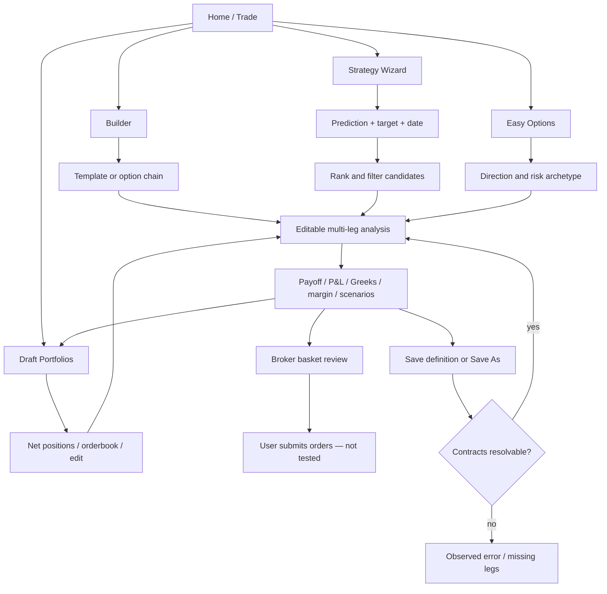

# Sensibull — direct-interface product study

Research session: 24 September 2026, America/Los_Angeles; application displays Indian-market dates/times. Desktop Chrome, existing authenticated session. Source: actual Sensibull UI, not public documentation. Account identifiers, balances, and portfolio performance are intentionally omitted. Numeric examples below concern temporary analysis legs, not recommendations.

## Evidence and scope

**Observed** means the screen/control was visible. **Tested** means an interaction and resulting state were inspected. **Unverified** means the behavior was not exercised or was unavailable. This is a reverse-engineered product requirements document, not a claim about Sensibull's internal implementation.

Inspected home, empty/populated builder, all template categories, option-chain drawer, P&L, Greeks, Strategy Chart, save dialog, existing saved strategy, draft handoff, basket review, Strategy Wizard and filters/details, Easy Options and detail, Expiry Trades, draft portfolio list/detail, draft edit and delete confirmation. No final trade, save, or deletion was submitted. No full historical backtest or strategy-alert configuration was found in these inspected paths; absence from this study does not establish absence from the product.

## 1. Screen inventory and interaction specification

### S01 — Home and Trade navigation

- **Purpose:** choose a trading workflow by expertise and intent.
- **Visible:** Easy Options, Strategy Wizard, Strategy Builder, Draft Portfolios; advanced analysis links, community P&L content; persistent Trade, Analyse, Watchlist, Positions and Orders navigation.
- **Inputs/controls:** workflow cards and Trade dropdown. Trade adds Expiry Trades, learning routes and Mindful Trading.
- **Tested transition:** Strategy Builder opens `/option-strategy-builder?instrument_symbol=NIFTY`.
- **State:** authenticated home. Personalized/community content competes with core workflow entry points. Authentication/empty/error states not encountered here.

### S02 — Empty strategy builder

- **Purpose:** initiate custom construction or load a template/existing strategy.
- **Visible:** underlying quote/search, Info, Settings; empty-editor illustration, Build a new custom strategy; Ready-made, Positions, Saved Strategies, Draft Portfolios tabs; Summary, Charts and Graphs, Greeks and IVs placeholders.
- **Inputs:** underlying, template expiry, directional category. Ready-made instructions explicitly ask the user to click a strategy.
- **Controls/results:** template selection replaces empty editor with legs and full analysis; Build opens construction. Manual P/L control disabled in initial state.
- **Loading:** underlying initially displayed `--`, then populated. Treat the transient placeholder separately from zero or missing data.

### S03 — Ready-made strategy catalog

- **Purpose:** translate a named options structure into editable contracts.
- **Visible:** small payoff-shape cards, strategy names, expiry dropdown, learning link; four categories.
- **Inputs:** category and expiry.
- **Tested:** Bull Call Spread populated buy 23050 CE and sell 23250 CE, both 29 Sep, one lot each. Subsequent editor/risk panels appeared. Category switching changes the card collection.
- **Bullish:** Buy Call; Sell Put; Bull Call Spread; Bull Put Spread; Call Ratio Back Spread; Long Calendar with Calls; Bull Condor; Bull Butterfly; Range Forward; Buy Future; Long Synthetic Future.
- **Bearish:** Buy Put; Sell Call; Bear Call Spread; Bear Put Spread; Put Ratio Back Spread; Long Calendar with Puts; Bear Condor; Bear Butterfly; Risk Reversal; Sell Future; Short Synthetic Future.
- **Neutral:** Short Straddle; Iron Butterfly; Short Strangle; Short Iron Condor; Batman; Double Plateau; Jade Lizard; Reverse Jade Lizard.
- **Others:** Call Ratio Spread; Put Ratio Spread; Long Straddle; Long Iron Butterfly; Long Strangle; Long Iron Condor; Strip; Strap.
- **Unverified:** every template's individual pricing/leg mapping and all expiry choices. Catalog availability is directly observed; full pricing validation is not implied.

### S04 — Populated leg editor and strategy summary

- **Purpose:** construct, resize and analyze a multi-leg strategy.
- **Visible:** strategy name; selected-leg count and recognized structure name; B/S, Expiry, Strike, Type, Lots, Price columns; per-leg selection and remove icon; price/depth menu; Reset Prices; Clear New Trades; Add/Edit; Add to Drafts; Trade All; overflow menu; Manual P/L.
- **Inputs:** per-leg expiry, strike with +/- steppers, CE/PE control, lots dropdown/input and editable entry price. Whole-strategy Shift, Width, Hedge and Multiplier controls.
- **Tested:** loading a two-leg template calculated net price/premium, payoff and risk; adding a put via drawer created a third leg and immediately changed those metrics. Width disabled for the inspected spread; Hedge was enabled for spread then disabled for the arbitrary three-leg combination. Structure-specific controls therefore have capability states.
- **Data example:** initial spread net debit 90.75 points, premium approximately ₹5,899, max profit ₹7,101, max loss ₹5,899, expiry breakeven 23141, reward/risk 1.2 and POP 44%. These are session snapshots, not stable product constants.
- **Price state:** UI says auto-refresh every 30 seconds and shows last-updated time. Manual entry prices and reset imply a distinction between analysis entry assumptions and current quotes.
- **Navigation:** embedded catalog/position sources stay available below; right-side analysis changes without navigation.

### S05 — Add/Edit option-chain drawer

- **Purpose:** choose contracts without leaving the analysis workspace.
- **Visible:** underlying/search and quote, Info, close, Straddles/Strangles/Strikes/Futures tabs, expiry selector, Settings, LTP/OI/Greeks modes. Chain has call and put sides, central strike/IV, deltas, prices and OI bars. Selected contracts show B/S and quantity.
- **Inputs:** expiry, instrument type, B/S on each side, quantity; multiple selections across contracts.
- **Tested:** Buy on 23100 put added one lot (65 units displayed in chain), changed selected count from two to three and recalculated the background strategy. Done returned to editor with three legs.
- **Controls:** Clear All; Done; Show Editor. Done initially disabled while chain loaded, enabled when selected legs were present.
- **Important states:** unknown/unpriced strikes displayed `--`; active rows contain quantity editors; call/put ITM areas use visual shading. Long chain scrolls independently of analysis.
- **Unverified:** straddle/strangle batch addition and futures construction were visible entry points but not exercised.

### S06 — Payoff graph and what-if workspace

- **Purpose:** compare expiry outcomes with modelled outcomes at a target date/price.
- **Visible:** On Expiry and On Target Date curves, underlying spot marker, projected P&L, standard-deviation bands, zoom, OI overlay selector and SD mode. Payoff Graph/Payoff Table subtabs; Add Booked P&L toggle.
- **Inputs:** target underlying via input/stepper/slider; target date/time picker and slider; reset controls; total IV offset and per-strike IVs.
- **Data:** max profit/loss, Target/Expiry breakeven toggle, reward/risk with inversion, POP, time value, intrinsic value; funds needed, margin needed and available margin; aggregate Greeks and target-day futures price; one/two-SD points and price bounds.
- **Tested:** adding a third leg changed chart range, summary, margin, POP and Greeks. Dedicated target/date/IV controls were inspected but not all combinations were exercised.
- **Visible unavailable state:** intraday OI-change warning says unavailable 08:00–09:18 and holidays. This is a specific data-window state, not a chart failure.
- **Unverified:** exact probability methodology, theoretical model and whether displayed return percentages use one consistent capital denominator.

### S07 — P&L Table

- **Purpose:** explain the total through its component legs.
- **Visible:** Instrument, Target P&L, Target Price, Entry Price, LTP; total row and projected total; Multiply by Lot Size and Multiply by Number of Lots switches.
- **Tested:** tab switch presented all three temporary legs and their individual/total projected amounts. Table uses common strategy/scenario context.
- **Important state:** sizing switches in this view were off while aggregate Greeks below had sizing switches on. KANIDA should make units unambiguous rather than assuming synchronized scaling.

### S08 — Greeks table

- **Purpose:** inspect signed leg exposures and totals.
- **Visible:** Instrument, Delta, Theta, Decay, Gamma, Vega, total row, lot-size and lot-count scaling switches.
- **Tested:** switch from P&L to Greeks retained legs and exposed signed sensitivities. Short call delta/vega values were negative.
- **Unverified:** numerical model and normalization conventions beyond labels shown.

### S09 — Strategy Chart

- **Purpose:** visualize recent historical combined premium alongside underlying futures.
- **Visible:** Strategy Price and NIFTY Sep FUT time series, separate price scales, Invert Price switch.
- **Tested:** switching tab rendered a historical series covering multiple recent sessions.
- **Boundary:** this screen is evidence of a historical strategy-price chart. It did not show entry/exit-rule specification, parameter testing, trade ledger, drawdown or a full backtest report.

### S10 — Saved Strategies and save dialog

- **Purpose:** retain reusable definitions and reopen them.
- **Visible:** search by name/underlying; saved-strategy rows with name and contract summary. Overflow: Save, Save As, Share. Save As disabled for a new strategy, enabled after opening an existing one.
- **Tested:** Save opened Save New Strategy dialog, prefilled name, 20-character counter, Cancel and Save Changes. Cancel left data unchanged. Existing strategy click loaded its instruments into builder.
- **Observed failure:** older saved definition loaded blank expiries and strike 0, with `Oops! Something went wrong`, Retry and Dismiss. Summary/chart became placeholders. Prior temporary premium text remained visible during the failure, so the presentation could imply valid pricing where analysis was broken. Root cause was not established.
- **Unverified:** successful save/duplicate, sharing, recovery after Retry and permanent deletion of saved definitions. Nothing was overwritten.

### S11 — Add to Draft Portfolio dialog

- **Purpose:** move an analyzed idea into tracked draft trading.
- **Visible:** list of existing portfolios, radio selection, Create new, Next disabled until selection; close button.
- **Tested:** Add to Drafts opened selector. Closed without creating or modifying a portfolio.
- **Unverified:** subsequent confirmation/fill assumptions for a newly added draft trade.

### S12 — Basket Order review

- **Purpose:** translate analyzed legs into broker orders.
- **Visible:** connected broker identity (Zerodha in this session), Intraday/Overnight, Prices refresh, Charges & Margin, each leg's bid/offer depth and OHLC/LTP/average price, Market/Limit, editable price/lots, individual Buy/Sell buttons; margin needed/available, Re-arrange, Place All at Market with order-type dropdown. New-tab basket preference also present.
- **Tested:** Trade All opened basket review; original two buy legs were displayed ahead of sell leg. Closed basket without submitting.
- **Critical observed inconsistency:** builder showed 29 Sep expiry while basket human-readable contract labels showed 28th Sep. The underlying broker symbol used a monthly expiry code. This study does not determine which label is correct; KANIDA must validate canonical instrument identity and render the same expiry throughout.
- **Behavior disclosed by UI:** price/quantity changes automatically update margin. Individual leg limit defaults coexist with a primary Place All at Market action; execution semantics need explicit review.
- **Unverified:** final submission, acknowledgements, partial fills, rejection, cancellation, post-trade positions and rolling live positions.

### S13 — Strategy Wizard inputs/results

- **Purpose:** discover concrete trades from an underlying price thesis.
- **Inputs:** stock, Above/Between/Below prediction, numeric target, target date; Go disabled until prediction selected. Filters unavailable before result generation.
- **Tested:** Above plus default target/date then Go produced 61 trades, five rows/page and 13 pages. Table showed trade, profit, breakeven, approximate capital, period return%; sortable headers and pagination.
- **Visible context:** event-risk count; expandable caution. Results included naked puts and bull put spreads.
- **Observed date inconsistency:** target picker said 28 Sep, results text said 29 Sep. Timezone/expiry normalization is a hypothesis, not established cause.
- **Empty/loading:** initial explanatory/locked illustration; brief results loading area. Zero-results state not induced.

### S14 — Wizard filters and expanded trade

- **Filters:** debit/credit premium, expiry checkboxes, hedged and unhedged strategy families with counts, target ATM IV per expiry, spread gaps, optional maximum-loss and minimum-profit sliders, delta range.
- **Expanded result:** clicking Trade first expanded details, rather than immediately submitting. It showed exact two legs, plain-language mechanism, liquidity warning, max profit/loss, POP placeholder, View Greeks, LTP/target price, quantity, Trade, Analyse and Add to Drafts.
- **Tested example:** bull put spread explanation describes short put plus lower-strike protection. UI warned that odd multiples of 50 may be illiquid and prices wrong.
- **Unverified:** applying every filter, subsequent Trade submission and Analyse transition.

### S15 — Easy Options and detail

- **Purpose:** present a small, understandable choice set for a directional view.
- **Visible:** NIFTY/BANKNIFTY/FINNIFTY cards with explanation, recent chart, expiry horizon; UP/NEUTRAL/DOWN.
- **Tested:** NIFTY UP revealed Defensive, Balanced and Aggressive cards. Each has thesis/breakeven language, maximum gain/loss, quantity, standalone funds, Add to Drafts, Trade, More Details.
- **More Details:** defensive example explained sell 23000 put / buy 22900 put, lower profit than loss but easier breakeven; expiry payoff interaction, maximum gain/loss price regions, expiry, breakeven, quantity, standalone margin and handoff actions.
- **UX observation:** differentiated risk archetypes plus concrete loss amounts make discovery readable. Broad low-risk/fun wording and color scales should not substitute for numeric risk.

### S16 — Expiry Trades unavailable state

- **Purpose:** thesis-based strategies near expiry.
- **Visible:** Bullish/Bearish/Neutral; FINNIFTY, BANKNIFTY, NIFTY, BANKEX, SENSEX choices with availability times.
- **Observed:** instrument buttons disabled; no strategies available and explicit return timestamp. Some labels said available in 0 hours while still disabled.
- **Boundary:** result cards and trading path could not be inspected in this state. Do not invent them.

### S17 — Draft Portfolios list

- **Purpose:** organize virtual/draft strategy records and aggregate P&L.
- **Visible:** Drafts Mode; selected/total portfolio count; total, unbooked and booked P&L; portfolio name/three P&L columns/strategy count; row and bulk selection; Create New; Delete portfolios; Recently Updated sort.
- **Tested:** list loaded populated portfolios, then clicking one opened its strategies.
- **Loading issue:** initial zero-count/no-portfolios message briefly appeared before populated data. This is a loading-to-content transition, not a genuinely empty account.

### S18 — Draft portfolio strategy detail

- **Purpose:** track virtual positions and their recorded orders.
- **Visible:** strategy selection, portfolio switcher, Create New Strategy, strategy name, Notes, minimize; Net Positions/Orderbook; underlying/expiry filters; breakeven/max profit/max loss; Instrument, Qty, Avg, LTP, total/unbooked/booked P&L.
- **Actions:** Open in Builder, Add Orders, Exit Orders, Edit, Delete, Greeks; Convert To Real Trades disabled for inspected old/expired position.
- **Tested:** Edit opened Orderbook Edit Mode. Row exposes sequence, Buy/Sell, contract chooser, quantity, entry price/date, exit price/date, LTP and P&L. Cancel/Save Changes (disabled while unchanged), Add Order, reset-price and Delete actions; quantity-error indicator visible on inspected old contract.
- **Delete confirmation tested, not completed:** warning explicitly says strategy and associated positions/orders will be deleted and cannot be undone. Cancel preserved it.
- **Important states:** expired marker; missing risk metrics `--`; closed-position toggle; loading initially showed zero orders before one loaded.
- **Unverified:** successful virtual order creation/exits, strategy alerts, dedicated roll orchestration and real conversion.

## 2. End-to-end flows

1. **Custom/template:** Home → Builder → underlying/expiry → template or chain → multi-leg edit → payoff/Greeks/margin → scenario analysis → save definition OR Add to Drafts OR basket review → user submits actual order (not tested).
2. **Thesis discovery:** Wizard → underlying + prediction + target + date → Go → sort/filter → expand candidate → inspect legs/explanation/risk → Analyse or draft or trade.
3. **Beginner discovery:** Easy Options → instrument direction → risk archetype → More Details → quantity → draft/trade.
4. **Manage:** Draft Portfolios → portfolio → strategy → net positions/orderbook → edit records/open in builder/exit → review changes. Saved definitions are a different entry source from tracked draft records.

## 3. Feature/functionality map

| Capability | Evidence | Important boundary |
|---|---|---|
| Named strategy templates | All four catalogs inspected | Individual mechanics not tested for every card |
| Multi-leg CE/PE construction | Three-leg temporary analysis tested | No live orders |
| Expiry/strike/quantity/price editing | Controls inspected; chain addition tested | Full expiry matrix untested |
| Payoff, risk, POP, breakeven | Populated and updated | Methodology not disclosed in inspected UI |
| P&L and Greeks tables | Switched and inspected | Scaling requires attention |
| What-if price/date/IV | Controls observed | Not all scenario combinations tested |
| Margin and costs | Summary/basket controls observed | Final broker reconciliation untested |
| Saved/duplicate/share | Save dialog and Save As states inspected | No persisted mutation |
| Virtual trade management | Draft portfolio/orderbook inspected | Fill model unverified |
| Historical analysis | Strategy Chart rendered | Full backtesting not established |
| Execution | Broker basket review inspected | Submit/fill/reject not tested |
| Adjust/roll | Editable legs/order records | Dedicated roll flow not established |
| Alerts | No strategy-alert editor encountered | Not evidence of product-wide absence |

## 4. Reverse-engineered PRD

**Problem:** options users need to turn either a named structure or a market thesis into priced legs, understand outcomes, preserve ideas, and execute through their broker.

**Users/jobs:** novice chooses direction and risk profile; experienced trader manipulates contracts and sensitivities; active trader manages draft/live positions. Success is not profit; useful product metrics include valid strategy construction rate, time to first risk review, discovery-to-analysis conversion, saved-definition reopen reliability and basket validation completion.

| Requirement | Expected behavior supported by UI | Acceptance criterion for a comparable implementation |
|---|---|---|
| SB-R01 Instrument context | Underlying quote and chain drive builder | All selected contracts belong to explicit underlying; latest quote timestamp visible |
| SB-R02 Template instantiation | Category + expiry generates legs | Template opens editable strategy and recalculates recognized structure |
| SB-R03 Contract editing | B/S, expiry, strike, CE/PE, lots, price | Change updates premium, graph, risk and exposures for the same revision |
| SB-R04 Selection semantics | Selected legs define analyzed subset | Count and totals identify exactly which legs are active |
| SB-R05 Analysis | Expiry/target curves plus leg tables | Table and graph use same assumptions; units explicit |
| SB-R06 Scenarios | Price, time and volatility overrides | Reset returns to documented baseline, without changing live positions |
| SB-R07 Persistence | Save versus Save As | Existing definitions are not silently overwritten when duplicated |
| SB-R08 Tracking | Portfolio → strategy → position/order hierarchy | Booked and unbooked totals reconcile to ledger; draft state prominent |
| SB-R09 Discovery | Targets generate sortable/filterable candidates | Every result exposes contracts, assumptions, capital and downside |
| SB-R10 Execution preparation | Basket with broker, price, quantity and margin | Contract identity survives handoff; review is separate from submission |
| SB-R11 Invalid historical contracts | Error/expired states | Preserve old leg identity; suppress stale live metrics; allow repair |

**Data inferred as necessary, not observed internals:** instrument/expiry master, option quotes and depth, OI and IV, lot sizes, pricing and Greek outputs, margin/cost adapter, saved-strategy definitions, draft trade ledger, broker session/order records, event calendar and historic price series.

**Primary product risks evidenced:** expiry-label mismatch across screens; old strategies cannot reliably resolve; stale prior totals during errors; transient false-empty states; multiple discovery entry points and overlapping saved/draft vocabulary; highly dense advanced workspace.

## 5. Flowchart

## 6. Strengths

- Strong integration of contract construction with outcomes; three-leg changes visibly recalculate the same workspace.
- Broad default catalog, including futures/synthetics and non-directional structures.
- Plain-language beginner discovery and precise target-based discovery coexist.
- Leg-level and aggregate exposure views; independent price/time/IV assumptions.
- Draft tracking has actual order/position records rather than being merely a saved graph.
- Broker review exposes depth, order types, sizing, sequencing and margin.

## 7. Weaknesses and KANIDA implications

- Different expiry labels between analysis/discovery/execution undermine contract confidence. Use canonical instrument IDs and one exchange-time rendering rule.
- A saved old strategy failed with zeroed strike fields. Preserve original terms and show expired/unresolvable badges plus explicit remapping.
- Loading states briefly impersonated empty accounts/orderbooks. Use skeleton/loading status until query completion.
- Dense workspace, nested tabs, unlabeled icons and multiple overlapping saved/draft entry points increase learning cost. Use one strategy library with explicit lifecycle statuses.
- Wizard can rank unhedged ideas beside hedged ones. Make loss constraints and risk type visible before ranking by returns.
- Basket's bulk market CTA differs from per-leg limit selection. Review exact execution policy before submit.
- No full rule backtest or strategy-alert flow established in the inspected scope. KANIDA must specify these independently, not claim they were observed here.
