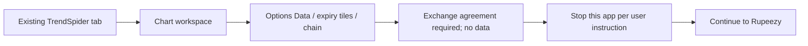

# TrendSpider — direct inspection and availability limitation

Session: 24 September 2026, desktop Chrome, existing tab at `https://charts.trendspider.com/`. User instructed: if unavailable, move to the next app without waiting.

## 1. Screen inventory

### T01 — Chart workspace with Options Data widget

**Observed directly:** WST daily chart for West Pharmaceutical Services, Inc., Nasdaq; OHLC, market-closed status, chart overlays and a lower relative-performance panel. The right side showed a scanner/watchlist with symbol, last price and change percentage. Top controls included Indicators, Candle Patterns, Chart Patterns, Alerts & Bots and Visual Scripts. Lower workspace tabs included Strategy Tester, Market Scanner, Options Data and other analytical widgets. Right sidebar included alerts, options, bots and trading.

**Purpose:** combine underlying market analysis and related data in one workspace. This purpose is inferred from the visible layout, not a verified end-to-end strategy workflow.

**Inputs and controls visible:** symbol field; Daily timeframe; options expiry tiles with dates/days to expiration; Options Grid Customize; lower workspace tabs; alert/bot/trading navigation. These controls were not exercised because the relevant options data was unavailable and the user requested immediate continuation.

**Options chain layout:** calls on left, puts on right; central strike column; call columns OI, Last, Bid, Ask; put side Ask, Bid, Last and OI. Expiry tiles extended across several monthly dates.

**Blocking state:** yellow message: “An exchange agreement is required in order to access this data.” A review-and-accept link was visible. Strike rows showed “no data.” No agreement was accepted.

**Action/result:** activated existing TrendSpider tab and inspected screenshot. The chart workspace was available; options market data required an agreement. No attempt was made to bypass the gate, wait for data, or claim access to downstream options workflows.

## 2. End-to-end user flow — verified boundary

Existing Chrome tab → chart workspace → already-selected Options Data widget → expiry/chain shell → exchange agreement gate → research stops and moves to next app.

No verified flow through options strategy construction, payoff, Greeks, broker review or execution can be provided from this session.

## 3. Feature/functionality map

| Requested capability | Evidence status |
|---|---|
| Strike/expiry selection | Chain layout and expiry tiles visible; interaction untested |
| Bid/ask and OI | Column labels visible; values blocked |
| Backtest/simulation | Strategy Tester entry point visible; operation/results unverified |
| Alerts/bots | Entry points visible; strategy linkage unverified |
| Broker/trading | Trading navigation visible; handoff unverified |
| Options builder/store/defaults/saved strategies | Not inspected beyond blocked data widget |
| Multi-leg CE/PE, payoff, P&L, Greeks, margin, breakeven | Unverified |
| Adjust/roll, save/duplicate/delete, virtual trade | Unverified |

“Unverified” is not “unsupported.” No feature-parity conclusion should be drawn from gated data.

## 4. PRD boundary and usable requirements

A detailed competitor PRD cannot honestly be reverse-engineered past this gate. The following are **KANIDA design implications inferred from the visible screen**, not verified TrendSpider behavior:

- Keep chart context adjacent to option-chain/strategy analysis where useful.
- Present expiry date and days to expiration together.
- Distinguish entitlement-blocked, empty, stale, market-closed and loading states.
- Preserve access to saved definitions and explanatory content while market data is blocked.
- Make prerequisite status visible before a user invests in constructing a strategy.
- Explore explicit strategy testing/monitoring destinations in the KANIDA design; do not assume TrendSpider's Strategy Tester backtests multi-leg options.

For engineering validation, a future authorized session would need market-data access, actual strategy creation, one completed test, saved-strategy lifecycle and an execution review. This study deliberately does not wait for that work.

## 5. Flowchart

## 6. Strengths supported by observation

- Underlying chart and option-chain context share a workspace.
- Expiry dates and DTE are surfaced together.
- The interface identifies the prerequisite for blocked options data.

## 7. Weaknesses and limitations

- Core options evaluation cannot proceed in the current entitlement state.
- The dense workspace presents many advanced entry points, increasing visual competition; this is a desktop layout judgment, not measured usability research.
- The evidence is insufficient to name TrendSpider the best F&O builder, backtester, or execution product. Its tester/bot labels alone do not prove those capabilities for multi-leg options.

No public documentation was substituted for unavailable product access.
