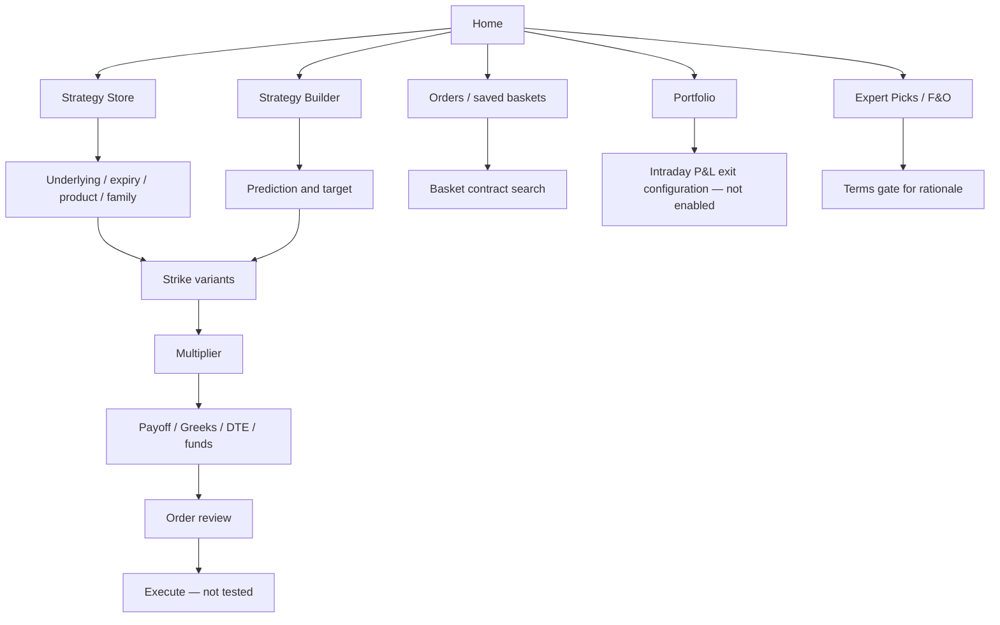

# Rupeezy / Astha — direct-interface product study

Inspected authenticated desktop Chrome at `https://flow.rupeezy.in/web/`, 24 September 2026. The application brands itself **Rupeezy**. A separate Astha-branded application was not inspected; this report covers the user-supplied Rupeezy/Astha reference only. No live orders, funds transfer, saved-basket edits, automated exits, or terms acceptance were performed.

Evidence vocabulary: **tested** = action plus resulting UI observed; **visible** = control inspected without completing its effect; **unverified** = no reliable observation. Reverse-engineered PRD requirements describe the visible product contract, not proprietary internals.

## 1. Screen inventory

### R01 — Home / For Traders

- **Purpose:** route broker customers to recommendations, option chain and strategy tools.
- **Visible:** market-index strip; Home/Market/Orders/Portfolio; expert Stocks & F&O recommendation cards; For Traders → Option Strategy (“Build or use expert strategies”); Basket Order; embedded option chain; position summary.
- **Inputs/controls:** Option Strategy opens strategy area. Recommendation View all opens Expert Picks. Chain supports instrument and expiry selection and expansion.
- **Data:** quotes, expiry/strike/type for recommendations, expected profit and target remaining; chain call/put OI, option prices and central strike/PCR.
- **State:** empty watchlist/zero positions were visible; live quote placeholders populated asynchronously. Home includes unrelated investing/news content, increasing distance to the options workflow.

### R02 — Strategy Store catalog

- **Purpose:** discover a named structure and generate concrete strike variants.
- **Navigation:** `/options-strategy/?tab=store`; sibling Strategy Builder tab; persistent broker navigation/watchlist.
- **Inputs:** index shortcuts NIFTY, BANKNIFTY, SENSEX, FINNIFTY, MIDCPNIFTY, NIFTYNXT50, BANKEX; Search Option Symbol; expiry date tiles; Intraday/Carryforward product type.
- **Visible templates:** Bull Call Spread, Bull Put Spread, Ratio Call Spread, Ratio Put Spread, Bear Call Spread, Bear Put Spread, Short Strangle, Long Strangle, Iron Condor, Iron Butterfly, Short Straddle, Long Straddle.
- **Each card:** structure name, About button, B/S markers, relative moneyness (ATM/OTM/ITM), option type and quantity ratio.
- **Tested:** Bull Call Spread About opened an explanation; card selection opened four numbered variants. Expiry/product controls visible but not every combination exercised.
- **Default leg recipes:** bull call = buy 1 ATM CE / sell 1 OTM CE; bull put = buy 1 OTM PE / sell 1 ITM PE; ratio call/put = buy 1 ATM / sell 2 OTM of same type; bear call = buy OTM CE / sell ATM CE; bear put = buy ATM PE / sell OTM PE; short/long strangle = sell/buy OTM put and call; iron condor = two bought outer options and two sold options; iron butterfly = bought OTM wings and sold ATM call/put; straddles = matched ATM call/put buys or sells.

### R03 — Template explanation

- **Purpose:** explain structure before selection.
- **Visible:** modal title, plain-language use case, legs and Okay.
- **Tested:** bull call description says limited expected increase, buy call and sell higher-strike call at same expiry, capped gains/limited losses. Okay closes modal and preserves catalog.
- **States:** no error/empty state encountered.

### R04 — Store strategy variants

- **Purpose:** choose among implementations of one family.
- **Visible:** underlying/exchange/expiry quote header, Back; expandable Bull Call Spread 1–4 cards; Multiplier minus/value/plus; max profit, breakevens, max loss; expanded leg list; required/available funds; Analyse and Continue.
- **Tested:** first variant displayed buy 23050 CE and sell 23100 CE, 29 Sep, one lot. Analyse opened payoff modal; Continue later opened order review.
- **State:** funds initially `...`, then numeric. Insufficient-funds warning and Add funds appeared. No funding link was followed.
- **Observed consistency concern:** initial variant leg prices changed as quotes loaded, but displayed risk figures persisted; card and analysis modal showed different breakeven values. The study establishes visible differences, not the root cause or correctness of a particular value.

### R05 — Analysis modal

- **Purpose:** review payoff and sensitivities without losing candidate selection.
- **Visible:** underlying quote; payoff plot with curved target-time line and angular expiry profile; Days To Expiry slider; breakeven, max profit/loss, Delta/Gamma/Theta/Vega; multiplier, leg list, funds and Continue; Back/Close.
- **Tested:** analysis loaded from placeholders/DTE 0 into populated DTE 4 state. Slider moved from 4 to 0. Continue opened pre-execution review.
- **Data example:** first spread max profit ₹1,374.75, max loss ₹1,875.25; card breakeven 23,078.85, analysis breakeven 23,087.50. Treat these as observed snapshots, not validated model outputs.
- **Inputs not found here:** explicit target spot input, global/per-leg IV scenario, leg-level Greeks table and P&L scenario table. Do not infer they are absent elsewhere.
- **State:** required-funds estimate loads independently; insufficient-funds message persists while Continue remains available for review.

### R06 — Strategy execution review

- **Purpose:** inspect basket before sending broker orders.
- **Visible:** strategy name, Back/Close, Name/Product Type/LTP/Order Price/Lots–Qty; full expiry and strike/CE/PE with B/S; Intraday; MKT; 65 units per inspected leg; required/available funds; Analyse and Execute.
- **Tested:** opened via Continue, then closed. Execute was not pressed.
- **Boundary:** final validation, rejection, partial fills, order sequencing and post-fill management are unverified. No third-party broker handoff was shown; this is within Rupeezy's broker UI.
- **Important behavior:** store product choice propagates to order review; primary execution review makes market order type visible. Individual price editing was not exposed in this inspected modal.

### R07 — Strategy Builder prediction form

- **Purpose:** generate structures from an underlying price prediction.
- **Navigation:** `/options-strategy/?tab=builder`.
- **Visible:** same underlying search/index shortcuts, expiry tiles, Intraday/Carryforward; selected instrument quote; Above/Between/Below; predicted-value inputs; Continue.
- **Tested:** Above reduced two value fields to one; entering 23500 enabled Continue; click changed button to disabled Loading, then generated result list.
- **Critical distinction:** this screen called “Strategy Builder” is a thesis-to-candidate generator in the inspected version. A free-form CE/PE leg grid was not present here.
- **Validation observed:** Continue disabled before suitable input. Invalid ranges/negative values were not tested.

### R08 — Generated strategy results

- **Purpose:** select an implementation of the prediction.
- **Visible:** underlying/expiry header and Back; large scrollable/virtualized list of repeated Bull Call Spread and Bull Put Spread cards with risk and breakeven; first expanded with actual contracts/funds/actions. Accessibility state reported 237 items for inspected target.
- **Tested:** increasing first candidate multiplier from 1 to 2 doubled lot counts, max profit and max loss; breakeven stayed unchanged. Example ₹1,374.75/₹1,875.25 became ₹2,749.50/₹3,750.50.
- **Controls:** expand/collapse card, multiplier, Analyse, Continue.
- **UX limits observed:** no prominent sort/filter controls or prediction summary in the inspected results viewport. Many repeated family names make differences difficult to compare. Selection does not provide direct strike/expiry edits in the inspected candidate card.

### R09 — Orders workspace

- **Purpose:** inspect broker order lifecycle.
- **Visible:** Executed, Pending, Rejected, GTT and Basket Order tabs; search; pending table Symbol/LTP/Product Type/Lots–Qty/Status/Order Price/Trigger Price; Cancel All.
- **Tested:** Orders opened pending empty state; Basket Order loaded saved basket list.
- **State:** No data found for pending orders; counts load asynchronously. GTT exists as navigation, but strategy linkage and trigger setup were not tested.

### R10 — Saved basket list and naming

- **Purpose:** retain reusable groups of orders.
- **Visible:** basket-name/order-count table, row/bulk checkboxes, Create New Basket and Execute (disabled when no selection). Existing rows had zero orders.
- **Tested:** opening a row showed an empty basket; Create New Basket replaced footer with inline Basket Name, 0/16 character counter, cancel and confirm. Cancel preserved the list.
- **Important boundary:** this is a saved **order basket**, not demonstrated persistence of payoff scenarios or strategy research metadata. No direct Store/Builder → Save Basket action was found in those screens.
- **Unverified:** successful basket creation, duplication/deletion or maximum-basket limits.

### R11 — Basket detail/search

- **Purpose:** assemble orders within a basket.
- **Visible:** basket name, `(0/10)` capacity, Search & add to Basket, Close; “Nothing is available in this basket” and instruction to search/click to add.
- **Tested:** opened existing empty basket, closed without modifying it.
- **Unverified:** contract-picker results, manual leg creation, basket analysis and actual execution. The visible 10-item capacity does not establish the maximum legs supported by strategy analysis.

### R12 — Portfolio positions and P&L auto-exit

- **Purpose:** monitor broker positions and configure account-level intraday exit thresholds.
- **Visible:** Positions/MTF/Holdings, search, overall/realized/unrealized P&L, optional P&L based on market depth, Symbol/LTP/Product Type/Lots–Qty/Avg Price/P&L; Square Off All; Set P&L Exit.
- **Tested:** Set P&L Exit opened Auto Exit on P&L panel. It showed intraday P&L/open-position count, “Active for today's session”, profit-booking amount with enable checkbox, loss-limit amount with enable checkbox, Set P&L Exit.
- **Disclosed behavior:** exits execute via market order; actual P&L may differ; applies only to intraday positions.
- **No mutation:** neither threshold nor enabling checkbox was changed; panel closed. Scope appeared account/intraday, not an individual options strategy. Do not market it as a confirmed strategy-alert engine.
- **State:** no positions; post-trade adjust/roll unavailable for inspection.

### R13 — Expert Picks F&O discovery

- **Purpose:** browse externally authored trade recommendations.
- **Visible:** Active/Closed/My Picks and All/Equity–MTF/F&O filters; attribution to registered research analysts; Recent Hits strip and See all closed.
- **Tested:** F&O filter displayed contract cards with Buy/Sell, intraday classification, exchange and timestamp, underlying, expiry/type/strike, quote/change, potential gain, entry, stop loss, target, margin and lot size. Analyst-registration control and Why this Reco link.
- **Boundary:** these were individual-contract recommendations, not demonstrated multi-leg strategy recommendations. “Recent Hits” is a selection of outcomes; no comprehensive performance audit was conducted.

### R14 — Recommendation terms gate

- **Tested:** Why this Reco opened Investment Disclaimer with terms link, Cancel and Proceed; text states proceeding accepts terms and conditions. Cancel returned to home.
- **Blocked:** rationale detail, follow/save controls and recommendation execution beyond this gate. No terms accepted and no public content substituted.

## 2. End-to-end flows

1. Home → Option Strategy → Store → underlying/expiry/product → family → variant → multiplier → Analyse → DTE scenario → Continue → review contracts/funds/order type → Execute (not submitted).
2. Strategy Builder → instrument/expiry/product → Above/Between/Below + values → Continue/Loading → generated candidates → analysis/order review.
3. Orders → Basket Order → existing basket or new name → contract search (not exercised) → selected-basket execution (not submitted).
4. Portfolio → positions → P&L Exit configuration → potential automated intraday market exits (configuration not enabled).
5. Home recommendations → Expert Picks → F&O → Why this Reco → terms gate → research stops for that path.

## 3. Feature/functionality map

| Capability | Evidence and qualification |
|---|---|
| Strategy store/defaults | 12 structures, recipes and explanations observed |
| Discovery builder | Prediction input and generated candidates tested |
| Strike selection | Select variant with concrete strikes; arbitrary strike editing not established |
| Expiry selection | Date tiles visible in Store/Builder |
| Calls/puts/multi-leg | Preassembled two/four-leg recipes; two-leg review tested |
| Sizing | Multiplier recalculation tested |
| Payoff/Greeks/breakeven/max loss-profit | Analysis modal populated |
| Margin | Required/available and shortage states observed |
| What-if | DTE slider tested; spot/IV controls not found in inspected modal |
| Saved strategies | Saved order baskets observed; strategy-definition persistence unverified |
| Duplicate/delete/roll | Not established for strategy objects |
| Backtest/virtual trade | No controls found in inspected strategy paths |
| Execution | Native order review observed; no submit |
| Monitoring | Portfolio P&L; intraday auto-exit config; strategy scoping unverified |
| Expert recommendations | Single-contract F&O cards; rationale terms-gated |

## 4. Reverse-engineered PRD

**Problem:** help a broker customer find a standard multi-leg position quickly, understand basic risk/capital needs, and prepare execution.

**Personas:** template-first options trader; directional user unsure of legs; broker customer maintaining order baskets. The inspected product optimizes selection and transaction preparation over deep scenario research.

| ID | Requirement | Acceptance criteria for a comparable implementation |
|---|---|---|
| RZ01 | Family catalog | Cards expose side/type/moneyness/ratio and concise explanation |
| RZ02 | Variant generation | Underlying/expiry/product produce executable contract combinations |
| RZ03 | Prediction generation | Above/Below requires one valid target; Between requires ordered bounds; loading explicit |
| RZ04 | Candidate sizing | Multiplier preserves ratios, scales monetary payoff and leaves breakeven invariant |
| RZ05 | Analysis | Candidate and modal share one quote/calculation revision; DTE control updates projected curve |
| RZ06 | Funds | Loading, available, shortage and error states distinguished; quote source/as-of explicit |
| RZ07 | Pre-execution | Show all legs, quantities, product and order type before Execute |
| RZ08 | Saved baskets | Name validation, capacity, empty-state contract search and explicit mutation controls |
| RZ09 | P&L automation | Clearly identify intraday/account scope, trigger thresholds, market execution and active duration |
| RZ10 | Recommendations | Author, timestamp, lifecycle, entry/stop/target and rationale provenance retained |

**Necessary data inferred:** instrument/expiry/lot master, quotes, candidate generation rules, payoff/Greek service, broker margin and funds, basket definitions/order records, positions/P&L, automation state and recommendation metadata. Internal APIs were not inspected.

**Useful product metrics:** time from family selection to risk review; valid candidate rate; target-to-candidate latency; candidate comparison rate; quote/margin consistency; review abandonment reason; basket reopen success. Profit is not a UX success metric.

## 5. Flowchart

## 6. Strengths

- Template cards show leg recipes before requiring navigation.
- Family → variants → analysis → review is easy to follow.
- Multiplier preserves structure and visibly scales monetary risk.
- Required/available funds and shortage are surfaced before execution.
- Recommendation cards include entry, stop, target, time and author attribution.
- P&L auto-exit scope and market-order mechanics are stated in the configuration UI.

## 7. Weaknesses and KANIDA implications

- “Builder” naming suggests arbitrary construction, while inspected behavior generates recommendations. Name this Discover; reserve Build for direct leg editing.
- Hundreds of repeated family cards lack visible comparison and filtering in inspected results. Rank a small explainable shortlist and allow side-by-side comparison.
- Candidate and analysis breakevens differ. Make all metrics derive from one immutable calculation revision and show quote timing.
- Strategy research, saved baskets and live positions are separate without an observed durable strategy identity. KANIDA should connect them with an explicit version/history model.
- No leg-level P&L/Greeks, full backtest, virtual ledger, IV scenarios or dedicated rolling workflow established in strategy screens. Build these only with explicit requirements, not assumptions about competitor parity.
- Large empty watchlist consumes horizontal space during strategy research. Make auxiliary panes collapsible and prioritize active task.
- Old Expert Picks cards showed zero quotes and anomalous instrument/lot combinations. Their correctness was not verified; KANIDA must mark unavailable data and validate contract identity before execution.
- Recommendation rationale blocked by terms; document entitlement states and retain browse access where possible.
