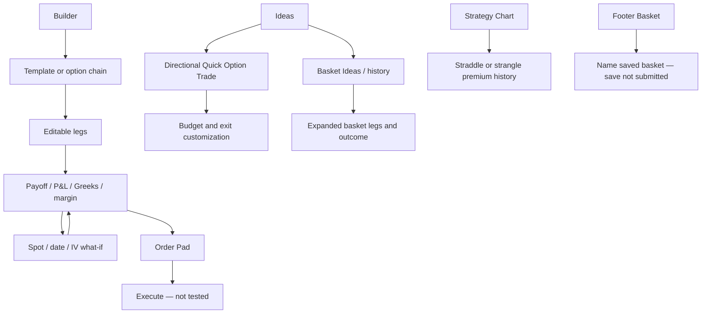

# 5paisa FNO 360 — direct-interface product study

Session: 24 September 2026, existing authenticated Chrome tab at `https://fno.5paisa.com/strategy-builder`. Direct interaction and screenshots, without public-documentation substitution. No final orders, saved baskets, preferences or account settings were changed. Temporary strategy-analysis inputs were exercised. Private identity/balance data is excluded.

**Observed/tested** refers to visible screens and verified transitions. **Unverified** does not mean unsupported. Product requirements below reverse-engineer the visible experience, not the implementation.

## 1. Screen inventory

### P01 — Strategy Builder empty state and shell

- **Purpose:** initiate options construction within the broker terminal.
- **Visible:** underlying search/quote, Clear, refresh and settings icons; Build your Strategy; template categories/expiry; empty right analysis area.
- **Global navigation:** Overview, Option Chain, Open Interest, Scalper, Ideas, F&O Stats, Strategy Chart, Strategy Builder, Company Info. Footer: Positions, Orders, Holdings, VTT, Basket, Watchlist, Screener, News.
- **Tested:** Bull Call Spread card opened editable two-leg analysis.
- **States:** initial empty editor gives one obvious action; analysis region blank until legs added. Several icon controls exposed glyphs rather than descriptive accessibility labels.

### P02 — Default template catalog

- **Purpose:** instantiate a structure from a payoff-shape card.
- **Inputs:** Bullish/Bearish/Neutral/Others; expiry dropdown. Cards show miniature payoff glyph and name.
- **Tested:** all category inventories inspected; bull call spread loaded buy 23050 CE / sell 23300 CE, one lot each.
- **Bullish:** Buy Call; Sell Put; Bull Call Spread; Bull Put Spread; Call Ratio Back Spread; Long Calendar With Calls; Long Call Diagonal Spread; Bull Condor; Bull Butterfly; Range Forward; Synthetic Long Call.
- **Bearish:** Buy Put; Sell Call; Bear Put Spread; Bear Call Spread; Put Ratio Back Spread; Long Calendar With Puts; Long Put Diagonal Spread; Bear Condor; Bear Butterfly; Risk Reversal; Synthetic Short Call.
- **Neutral:** Short Straddle; Iron Butterfly; Short Strangle; Short Iron Condor; Batman; Double Plateau; Jade Lizard; Reverse Jade Lizard.
- **Others:** Call Ratio Spread; Put Ratio Spread; Long Straddle; Long Iron Butterfly; Long Strangle; Long Iron Condor; Strip; Strap.
- **Boundary:** names are transcribed as shown, including Synthetic Long/Short Call; do not silently replace them with other financial definitions. Individual mechanics were not validated for every card.

### P03 — Editable legs and risk summary

- **Purpose:** assemble and evaluate a custom multi-leg position.
- **Visible:** selected-leg checkboxes; B/S, expiry, strike, CE/PE, lots, entry price and LTP; strike/lot steppers; delete icons; Lot Multiplier; Net Premium Pay; Trade; Add/Edit.
- **Inputs:** side/type toggles, per-leg expiry, strike, quantity, entry price. Dropdown showed multiple weekly/monthly/long-dated expiries and W1/W2/W3 markers.
- **Data example:** two-leg spread premium 104.40 points; max profit ₹9,464, max loss ₹6,786, POP 42.87%, margin approximately ₹41,396.88, funds ₹44,526.63, RR Ratio 0.72, breakeven 23,154.41. Snapshot only, not advice or independent model verification.
- **Tested:** adding a 23100 put changed premium to 234.25, risk, margin and two breakeven points. The right panel reacted immediately.
- **Important state observation:** the later category-navigation sequence returned the editor to two legs. Cause was not isolated; do not assume a reliable persistence contract from this session. KANIDA needs explicit dirty-state preservation and regression coverage.

### P04 — Option/futures chain drawer

- **Purpose:** pick contracts while retaining background analytics.
- **Visible:** OPT/FUT tabs, expiry, underlying/quote, Greeks checkbox, Reset, Done; call/put LTP sides, B/S controls, central strikes and OI bars; selected contract +/- quantity.
- **Tested:** clicking B on 23100 put added it as a third leg; Done returned to editor; analytics updated.
- **Important states:** selected buy/sell sides visually highlighted; empty or unavailable prices sometimes shown as 0.00 in distant strikes. Zero and unavailable data need distinction.
- **Unverified:** futures addition and full chain-Greeks mode behavior.

### P05 — Payoff and scenario controls

- **Purpose:** compare expiry outcome and target-date model output.
- **Visible:** payoff chart with spot marker, profit/loss shading and ±1/2 SD lines; Max Profit/Loss, Probability of Profit, RR Ratio, breakevens, Margin Required, Funds Needed.
- **Inputs:** target underlying value and slider; target date button/picker/previous-next/slider; target and date resets; global strikewise IV offset; per-leg IV +/- inputs; Reset IV.
- **Tested:** target changed from 23063.1 to 23500; percent move changed to 1.89%; P&L table showed new projected leg prices and aggregate P&L. This verifies forward scenario recalculation, not historical backtesting.
- **Units:** Net Premium initially displays points while monetary risk includes lot size. RR Ratio orientation is not spelled out in its label. KANIDA should label both directly.
- **Date concern:** visible target-date button and hidden/accessibility picker used different local/date representations. Builder expiry labels read 28 Sep while native order pad read 29SEP. No cause was established; timezone normalization is a possible explanation only.

### P06 — P&L Table

- **Purpose:** reconcile scenario outcome by leg.
- **Columns:** Instrument, Target P&L, Target Price, Entry Price, LTP; total row.
- **Tested:** at baseline target, each leg P&L was zero. At 23500, temporary three-leg example showed target P&Ls ₹22,041.50, −₹14,696.50 and −₹7,566.00, total −₹221.00; target option prices differed from frozen entry/LTP. Values are illustrative snapshots.
- **State:** tab shares strategy and scenario; removing/replacing legs changes rows. Explicit last calculation timestamp was not observed in this table.

### P07 — Greeks and builder settings

- **Purpose:** explain exposure by leg and in total.
- **Columns:** Instrument, Delta, Theta, Decay, Gamma, Vega; total row with signed values.
- **Tested:** switched into Greek view for three-leg strategy; row signs reflected side. Settings popover exposed Multiply By Lot Size and Manual P&L checkboxes; neither setting was changed.
- **Unverified:** scaling behavior after toggling, definition of Decay versus Theta, model assumptions and a manual-P&L form.

### P08 — Embedded Strategy Charts and MultiStrike OI

- **Purpose:** add historical premium/OI context alongside analysis.
- **Observed:** Strategy Charts tab exposed Time/Net Premium axes and chart tools. MultiStrike OI displayed “Please select strategy to draw charts” although editor had checked legs.
- **Tested:** tab transitions; screenshot verification of the contradictory MultiStrike OI empty state.
- **Boundary:** successful OI series rendering was not established. Neither tab demonstrated a rule-driven backtest.

### P09 — Order Pad

- **Purpose:** prepare all selected legs for native broker execution.
- **Visible:** Delivery/Intraday global choices; table Name, Product Type, Order Type, Qty, Price, Trigger, LTP; side markers; Market/Limit/SL per leg; quantity +/-; Freeze Qty 1755 for inspected contracts; Execute At Market and Execute; close.
- **Tested:** Trade opened modal, then close exited without submission. The temporary three legs appeared, each 65 units, limit selected, entry prices in order-price fields.
- **Observed expiry mismatch:** editor showed 28 Sep 2026, order-pad names showed NIFTY 29SEP. Canonical identity correctness was not established by this study.
- **Unverified:** actual order acknowledgements, execution ordering, split orders, partial-fill recovery and rejection. Freeze quantity is a session/instrument datum, not a global rule to hard-code.

### P10 — Basket drawer and Create Basket

- **Purpose:** manage saved order groups separately from analysis.
- **Visible:** footer Basket opens drawer; “No Baskets”, explanatory copy and Add New Basket; creation modal Name your Basket, help text and Save.
- **Tested:** opened empty list and naming dialog; Escape dismissed without saving.
- **Boundary:** no builder Save/Save As action was found in the inspected controls. Basket persistence does not establish persistent strategy analysis/scenarios. Edit/duplicate/delete of an existing basket could not be inspected because no baskets existed.

### P11 — VTT entry

- **Purpose observed:** an order-related feature, not demonstrated paper trading.
- **Visible:** No VTT orders placed; Start new VTT; next modal Search Scrip for VTT with All/FNO/Equity/ETF and Recent View.
- **Tested:** entry/search modal opened then dismissed.
- **Boundary:** acronym meaning, order rules and strategy connection were not established. Do not label VTT “virtual trade” from its name.

### P12 — Dedicated Strategy Chart: Straddle / Strangle

- **Purpose:** inspect historical combined premium with underlying index context.
- **Navigation:** sidebar Strategy Chart → `/straddleChart`.
- **Visible:** Straddle Chart dropdown with Strangle Chart alternative; index choices NIFTY/BANKNIFTY/FINNIFTY/MIDCPNIFTY; strike selector, expiry, refresh, Place Strategy; chart with underlying dashed line and straddle line, separate axes and time labels.
- **Tested:** straddle chart successfully rendered; dropdown switched to Strangle, exposing separate Call and Put strike selectors. Selectors initially showed Loading and Place Strategy disabled, then populated in the straddle state.
- **Unverified:** Place Strategy final path and chart-based alert setup. This screen is historical premium visualization, not a proven backtest engine.

### P13 — Derivatives Ideas / Quick Option Trade

- **Purpose:** discover individual option ideas from direction.
- **Navigation:** Ideas → Derivatives, Basket Ideas, Commodity.
- **Visible:** NIFTY/BANKNIFTY/SENSEX Bullish/Bearish toggles. Below: Short Term and Intraday recommendation sections, View All and View History.
- **Tested:** NIFTY Bullish generated three call cards, ATM/OTM1/OTM2. Fields: contract, expiry, CMP, entry, target, stop loss, investment required, expected loss/profit, lots with “1 Lot = 65 Qty”, Trade Now.
- **Labels:** ATM card marked Recommended/High Risk; OTM cards Low Risk. These are UI labels, not validated suitability or total-risk judgments.
- **Empty states:** no active calls for Short Term and Intraday; retained history entry points.

### P14 — Quick Option Trade Customize

- **Purpose:** set budget and planned exit assumptions for generated ideas.
- **Visible:** amount to trade with (10000 default), maximum loss percentage/amount (30%/3000), profit-booking percentage/amount (40%/4000); explanatory text ties them to stop-loss/target calculation; Save.
- **Tested:** opened customization only; did not save preferences.
- **Critical product distinction:** planned stop-loss amount is not necessarily maximum possible loss. KANIDA should show structural maximum loss and planned exit-risk separately.

### P15 — Basket Ideas active and history

- **Purpose:** discover expert multi-leg derivative baskets and inspect past lifecycle.
- **Visible:** Derivative Baskets with named author; active state “No active calls available at this time”; View History.
- **Tested:** history opened table with date groups, basket name, entry, target, stop loss, closed at; statuses included Profit Booked, Stoploss Triggered, Target Achieved, Exit. Rows included iron fly and call/put credit/debit spreads.
- **Expanded row:** Sensex Iron Fly showed four exact instruments and B/S: long lower put, short ATM put/call, long upper call. Confirms multi-leg discovery history.
- **Boundary:** active recommendation order handoff unavailable in the inspected state; history is not a user-run backtest, complete performance audit, or saved personal strategy library.

## 2. End-to-end user flows

1. Builder → underlying → template or Build/Add–Edit → chain/expiry/B–S/lots → editable legs → payoff/risk → scenario price/date/IV → P&L/Greeks → Trade → Order Pad → Execute (not submitted).
2. Ideas → index direction → ATM/OTM choices → customize budget/exit assumptions → quantity → Trade Now (not submitted).
3. Basket Ideas → active empty state → history → expand multi-leg basket to inspect instruments/outcome.
4. Strategy Chart → straddle/strangle → index/strike(s)/expiry → premium/underlying plot → Place Strategy (visible, not exercised).
5. Footer Basket → empty list → new basket name → Save (not submitted). No demonstrated link that preserves full builder state.

## 3. Feature/functionality map

| Capability | Direct evidence |
|---|---|
| Default structures | Four catalogs inspected, including calendars/diagonals |
| Manual CE/PE/multi-leg | Third leg added through chain |
| Expiry/strike/size/entry editing | Visible; target and chain interactions tested |
| Payoff/P&L/Greeks/POP/risk/margin | Populated views inspected |
| What-if spot/time/IV | Controls visible; spot → P&L tested |
| Premium history | Dedicated straddle chart rendered |
| MultiStrike OI | Tab opened; contradictory empty state |
| Strategy persistence | Not established; empty saved-basket workflow inspected |
| Duplicate/delete/roll | Leg removal visible; strategy lifecycle unverified |
| Virtual trade | Not established; VTT must not be assumed virtual |
| Backtest | Not established from premium charts/history |
| Execution | Multi-leg order pad inspected, no execution |
| Monitoring | Positions/orders/VTT entry points visible; strategy-alert setup unverified |
| Recommendations | Quick single-leg options and historical expert multi-leg baskets |

## 4. Reverse-engineered PRD

**Problem:** allow a broker customer to build custom option combinations, inspect risk/scenarios, and prepare a multi-leg order without leaving the terminal.

**Personas:** experienced options trader using chain and Greek controls; direction-first user consuming Quick Option Trade; expert-basket follower; premium-chart user.

| ID | Requirement | Comparable acceptance criterion |
|---|---|---|
| FP01 | Catalog and custom chain | Every template resolves to editable, identifiable contracts; manual legs can be added |
| FP02 | Scenario state | Price/date/IV overlays are separate from entry prices and actual orders |
| FP03 | Leg table | Selection, side, expiry, strike, type, lots, entry and LTP remain explicit |
| FP04 | Analysis consistency | Summary/curve/P&L/Greeks use identical leg revision and quote context |
| FP05 | Units and risk | Points versus currency, lot scaling and ratio orientation are labeled |
| FP06 | Execution review | Exact contract, quantity, product, type, price/trigger and limits visible before submission |
| FP07 | Chart integrations | Missing/unavailable strategy series state explains how to recover without losing legs |
| FP08 | Discovery | Planned targets/stops are distinguished from payoff extrema |
| FP09 | Historical recommendations | Original legs plus lifecycle/outcome retained, including losses and exits |
| FP10 | Accessibility | All icon buttons have action names; complete keyboard route through editor/review |

**Inferred dependencies:** contract/expiry master, real-time chain, option/underlying historical series, IV/pricing/Greeks, probability and margin service, broker basket/order/position adapters, recommendation records and persisted preferences. Backend stack/API names are unknown.

**Product metrics:** time to valid strategy, scenario exploration completion, analysis-to-review conversion, contract mismatch count, chart-empty-state incidence, accidental draft loss, calculation reconciliation and keyboard task success.

## 5. Flowchart

## 6. Strengths

- Complete direct construction plus template catalogs in one workspace.
- Entry price and LTP are separate, enabling explicit hypothetical analysis.
- Spot/date/IV controls and per-leg P&L/Greeks provide useful diagnostic detail.
- Native order pad exposes per-leg market/limit/stop-loss choices and freeze quantity.
- Dedicated straddle/strangle chart connects premium history and underlying context.
- Expert-basket history includes both profitable and stop-loss outcomes and expands exact legs.

## 7. Weaknesses and KANIDA implications

- Expiry/date representations differ across builder and broker review. Keep exchange date and timezone explicit; validate IDs end to end.
- MultiStrike OI asks for a selection already present. State contracts between widgets need regression tests and actionable errors.
- No clear saved-analysis library found. Keep a durable strategy identity linking draft, paper, live and archived records.
- Risk labels on OTM ideas can obscure probability, liquidity and full premium loss. Show risk dimensions and numeric downside rather than a single low/high label.
- Heavy dark density, duplicated navigation and glyph-only controls reduce accessibility.
- Historical charts, recommendation history and virtual simulation are different capabilities. Name them precisely.
- User-added legs were not consistently retained through the observed sequence; cause unisolated. KANIDA should autosave/version drafts and keep category browsing independent of active legs.
