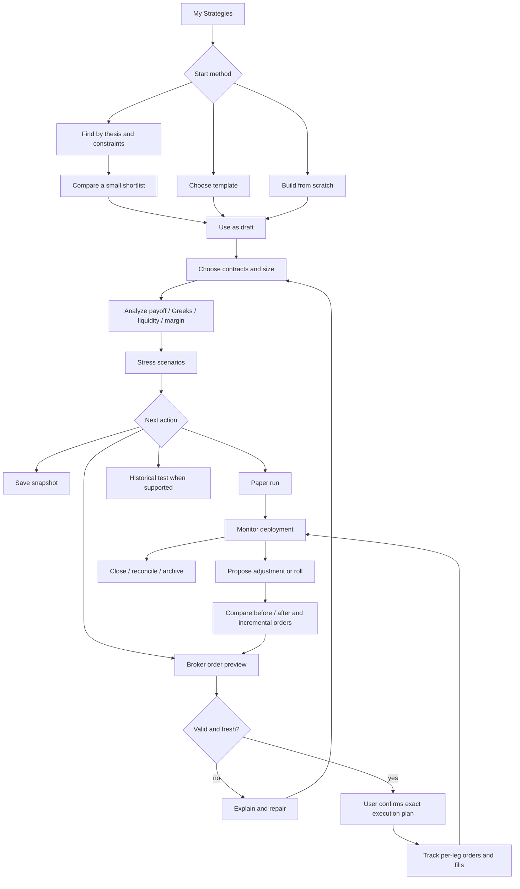
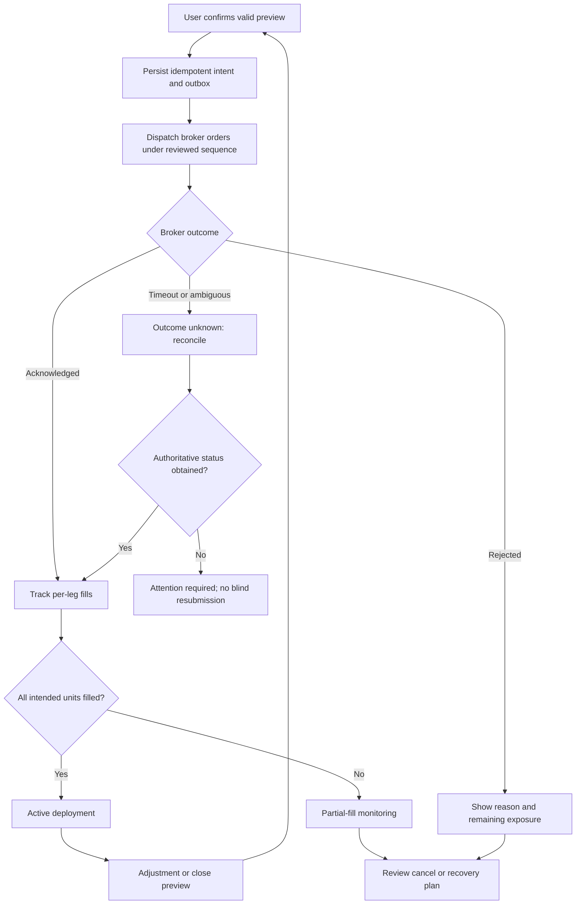

# KANIDA Strategy Builder — product, UX and engineering blueprint

Version 1.0 · 24 September 2026 · Proposed product specification

This blueprint is a **KANIDA design proposal** informed by the direct-interface reports in this folder. It is not a competitor feature claim or investment recommendation. Source tags reference inspected screens: S = Sensibull, T = TrendSpider, R = Rupeezy, P = 5paisa. Where access was unavailable, the design is explicitly independent. Product decisions below are proposed defaults for engineering/UX review, not claims of existing KANIDA functionality.

## 1. Product decision and scope

Build one strategy workspace that preserves a user's thesis, contracts, analysis assumptions, saved revisions, paper trades, broker orders and monitoring history. Use progressive disclosure to make the first strategy straightforward without limiting advanced analysis.

**Primary journey:** Choose intent → choose/build legs → understand risk → stress-test → save/paper or review orders → execute with explicit user confirmation → monitor → adjust/roll with a before/after comparison → close/archive.

**Primary navigation:** My Strategies · Discover · Build. Within a selected strategy: Build · Analyze · Test · Activity. Paper/Live status is explicit; it is not a cosmetic toggle that changes an existing ledger's meaning.

**First release:** Indian listed options, supported index instruments and broker adapters, same-expiry single-underlying strategies, 1–8 analytical legs, manual construction, curated templates, deterministic scenario analysis, versioned saving, paper ledger, broker preview/execution, alerts and reconciliation. The eight-leg cap is a proposed KANIDA capacity, not an exchange rule; adapter limits may be lower and must be enforced before preview.

**Subsequent releases:** futures legs; stock options when settlement/delivery obligations are implemented; calendars/diagonals with explicitly correct multi-expiry analytics; historical replay and rule backtesting; richer discovery; coordinated roll planning. The data model supports these early, but UI capabilities remain disabled until their analytics/execution requirements pass validation.

**Not the initial promise:** guaranteed returns, personalized trade advice inferred from an account balance, atomic exchange execution of independent legs, fully automated rebalancing, or historical results computed from current quotes. Recommendation ranking means “matches the user's supplied constraints,” not “will be profitable.”

### Users and jobs

| User | Job | Minimum successful experience |
|---|---|---|
| Direction-first learner | Express a thesis and choose a comprehensible structure | Three explainable candidates, explicit downside/capital, editable legs |
| Experienced options trader | Construct exact contracts and stress exposures | Fast chain keyboard flow, granular IV/time/price, signed leg/total Greeks |
| Active strategy manager | Keep research, fills and adjustments coherent | Actual-fill P&L, alerts, version history, before/after adjustment review |
| Researcher | Test a repeatable thesis without confusing assumptions and facts | Reproducible snapshot/replay, realistic fill/cost assumptions, exportable ledger |

### Success measures

- Median/p90 time to first valid analyzed strategy; percentage of sessions reaching a risk review.
- Save/reopen fidelity, contract-resolution error rate and zero unintended overwrites.
- Calculation latency, cross-panel revision agreement and stale-result display incidence.
- Preview-to-submit mismatch rate, duplicate-order incidence, unknown-order resolution time.
- Paper/live distinction comprehension and per-unit/total exposure comprehension in usability testing.
- Alert precision, delivery latency and user acknowledgement rate.
- Product profitability is not a UX quality metric; do not optimize users toward higher trade frequency or risk.

## 2. Information architecture and object language

| User term | Meaning | Must not be conflated with |
|---|---|---|
| Strategy | Durable container for thesis and versions | Broker basket or account position |
| Draft | Editable research state, autosaved | Submitted order |
| Snapshot | Named immutable revision of legs and assumptions | Current live quotes |
| Template | Relative leg recipe plus explanation | Guaranteed trade or fixed historical contracts |
| Scenario | Hypothetical spot/time/IV/cost assumptions | Real fills or actual P&L |
| Paper run | Simulated execution ledger against a specific revision | Live broker orders |
| Live deployment | Broker execution and fills linked to a revision | Research definition that can be freely rewritten |
| Adjustment | Proposed changes to an existing deployment | Silent mutation of filled history |
| Roll plan | Explicit close-old/open-new adjustment | Editing a leg's expiry in a live position |
| Replay | Historical walkthrough of specified contracts | Rule backtest across many entry dates |
| Backtest | Rules evaluated across historical opportunities | Premium chart or recommendation history |

Use one library with filters Research, Paper, Live, Closed and Archived. These are **derived views**, because a strategy can have multiple research revisions and multiple paper/live deployments simultaneously. Do not store one misleading strategy-wide status that loses this distinction.

## 3. Recommended end-to-end flow



A returning user should reopen the last strategy and see which context is active: “Research draft,” “Paper run,” or “Live deployment.” A live deployment opens Monitor; editing opens a separate proposed adjustment. Never present editable research prices as actual execution prices.

## 4. Screen-by-screen UX specification

Each screen lists its purpose, data, inputs/actions, transitions and required states. Desktop layout recommendations are proposals; none of the competitors' mobile behavior was inspected.

### K01 — My Strategies

**Purpose:** find work and understand its lifecycle without remembering whether it lives in a builder, basket or portfolio.

**Desktop layout:** top search and New Strategy; compact Research/Paper/Live/Closed filters; sortable table. Columns: name, underlying, structure, latest revision, active contexts, modified time, data health. Live/paper deployment subrows add realized/unrealized P&L and alert state. Grouping by underlying is optional.

**Inputs/controls:** search by name/tag/underlying; lifecycle and owner filters; sorting; row open; overflow Rename, Duplicate, Export, Archive. Bulk archive applies to research only; never implicitly closes live positions.

**Behavior:** New Strategy → K02. Open draft → K05. Open live deployment → K12. Duplicate creates a new strategy linked by `sourceStrategyId` and copies selected research revision/scenarios, without copying orders, fills, broker credentials or active alerts. Rename does not change immutable revision content. Archive hides from default library but retains history.

**States:** loading skeleton; first-use empty with three start choices; filtered empty with Clear filters; partial backend failure with cached metadata marked offline; unresolved/expired-contract badges; autosave conflict. Display failed execution/reconciliation prominently in deployment row, not as a general strategy error.

### K02 — Start a Strategy

**Purpose:** choose a construction path without expert terminology.

**Visible:** Build from scratch · Use a template · Find a strategy. Underlying search, exchange, optional thesis note. Recent underlyings are shortcuts, not defaults that silently persist across unrelated trades.

**Actions:** Scratch creates an empty autosaved draft and opens chain; Template → K03; Find → K04. Back returns library without discarding created draft. Naming can remain “Untitled NIFTY strategy” until deliberate rename.

**States:** no market-data entitlement; unavailable underlying; instrument search loading/error; supported-market explanation. Users can inspect explanations and saved history without pretending live quote access exists.

### K03 — Template Library and Detail

**Purpose:** understand a structure and select it intentionally.

**Visible:** direction (Bullish/Bearish/Range/Volatility), defined/unlimited risk, leg count, debit/credit, complexity, preview payoff shape and name. Filter/search uses these dimensions. Default view favors simple defined-risk structures, with an explicit Show advanced control.

**Template detail:** plain-language use case, assumptions, when it loses, relative leg recipe, maximum-risk shape, assignment/settlement notes relevant to supported instruments, required capabilities. No fabricated current returns on generic templates.

**Inputs/actions:** underlying, valid expiry, width/moneyness or delta preference where supported, size. Preview resolves contracts using a coherent snapshot. Use template opens K05 as a new revision. If opened while editing another draft, offer Replace draft legs or Add compatible legs and show resulting leg count before applying.

**States:** missing expiry, illiquid/unpriced leg, incompatible existing underlying, unsupported calendar capability, maximum-leg constraint. A template with unresolved legs remains a recipe, not an executable strategy.

### K04 — Discover and Compare

**Purpose:** propose a small relevant set from the user's own thesis and constraints.

**Inputs:** underlying; view Up/Down/Range/Large move/Small move; horizon/expiry; optional target or range; maximum structural loss; capital budget; defined-risk-only default; liquidity threshold. Advanced: debit/credit preference, delta band, number of legs, IV scenario, eligible strategy families.

**Results:** initial 3–6 candidates with distinct explanations (“lower maximum loss,” “wider profit zone,” “lower required capital”), exact legs, max gain/loss, breakeven, estimated funds, spread/liquidity grade with raw evidence, scenario P&L at user's target, quote as-of. Grade methodology must be documented; no invented safety score. POP optional with assumption label, never a guarantee.

**Actions:** compare up to three; filter/sort by supported dimensions; inspect why matched and excluded constraints; Use as draft → K05. Changing thesis generates a new request/revision and cancels old results. Large result sets are optional, not the first experience.

**Compare layout:** aligned rows for same metrics and identical scenario/size conventions. Normalize only explicitly—one-lot versus equal-risk comparisons are separate controls.

**States:** no matches explains which constraint binds and offers explicit relaxation; quotes stale; no liquidity; unsupported instrument; generation failure/retry; partial results. Never silently relax risk budget. User-provided target remains visible above the result list.

### K05 — Build Workspace

**Purpose:** make exact contracts and sizing inspectable while preserving analysis context.

**Desktop layout:** strategy header/status/autosave; left leg editor (~45%); right risk summary and payoff (~55%); optional chain drawer; lower scenario panel. No permanent empty watchlist. Tabs Analyze/Test/Activity are secondary to the current build.

**Leg row:** include checkbox, side, contract identity (underlying/exchange/expiry/strike/type), lots and units, entry-price basis, live bid/ask/LTP, IV, liquidity marker, overflow. Expand a row for depth, contract metadata and source timestamps.

**Inputs/actions:** add from chain; duplicate research leg; remove with undo; switch B/S; switch CE/PE only after resolving correct instrument; expiry/strike picker; integer lots; entry price Live executable estimate/LTP/manual; strategy multiplier preserving ratios. Shift/width operations operate only on recognized compatible templates and preview changed contracts. Undo/redo affects research state only.

**After edit:** immediately update draft revision, mark calculations pending, debounce recalculation, accept only matching results. Keep previous graph dimmed and labeled “Updating from revision n” rather than showing stale values as fresh. Margin has independent pending state.

**Data:** debit/credit premium in points and total currency, fees estimate, recognized structure with confidence/“Custom” fallback, leg count. Negative zero normalized. Disabled legs excluded consistently from analysis and order preview, with exclusion count visible.

**States:** invalid quantity, duplicate/opposing instrument resolution, no quote, expired contract, unsupported product, autosave offline/conflict, incomplete leg, leg cap. Edit never silently maps an expired contract to today's nearest expiry.

**Primary actions:** Save snapshot; Paper trade; Review order. Build remains usable without connected broker, with indicative margin explicitly labeled.

### K06 — Contract Picker / Option Chain

**Purpose:** add exact listed instruments quickly.

**Visible:** underlying quote/as-of, expiry date plus DTE and exchange timezone, calls left/puts right, strike center. Default columns bid/ask, LTP, IV, OI; optional volume/Greeks. ATM marker and ITM shading supplement text. Selected contracts show side and lots.

**Inputs/actions:** underlying search; expiry picker; strike search; B/S; quantity; Show selected; Done. Futures tab appears only when enabled. Keep chain scroll position around spot when switching compatible expiries; preserve selected legs from other expiries with badges.

**Behavior:** staging selections updates draft and analysis; Done closes drawer. Explicit Reset selection affects this drawer's staged addition, not saved positions. Keyboard: arrows navigate rows, tab reaches labeled B/S, Enter adds selected side, Escape closes; no global hotkey submits an order.

**States:** loading skeleton; zero bid distinct from missing quote; crossed/stale quote; expiry no contracts; entitlement block; unsupported lot size; disconnected market stream. Disallow using absent prices as zero-cost legs.

### K07 — Analyze: Payoff, P&L and Greeks

**Purpose:** understand structural outcomes, modelled outcomes and capital requirements with shared assumptions.

**Always-visible risk strip:** structural maximum loss; maximum profit; breakeven(s); required funds estimate. Infinite values use “Unlimited” with explanation, not an arbitrary chart-bound maximum. Fees included/excluded status and as-of are visible. Margin and funds are distinct.

**Payoff:** expiry curve and scenario-date curve, solid/dashed distinction; spot and breakevens; draggable crosshair/keyboard price selection; zoom that changes display only. Standard-deviation overlay is optional with model label. Values outside plotted range still contribute to mathematical extrema.

**P&L table:** side/contract/units, entry basis, current executable estimate, scenario price, modeled unrealized P&L, fees and net total. In live context use weighted actual fills and realized ledger; display research comparison separately.

**Greeks:** Delta/Gamma/Theta/Vega and optional Rho, per-leg and signed total; one shared “per option unit / full strategy” selector. Show Theta per calendar day, Vega per one percentage-point IV move, Delta per underlying point with explicit currency conventions. Any alternate convention must be labeled. Decimal precision adapts without turning small exposure into zero.

**Actions:** explain a metric, pin scenario, compare snapshots, show assumptions, open liquidity/depth. Never mix expected profit at a target with guaranteed or maximum profit.

**States:** unsupported multi-expiry extrema, partial quote coverage, stale theoretical model, margin failed, no valid selected legs. Show unavailable values with reason; never zero them.

### K08 — Scenario Lab

**Purpose:** stress the draft without changing its contracts or real positions.

**Basic:** spot change in points/%; valuation date/time in exchange timezone. **Advanced:** parallel IV shift in percentage points, per-leg IV override, fees/slippage, rates/dividends where model requires them. Baseline values and overridden values remain distinguishable.

**Actions:** reset each dimension/all; save named scenario; compare baseline plus up to three scenarios; stress preset moves (e.g. ±1%, time forward, IV ±2 points) are hypothetical controls, not forecasts. Table/graph update together. Show worst result only over the specified scenario set, never call it structural maximum loss.

**States:** target after expiry, per-leg expiry boundary, impossible negative IV/spot, missing model input, unsupported settlement transition. First release blocks unsupported mixed-expiry analysis rather than applying a terminal-payoff formula incorrectly.

### K09 — Save, History and Duplicate

**Purpose:** preserve work and make provenance clear.

**Visible:** autosave state, named snapshots, changes summary, author/time, template/source, quote snapshot and model version. Fields: name (proposed 80-character limit), tags, thesis, notes.

**Actions:** Save snapshot creates immutable revision; restore creates a new working revision based on old content; Duplicate creates a new strategy with research-only content. Export JSON/CSV and human-readable risk summary with as-of/assumptions. Archive is reversible; permanent deletion of research follows explicit policy and is unavailable for records needed by live deployments/audit retention.

**States:** offline pending save, conflict with another session, validation error, expired symbols. Reopening always shows original terms even when current quotes cannot be resolved; “Repair as new draft” invokes explicit remapping preview.

### K10 — Paper Trade and Historical Test

**Purpose:** separate forward simulation, historical replay and rule backtesting.

**Paper entry:** choose simulated execution policy, capital, fees, slippage, session restrictions. Preview fill basis per leg, then Start paper run. Creates immutable order/fill events under paper mode; never sends broker messages. Show partial/unfilled simulations when model demands them. A paper run cannot be converted into a live order by changing one flag.

**Replay:** fixed historical contracts and time interval; replay quote/depth availability and order assumptions; step/pause controls; simulated position/P&L timeline. If only end-of-day data exists, restrict execution granularity accordingly.

**Rule backtest (later):** underlying universe, entry/exit time rules, relative strike selection, expiry selection, DTE, sizing/capital, rebalance/roll rules, costs, fill model, data version and evaluation window. Require point-in-time selection; no look-ahead. Results include all trades, rejected/unfilled legs, net/gross P&L, drawdown, exposure, margin utilization and sensitivity to assumptions.

**Actions:** queue/cancel test, view run progress, compare runs, export ledger, copy rules to new research draft. Cancellation preserves partial results labeled incomplete; it does not fabricate a final statistic.

**States:** missing historical chain, entitlement, instrument delisting/lot change, insufficient sampling, unsupported historical margin, failed calculation, cancelled job. No-data test cannot silently substitute latest quotes. Details appear in section 9.

### K11 — Broker Review and Execution Status

**Purpose:** confirm exactly what will be sent and recover from non-atomic outcomes.

**Review:** broker/account identity, strategy revision, contract ID and human-readable expiry, B/S, quantity in lots/units, product, order type, limit/trigger, bid/ask age, estimated fees, expected debit/credit, initial/peak/after-fill margin where available, available funds. All values belong to one preview hash with expiry time.

**Actions:** connect/reconnect supported broker; edit execution-only values; refresh preview; choose execution sequencing; submit once with explicit confirmation. Any change to legs, size, broker, order type, price or product invalidates preview. UI distinguishes “Submit limit orders” from “Submit market orders.” No hidden bulk conversion to market.

**Sequence:** propose risk-aware hedge-first/de-risk-first order dependencies; show order groups. If broker supports true atomic multi-leg execution, adapter advertises it; otherwise say independent leg execution. Do not imply hedge-first removes all risk or always minimizes capital.

**Status:** per-leg validation/submitting/acknowledged/open/partial/filled/rejected/cancelled/unknown; aggregate deployment status; residual risk and margin. User can cancel remaining orders or review a new recovery plan. Never auto-repeat an uncertain submission.

**Blocking states:** stale/crossed/missing quotes, instrument mismatch, unsupported product, expired contract, invalid lot/freeze/tick, insufficient validated funds, expired broker auth, market/session restriction, uncertain prior request. Broker error maps to leg and repair action.

### K12 — Monitor Strategy

**Purpose:** follow actual deployment performance and risks.

**Visible:** explicit Paper or Live badge, strategy/revision, per-leg fills/open quantities, realized/unrealized/total P&L net/gross, valuation basis, exposure/Greeks, margin estimate and data age. Timeline shows orders, fills, adjustments, alerts and notes.

**Actions:** create alert, inspect execution history, propose adjustment, roll, close selected/all legs via new order review. Manual annotations cannot alter the actual fill ledger. Unmapped broker positions appear separately and require deliberate strategy assignment.

**States:** reconciling, residual legs, partially filled, broker disconnected, stale valuation, settlement pending, closed. Quotes unavailable means last-known valuation plus age, not P&L zero.

### K13 — Alerts and Monitoring Rules

**Purpose:** turn research thresholds into explicit, auditable notifications.

**Inputs:** per-strategy/per-deployment scope; net P&L threshold, underlying crossing, breakeven proximity, net delta/vega limit, IV move, DTE/time reminder, margin utilization, unhedged residual exposure; direction; debounce/cooldown; valid session/window; notification channel.

**Actions:** preview condition with current data; create/enable/pause/delete notification rule; acknowledge event. Alert shows sample validity, last evaluation and last delivery. Editing makes a new rule version.

**Boundary:** first release alerts notify only. Automated exits, if later introduced, require a separate order-automation authorization with scope, expiry, order policy, risk limits, idempotency and kill switch. Never turn a notification into a live order by default. Rupeezy's observed intraday account-level control is inspiration for clarity of scope, not permission to copy its behavior blindly.

**States:** armed, paused, stale-input suppression, triggered, queued, delivered, failed/retrying, expired. No repeated storm while condition remains true; rearm semantics explicit.

### K14 — Adjust / Roll Comparison

**Purpose:** compare the actual deployment with a proposed change and derive incremental orders.

**Visible:** Current vs Proposed legs, retained/close/open/increase/decrease markers; realized P&L carried forward; incremental debit/credit, costs, maximum risk, scenario results, Greeks, margin and peak transition risk. “Roll” explicitly selects old leg(s), new expiry/strike/size and close/open quantities.

**Actions:** edit proposal, save research alternative, paper simulate, review incremental orders. Execution does not update the deployment's actual holdings until fills reconcile. A cancelled proposal leaves current positions untouched.

**States:** stale base position, changed external fills, invalid replacement expiry, insufficient incremental margin, partial old close/new open, expired contracts. If broker positions change after proposal generation, mark conflict and recompute; do not silently apply to new holdings.

## 5. Desktop and mobile behavior

| Area | Web desktop | Mobile proposal |
|---|---|---|
| Library | Table with expandable deployments | Search plus cards with status/underlying; details on tap |
| Build | Legs and payoff side by side | Legs / Analysis tabs; persistent compact maximum-loss/funds strip |
| Chain | Drawer overlays optional left context | Full-screen picker, calls/puts switch or compact two-sided chain; selected-leg tray |
| Leg edit | Inline controls plus details | One leg form in sheet; explicit Apply/Cancel; full contract header |
| Scenarios | Inline spot/time; advanced IV panel | Bottom sheet with labeled numeric fields; chart updates after Apply or debounced valid edits |
| Comparison | Three aligned candidates | Two at a time or horizontally navigable candidates with persistent metric labels; avoid tiny tables |
| Order review | Full table and sequencing summary | One card per leg plus totals; final review names number of orders and total units |
| Monitoring | P&L/exposure with timeline | Current status first; alerts and residual-risk banners; expandable position cards |
| Charts | Crosshair/hover plus keyboard | Tap pins values; pinch optional; textual table always available |

**Accessibility:** support keyboard-only creation/review, visible focus, no glyph-only controls, minimum 44px coarse-pointer targets, readable dynamic text, status beyond red/green, explicit screen-reader labels (“Buy NIFTY … call”), polite announcement of completed recalculation and assertive blocking errors. Do not announce every tick. At narrow widths, columns become cards; actions never depend on hover.

**Timezone:** contracts use exchange-local expiry date; timestamps show exchange timezone by default and optional local equivalent. Store expiry date independently from UTC timestamps. Never compute display expiry by converting a midnight UTC date into browser local time.

## 6. Default strategy catalog

Templates are versioned recipes resolved against a contract master and snapshot. Default strike choices must be visible and editable; unsupported legs disable Use with explanation.

| Release | Family | Recipe and parameters |
|---|---|---|
| Initial | Long call / long put | Buy one option; ATM or user moneyness; one expiry |
| Initial | Bull call spread | Buy lower-strike call, sell higher-strike call; equal units/expiry |
| Initial | Bear put spread | Buy higher-strike put, sell lower-strike put |
| Initial | Bull put spread | Sell higher-strike put, buy lower-strike put |
| Initial | Bear call spread | Sell lower-strike call, buy higher-strike call |
| Initial | Long straddle / long strangle | Buy call and put at same/different strikes; equal units |
| Initial | Iron condor | Long outer put/call; short inner put/call; validate ordering and compatible units |
| Initial | Iron butterfly | Short center put/call; long wings; explicit unequal-wing handling |
| Advanced initial, explicit unlimited-risk label | Short call/put, short straddle/strangle | Premium credit; unbounded/large downside semantics where applicable; never default novice shortlist |
| Later | Call/put butterflies and condors | Explicit 1:−2:1 or configured ratios; asymmetric wings analyzed correctly |
| Later | Ratio spreads/backspreads | Signed ratios and uncovered tail risk disclosed |
| Later | Calendars/diagonals | Multiple expiries with scenario valuation at each boundary; no simplistic single-expiry extrema |
| Later | Futures/synthetics | Only with futures valuation, margin and settlement capability |

Avoid novelty names in the initial catalog unless the full recipe/explanation is maintained. The competitors' broad catalogs are references, not a mandate to implement every structure at launch.

## 7. Analysis and calculation contract

### Valuation conventions

- Use signed units `q = sideSign × lots × contractLotSize`; buy positive, sell negative. A model version owns units and rounding rules. Contract lot size is point-in-time metadata, not a constant copied from this study.
- For same-expiry European-style options at terminal underlying `S`, gross expiry P&L is the sum of `q × (intrinsic(S) − entryPrice)`; call intrinsic `max(S−K,0)`, put `max(K−S,0)`. Add realized ledger P&L only in deployment context, then subtract explicit modeled fees/slippage/settlement costs as applicable. Do not apply this terminal shortcut to early-exercise or multi-expiry cases without supported modeling.
- Calculate extrema analytically across payoff breakpoints/tails where supported; a finite plotted range cannot establish bounded loss. Detect both/all roots for breakeven; flag model-dependent roots separately from terminal ones.
- Scenario P&L uses modelled option value at target time/spot/IV versus entry basis. Model inputs include contract exercise/settlement properties, rates, dividends and calendars. Model selection must be validated by instrument capability; an unsupported model returns a reason, not a number.
- For futures, add separate signed mark-to-market and settlement/margin rules when enabled. Futures are not zero-premium options.
- Delta/Gamma are price derivatives; Theta's time unit and Vega's IV unit must be part of API output. Aggregate only after converting to consistent currency, lot and side conventions.
- POP is optional: expose distribution/model version, horizon, input volatility and excluded costs. If a supported distribution is unavailable, return unavailable. Never infer POP from reward/risk alone.
- Display premium points, total cash debit/credit, fees, exchange/broker margin and required cash as separate quantities. Rounding for UI is not rounding for contract/order validation.

### Quote selection and liquidity

Default research entry estimate: buy at ask/sell at bid when valid; allow midpoint/LTP/manual with label. Store basis and snapshot. Current liquidation estimate reverses executable sides. Manual values are hypothetical and cannot silently populate a live order without review.

Quote record requires bid/ask sizes, LTP, exchange/event and receive times, source, sequence, market status and quality flags. Display spread in points and percentage, depth/volume/OI when licensed, last trade age and missing-data state. Stale thresholds are configured per venue/session/provider; proposed active-session UI warning at >5 seconds and execution-preview freshness requirement at ≤3 seconds must be validated against feed and broker capabilities before launch.

Do not infer liquidity from OI alone. Do not replace missing bid/ask with zero. A stale last-known quote may support clearly labeled research, but cannot pass live execution validation by itself.

### Margin

Maintain indicative research margin separately from broker-validated preview margin. Where broker exposes them, show initial order margin, portfolio/net margin, post-hedge margin, peak sequencing requirement and premium cash effects; do not add quantities that double-count the same debit. Every number includes `basis`, `asOf`, `brokerAccountRef`, `includesPremium`, `includesFees`, `expiresAt` and availability reason.

If the broker cannot provide peak path margin, say unavailable and use a reviewed conservative policy; never label the final hedged margin as guaranteed execution funding. Changes to selected legs, positions, product or execution sequence invalidate margin. Model hedge breakage during partial fills and exits.

## 8. Backend responsibilities and boundaries

Start with a modular application and durable workers; these boundaries need not be independently deployed microservices. Use a transactional relational store for ownership, revisions and ledgers, an event/outbox mechanism for durable work, and licensed time-series/object storage for market snapshots and historical datasets.

| Boundary | Responsibilities | Failure behavior |
|---|---|---|
| Identity and entitlements | Workspace membership, account ownership, broker connection scopes, market-data access | Deny unauthorized object access; do not leak another account through IDs or caches |
| Instrument master | Canonical contract IDs, exchange symbols, expiry dates, lot/tick changes, trading/settlement calendars | Unresolved or retired contracts remain visible in old snapshots but cannot be submitted |
| Market-data gateway | Normalize quotes, timestamps, sequences and quality; subscriptions; entitlement enforcement | Mark gaps/staleness; preserve last known values with age; resnapshot after sequence gaps |
| Strategy repository | Draft autosave, optimistic concurrency, immutable named revisions, clone/archive | Conflict response preserves both edits; no last-writer silent overwrite |
| Template/discovery engine | Versioned recipes, valid contract resolution, constrained candidate generation and explanations | Return no-match reasons and editable constraints; no relaxation without consent |
| Analytics engine | Payoff roots/extrema, scenario valuation, Greeks, costs and optional POP | Return per-metric availability and reason; never turn exceptions into zero risk |
| Margin/preview service | Broker capability checks, margin/cash validation, exact order preview and expiry | Invalidate expired or changed previews; research remains usable |
| Execution coordinator | Idempotent submission, leg sequencing, broker correlation, partial-fill state | Persist intent before dispatch; ambiguous outcomes go to reconciliation |
| Position/ledger service | Append-only fills, charges, realized/unrealized P&L, adjustment lineage | Reconcile broker truth; surface discrepancies and prevent unsupported actions |
| Paper/research jobs | Paper fills, replay/backtest datasets, job progress and reproducibility | Explicit missing-data/failed/cancelled states; partial output never labeled complete |
| Alert engine | Stateful rules, crossing/debounce/cooldown, session rules, notification delivery | Log evaluation gaps; recover without flooding users with duplicate alerts |
| Audit/telemetry | Actor, revision, model/data version, request correlation and state transitions | Retain operational evidence without logging access tokens or unnecessary personal data |

Secrets reside in a dedicated encrypted store. Broker adapters expose declared capabilities: supported products and order types, leg/quantity limits, preview support, client-order identifiers, cancellation, streaming updates and reconciliation lookup. Never assume capabilities based on the UI of another broker.

### Ownership and persistence

Every strategy, revision, deployment, job and alert is scoped to an owner/workspace. Broker connections require explicit account authorization. Enforce object authorization server-side on every read/write/event subscription. Market data cache keys include entitlement boundaries where required. Retention, export and deletion policies must be agreed with the operating jurisdiction, broker contracts and data licenses before production; this document does not assert legal retention periods.

## 9. Data model

Use decimal-safe amounts, explicit currency and price scale; use integers for lots/units. IDs are opaque. Timestamps are UTC instants; expiry is an exchange-local date with separate session/settlement timestamps.

| Entity | Required fields and relationships |
|---|---|
| Instrument | instrumentId, venue, underlyingId, type, optionRight, strike, expiryDate, exchangeTimezone, lotSize, tickSize, currency, exerciseStyle, settlementType, effectiveFrom/To, tradability, symbolMappings |
| Strategy | strategyId, ownerId, name, thesis, tags, createdAt, archivedAt, latestDraftVersion; deployments referenced separately |
| Draft | strategyId, version, underlyingId, ordered legs, selected analysis legs, assumptions, lastSavedAt; optimistic concurrency token |
| Revision | revisionId, strategyId, immutable leg definitions, assumption set, parentRevisionId, author, timestamp, templateVersion, checksum |
| Leg | legId, instrumentId, side, lots, units, entryBasis, hypotheticalEntryPrice if supplied; metadata version used for conversion |
| MarketSnapshot | snapshotId, asOf, underlying quote, per-instrument bid/ask/LTP, event/receive times, source, sequences and quality flags |
| Analysis | analysisId, revision/draft hash, snapshotId, scenarioId, modelVersion, costsVersion, payoff samples, roots/extrema, signed Greeks, metric statuses and warnings |
| Scenario | scenarioId, name, targetSpot, targetTime, IV mode and shifts/overrides, cost/slippage assumptions; compatible revision hash |
| BrokerConnection | connectionId, ownerId, adapter, maskedAccountRef, secretRef, scopes, capabilities, connectionStatus |
| ExecutionPreview | previewId, revisionId, accountRef, exact contracts/order parameters, sequence plan, margin/cash result, snapshotId, capabilityVersion, expiresAt, contentHash |
| Deployment | deploymentId, strategyId, revisionId, mode PAPER/LIVE, accountRef for live, status, openedAt/closedAt, parentDeploymentId for adjustment |
| OrderIntent | intentId, deploymentId, previewId, clientRequestId, legId, quantity, product/type/prices, state, brokerOrderId, lastReconciledAt |
| Fill | fillId, brokerTradeId or paperFillId, intentId, instrumentId, side, units, price, fees, executionTime, source; immutable with compensating correction entries |
| PositionAllocation | allocationId, deploymentId, instrumentId, filledUnits, remainingUnits, ledger basis; explicit mapping to broker aggregate position |
| Alert | alertId, deployment/strategy reference, rule type, threshold/unit, crossing direction, data source, session policy, cooldown, channels, enabled, lastEvaluation/trigger |
| ResearchJob | jobId, type, revision/rulesVersion, datasetVersion, interval, assumptions, status, progress, coverage, resultRef, failure reason |
| AuditEvent | eventId, actor/service, entity/version, action, timestamp, request/correlationId, safe diff or content hash |

A broker may aggregate the same contract across several strategies and manual trades. Keep KANIDA allocations separate from broker net positions. When imported/manual activity cannot be attributed, show an unallocated discrepancy and ask the user to map it; do not silently assign it to a strategy.

### Core invariants

1. Analysis panels render one matching revision/hash and snapshot. A slow response for an older edit is discarded.
2. A live fill never changes because the user edits a research draft.
3. A named revision is immutable; changes create another revision.
4. Lots-to-units conversion uses the contract's applicable metadata; no hardcoded lot size.
5. A submission references the exact reviewed preview and its hash. Any material change requires a new preview and explicit confirmation.
6. One client request cannot create two submissions. Broker timeouts are not evidence of rejection.
7. Strategy-level realized/unrealized totals reconcile to allocated ledger entries; account totals can differ for explained unallocated positions and fees.
8. Missing metrics carry `unavailable`, `stale` or `unsupported` status, never a numeric zero placeholder.

## 10. API and event contract

Proposed REST JSON API; authentication and object authorization apply to all routes. Version schema changes. Responses carry `requestId`; calculations carry `inputHash`, `snapshotId`, `asOf`, `modelVersion` and per-metric status. Money values use decimal strings plus currency; dates use ISO date strings.

| Route | Input | Result and behavior |
|---|---|---|
| `GET /v1/instruments` | underlying, expiry, right, search, cursor | Tradable contracts and versioned metadata; stable cursor pagination |
| `GET /v1/chains` | underlyingId, expiryDate | Snapshot plus subscription reference and quality/session state |
| `GET /v1/templates` | level, direction, supported capabilities | Recipes, explanations, parameter schema and supported status |
| `POST /v1/discovery` | thesis, horizon, capital/loss limits, permitted risk families | Ranked candidates, assumptions, match explanation and no-match reasons |
| `POST /v1/strategies` | name, initial draft | Durable strategy and draft version |
| `PATCH /v1/strategies/{id}/draft` | baseVersion, explicit edits | New version; `409 VERSION_CONFLICT` preserves local changes |
| `POST /v1/strategies/{id}/revisions` | draftVersion, name | Immutable named revision; reject if version changed |
| `POST /v1/strategies/{id}/clones` | revisionId, newName | New independent strategy with provenance and no copied live orders |
| `POST /v1/strategies/{id}/archive` | expectedVersion | Archive research container; active deployments remain visible |
| `DELETE /v1/strategies/{id}` | expectedVersion | Only eligible unused research; deny destructive deletion of execution history |
| `POST /v1/analyses` | draft/revision hash, snapshot policy, scenario | Calculation result or async job reference; never mix old legs with new metrics |
| `POST /v1/paper-runs` | revisionId, fill/cost policy, starting snapshot | Paper deployment and disclosed fill assumptions |
| `POST /v1/research-jobs` | replay/backtest specification, dataset policy | `202` jobId; progress and data coverage available separately |
| `GET /v1/research-jobs/{id}` | — | Queued/running/completed/failed/cancelled and reproducibility manifest |
| `POST /v1/execution-previews` | revisionId, broker connection, product, leg orders, sequence | Exact preview with margin, warnings, expiry and hash; no orders sent |
| `POST /v1/deployments` | previewId, previewHash, explicit confirmation | Idempotent dispatch intent; returns deployment, possibly pending status |
| `GET /v1/deployments/{id}` | — | Per-leg intent/order/fill states, positions and reconciliation age |
| `POST /v1/deployments/{id}/adjustment-previews` | close quantities, proposed new legs | Before/after exposure, path funding and exact close/open review |
| `POST /v1/order-intents/{id}/cancel` | expectedState/version | Cancellation request; not a guarantee that an in-flight fill was prevented |
| `POST /v1/alerts` / `PATCH /v1/alerts/{id}` | rule definition and expectedVersion | Validated rule; no automatic trading side effect |
| `GET /v1/strategies/{id}/activity` | cursor | Audit-safe history of revisions, jobs, deployments and alerts |

Require an `Idempotency-Key` for execution and other creation endpoints susceptible to retries. Reusing a key with a different payload returns conflict. Persist the key/result transactionally for a documented retention window covering broker recovery. Use server-enforced request limits and bounded candidate generation.

Example metric envelope (illustrative schema, not a competitor value):

```json
{
  "analysisId": "analysis_example",
  "inputHash": "revision_hash",
  "snapshotId": "snapshot_example",
  "modelVersion": "options-model-v1",
  "metrics": {
    "maxLoss": {"status": "available", "value": "2500.00", "currency": "INR", "basis": "expiry_gross"},
    "brokerMargin": {"status": "unavailable", "reason": "BROKER_NOT_CONNECTED"},
    "vega": {"status": "available", "value": "120.00", "unit": "INR_per_1_percentage_point_IV"}
  }
}
```

Errors have stable codes, human-readable messages, field paths, retryability and correlation IDs. Required codes include `UNRESOLVED_CONTRACT`, `INVALID_LOT_MULTIPLE`, `UNSUPPORTED_STRUCTURE`, `MISSING_QUOTE`, `STALE_QUOTE`, `MARKET_CLOSED`, `VERSION_CONFLICT`, `PREVIEW_EXPIRED`, `PREVIEW_CHANGED`, `MARGIN_UNAVAILABLE`, `INSUFFICIENT_FUNDS`, `BROKER_DISCONNECTED`, `ORDER_OUTCOME_UNKNOWN`, `ENTITLEMENT_REQUIRED` and `HISTORICAL_COVERAGE_INCOMPLETE`. Do not expose raw broker secrets/errors directly to the UI.

### Streaming

Publish authorized `quote.updated`, `analysis.ready`, `draft.saved`, `deployment.updated`, `order.updated`, `fill.recorded`, `position.reconciled`, `alert.triggered` and `researchJob.updated` events. Envelope: eventId, entityId, entityVersion, sequence, occurredAt, correlationId, payload. Consumers deduplicate and reject older versions. Reconnect with last event cursor; on an unrecoverable gap, fetch a fresh snapshot before applying further events. Quote rendering may be throttled; order/fill correctness may not be dropped for UI performance.

## 11. State machines and execution recovery

Keep independent states rather than one global loading flag:

| Object | States | Key UI behavior |
|---|---|---|
| Draft save | clean, dirty, saving, saved, conflict, failed | Persist unsent local edits; display retry/conflict resolution |
| Analysis | empty, invalid, queued, calculating, ready, stale, failed, unsupported | Dim prior result with its revision/time; block presenting it as current |
| Preview | building, valid, expired, invalidated, failed | Submit only when valid and unchanged |
| Deployment | preparing, submitting, working, partially_filled, active, adjusting, closing, closed, attention_required | Per-leg detail and remaining exposure always visible |
| Order intent | created, dispatching, acknowledged, partially_filled, filled, cancel_pending, cancelled, rejected, outcome_unknown | Unknown outcome requires broker reconciliation before retry |
| Alert | draft, armed, triggered, cooldown, paused, data_unavailable, expired | Distinguish inactive rule from unavailable evaluations |
| Research job | queued, running, completed, failed, cancelled | Completion requires coverage/results validation |



Execution is generally a sequence of separate broker orders, not atomic multi-leg success. Preview describes the sequence and its funding/exposure tradeoffs. Adapter capabilities and a reviewed policy determine whether hedges are bought first, parallel dispatch is supported, or user-selected ordering is acceptable. A changed sequence requires recalculation/review.

Partial fills must show filled units, unfilled units, current exposures and actionable choices. Cancellation remains pending until confirmed; late fills update the ledger. Recovery orders require a concrete new review. A lost network response must recover the persisted submission/result using the same idempotency key and broker correlation, never start a fresh batch automatically.

Rolling creates a linked plan with close-old and open-new orders, realized P&L and fees, path margin and post-roll exposure. If opening fails after closing succeeds, show the actual flat/reduced position; do not pretend the roll completed. If close fails, do not assume the original risk disappeared.

## 12. Paper trading, replay and backtesting

### Paper trading

Paper entry uses a documented fill policy (for example executable bid/ask with configurable slippage) and a snapshot timestamp. If depth is absent, label size capacity unmodeled. A missing quote leaves an order pending/unfillable under the policy, never filled at zero. Paper exits and adjustments append ledger entries. Live execution from a paper strategy creates a new live deployment and fresh broker review; it does not convert synthetic fills into real ones.

### Historical research

Historical jobs require point-in-time instruments and lot sizes, expired option chains, bid/ask or an explicitly disclosed alternative, underlying data, IV/model inputs where needed, market calendars, contract adjustments and a versioned fees/slippage policy. Data licensing and coverage determine availability; a present-day option chain cannot reconstruct past opportunity sets.

Replay answers how specified contracts behaved over a selected interval. Rule backtesting additionally specifies entry schedule/signal, eligible expiry/DTE, strike-selection rule, liquidity filters, quantities, exits/stops/targets, adjustment rules, overlapping positions and capital allocation. Evaluate rules only with information available at each simulated time. Make intrabar stop/target ambiguity explicit; use a documented conservative policy when finer data is unavailable.

Results include net/gross P&L, capital basis, drawdown, win/loss distribution, exposure timeline, fill ledger, costs, rejected/unfilled opportunities, coverage gaps and sensitivity to slippage. Annualized/percentage metrics require a declared denominator and sufficient interval. Show benchmark only when meaningful. Export the manifest: dataset version, strategy/rules version, model version, calendar, input parameters and execution assumptions. Never rank strategies from incomparable periods or different fill assumptions without disclosure.

Allow cancel, resumable processing where safe and an explicit failed state. Missing intervals must either fail the job or be excluded with quantified coverage and a user-approved policy; no silent forward-fill of tradeable option prices. Historical result cards link to assumptions and trade ledger, not just a profitable curve.

## 13. Monitoring and alerts

Monitor actual allocated positions using fill-based entry prices. Separate realized P&L, unrealized mark-to-market, fees and total; label mark basis and quote age. Keep broker reconciliation age visible. Group alerts by strategy but distinguish analytical draft alerts from live-position alerts.

Initial rule types: underlying crossing, strategy P&L amount/percentage with explicit denominator, Delta threshold, approaching expiry, quote/data outage and execution attention. Later: margin utilization and volatility changes where reliable data exists. Each rule specifies direction/crossing, evaluation cadence, market-session behavior, debounce, cooldown, expiry, enabled channels and source quality requirement.

Avoid alert storms: trigger on transition into a condition, re-arm under a defined reset condition, and deduplicate by rule/event window. During data loss, pause price-dependent evaluation and show the gap; do not fire on an interpolated zero. Recovery sends a concise state update according to the user's preferences. Notifications deep-link to the relevant deployment and contain timestamp/basis. Alert delivery does not place orders. Any future automatic-exit feature needs a separate explicit authorization, broker capability model and recovery specification.

## 14. Acceptance criteria and verification

| Area | Required acceptance evidence |
|---|---|
| Builder | Add/remove/edit each leg; mixed call/put multi-leg strategy; invalid quantity/strike/expiry blocked with field reason; keyboard and mobile completion |
| Catalog | Every enabled recipe resolves valid ordered strikes and intended signed ratios; no accidental uncovered tail from inverted wings |
| Analytics | Independently checked long/short option, vertical, straddle, condor and asymmetric-wing fixtures; exact roots/tails, signed Greeks and unit conversion; costs displayed consistently |
| Scenarios | Spot/time/IV changes update all panels to the same input hash; reset restores baseline; unavailable model/expired target is explicit |
| Async behavior | Rapid consecutive edits with out-of-order responses never show mismatched legs/payoff/margin; disconnect/reconnect produces coherent state |
| Contracts/timezone | Same expiry date shown in chain, builder, review and broker mapping across browser timezones; historical lot-size changes respected |
| Persistence | Save/reopen reproduces contracts and assumptions; clone independent; two-tab conflicts preserve edits; archive does not hide active risk |
| Paper | Deterministic fill policy, missing/stale quotes, costs, partial/pending fills and adjustment ledger verified |
| Execution | Expired/modified preview rejected; duplicate requests create one intent; timeout reconciles; reject/partial/late fill/cancel race tested with broker sandbox or deterministic adapter |
| Position attribution | Same contract across two strategies plus manual account activity produces correct allocations and explicit unallocated residual |
| Margin | Preview invalidated after changed legs/product/sequence/positions; unavailable margin never presented as zero; premium inclusion avoids double counting |
| Alerts | Crossing/cooldown/re-arm/session behavior, outage/recovery, duplicate event delivery and channel failures tested |
| Backtest | No future data used for selection; point-in-time universe/lot size; missing intervals and ambiguous intrabar paths handled by declared policy |
| Security | Cross-owner object access/subscription denied; credentials absent from logs; broker token revocation handled; entitlement gates enforced server-side |
| Accessibility | Keyboard-only flow, focus return from drawers, meaningful chart table alternative, screen-reader labels and narrow-screen controls verified |

Proposed performance targets, to validate with realistic data: p95 local leg feedback under 100 ms; supported same-expiry analysis under 500 ms after a valid snapshot reaches the service; autosave acknowledgement under 1 second in healthy conditions. Broker calls show progress and timeout/recovery rather than promising a latency KANIDA cannot control. Load-test representative eight-leg workspaces and concurrent market-open streams. Establish production SLOs after measuring provider limits.

Use deterministic calculation fixtures and independent numerical checks, integration tests against versioned broker adapters, and usability sessions for comprehension. Critical usability tasks: identify maximum loss versus stop-loss target, distinguish estimated from actual P&L, recognize stale data, recover from a partial fill, and explain what a roll will close/open.

## 15. Delivery sequence and release gates

| Stage | Deliverable | Gate to advance |
|---|---|---|
| Foundation | Instrument master, quote quality, calculation conventions, versioned draft model and design system | Independent analytics validation and contract/timezone consistency |
| Research workspace | K01–K09, manual chain, initial templates, scenario analysis, save/clone/archive | Complete supported strategy journey without broker; accessibility and persistence acceptance |
| Paper and monitoring | Paper ledger, activity, initial alerts and allocation model | Deterministic fills, clear hypothetical labels and alert recovery |
| Broker pilot | One explicitly supported adapter, review, submission, fills, reconciliation and close | Sandbox/recovery matrix passed; controlled pilot and operational runbooks |
| Discovery expansion | Constraint ranking, comparable candidates and explanations | No invalid/risk-misclassified candidates; comprehension and latency validated |
| Historical research | Licensed point-in-time replay, then rule backtesting | Dataset coverage and reproducibility gate; look-ahead tests passed |
| Advanced structures | Multi-expiry/futures/stock options and coordinated roll UX | Instrument-specific analytics, settlement, margin and partial-execution tests |

Rollout uses capability flags by instrument/adapter/account, not hidden fallback behavior. Operations need runbooks for feed outages, broker disconnects, ambiguous submissions, position mismatch, stale instrument masters and alert delivery incidents. Disable new submissions independently from research and monitoring so an incident does not remove visibility into existing risk.

### Decisions required before implementation commitment

- Which exchanges, instruments, broker adapters and account products are launch-supported?
- Which licensed feeds provide depth, expired contracts, historical chains and redistribution rights?
- Which pricing models/conventions and independent validation owner are approved?
- What broker-specific execution ordering and unknown-outcome recovery can actually be supported?
- What research retention, execution audit, user-export and deletion policies apply?
- Is KANIDA discovery limited to user-defined constraint matching, or will regulated advisory content be offered through a separately reviewed product?
- What alert channels and delivery guarantees are in scope, and what market-session rules should users control?

These are launch dependencies, not reasons to omit the specified UX or silently guess a production capability.

## 16. Research-to-design traceability

| Evidence | KANIDA decision |
|---|---|
| Sensibull S03–S08: templates, multi-leg chain, integrated payoff/table/Greeks | K03/K05–K08 share one strategy model and synchronized analytics |
| Sensibull S10–S11: save/draft flows and stale saved-contract error | Immutable revisions, explicit expired/unresolved state, no stale result presented as current |
| Sensibull S13–S15: Wizard filters and simpler directional flow | Separate quick intent discovery from advanced filters; explain candidate matches |
| Sensibull S16–S18: unavailable expiry flow and draft lifecycle | Contextual availability, paper ledger and explicit edit/exit semantics |
| TrendSpider T01: chart context, options-data agreement gate | Linked chart context where useful; capability/entitlement checks before promising analytics |
| Rupeezy R02–R08: store variants, prediction generator, compact analysis/review | Family → compare → analyze → review, but one contract identity and consistent snapshots |
| Rupeezy R09–R14: basket/order/position tools and research gates | Strategy container distinct from execution basket; alerts explicitly scoped; discovery provenance |
| 5paisa P02–P07 and P09: inline builder/scenarios and order-pad expiry discrepancy | Direct controls, accessible scenario inputs and end-to-end expiry invariant |
| 5paisa P08–P12: empty chart/basket/VTT and premium-history surfaces | Honest empty/error states; distinguish history charts from replay/backtest and VTT from paper |
| 5paisa P13–P15: quick ideas/budget customization and recommendation history | Explain stop/target versus maximum loss; active ideas and historical evidence separated |
| Cross-app unverified mobile, complete live fills and historical backtests | Explicit KANIDA design proposals and validation gates rather than competitor assertions |

The resulting product should feel like one continuous workspace: a user can explain the strategy, reproduce its assumptions, distinguish estimated from actual outcomes, and see exactly what each action will change before it reaches a broker.
